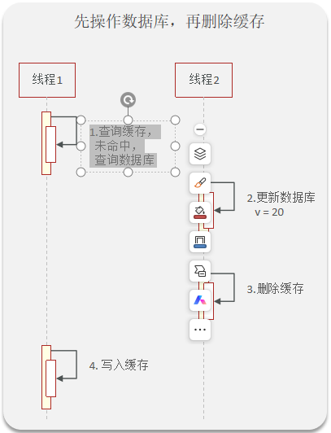

# Redis相关面试题

>**面试官**：什么是缓存穿透 ? 怎么解决 ?
>
>**候选人**：
>
>嗯~~，我想一下
>
>缓存穿透是指查询一个一定**不存在**的数据，如果从存储层查不到数据则不写入缓存，这将导致这个不存在的数据每次请求都要到 DB 去查询，可能导致 DB 挂掉。这种情况大概率是遭到了攻击。
>
>解决方案的话，我们通常都会用布隆过滤器来解决它
>
>
>
>**面试官**：好的，你能介绍一下布隆过滤器吗？
>
>**候选人**：
>
>嗯，是这样~
>
>布隆过滤器主要是用于检索一个元素是否在一个集合中。我们当时使用的是redisson实现的布隆过滤器。
>
>它的底层主要是先去初始化一个比较大数组，里面存放的二进制0或1。在一开始都是0，当一个key来了之后经过3次hash计算，模于数组长度找到数据的下标然后把数组中原来的0改为1，这样的话，三个数组的位置就能标明一个key的存在。查找的过程也是一样的。
>
>当然是有缺点的，布隆过滤器有可能会产生一定的误判，我们一般可以设置这个误判率，大概不会超过5%，其实这个误判是必然存在的，要不就得增加数组的长度，其实已经算是很划分了，5%以内的误判率一般的项目也能接受，不至于高并发下压倒数据库。
>
>
>
>**面试官**：什么是缓存击穿 ? 怎么解决 ?
>
>**候选人**：
>
>嗯！！
>
>缓存击穿的意思是对于设置了过期时间的key，缓存在某个时间点过期的时候，恰好这时间点对这个Key有大量的并发请求过来，这些请求发现缓存过期一般都会从后端 DB 加载数据并回设到缓存，这个时候大并发的请求可能会瞬间把 DB 压垮。
>
>解决方案有两种方式：
>
>第一可以使用互斥锁：当缓存失效时，不立即去load db，先使用如 Redis 的 setnx 去设置一个互斥锁，当操作成功返回时再进行 load db的操作并回设缓存，否则重试get缓存的方法
>
>第二种方案可以设置当前key逻辑过期，大概是思路如下：
>
>①：在设置key的时候，设置一个过期时间字段一块存入缓存中，不给当前key设置过期时间
>
>②：当查询的时候，从redis取出数据后判断时间是否过期
>
>③：如果过期则开通另外一个线程进行数据同步，当前线程正常返回数据，这个数据不是最新
>
>当然两种方案各有利弊：
>
>如果选择数据的强一致性，建议使用分布式锁的方案，性能上可能没那么高，锁需要等，也有可能产生死锁的问题
>
>如果选择key的逻辑删除，则优先考虑的高可用性，性能比较高，但是数据同步这块做不到强一致。
>
>> `SETNX` 的意思是 **Set if Not Exists**：只有当 Redis 中的 key 不存在时，才设置成功。
>>
>> ```
>> SET lock_key request_id NX EX 10
>> ```
>>
>> - 成功：说明抢到了锁
>> - 失败：说明锁已被别人持有
>> - `EX 10`：10 秒后自动过期，防止死锁
>
>
>
>**面试官**：什么是缓存雪崩 ? 怎么解决 ?
>
>**候选人**：
>
>嗯！！
>
>缓存雪崩意思是设置缓存时采用了相同的过期时间，导致缓存在某一时刻同时失效，请求全部转发到DB，DB 瞬时压力过重雪崩。与缓存击穿的区别：雪崩是很多key，击穿是某一个key缓存。
>
>解决方案主要是可以将缓存失效时间分散开，比如可以在原有的失效时间基础上增加一个随机值，比如1-5分钟随机，这样每一个缓存的过期时间的重复率就会降低，就很难引发集体失效的事件。
>
>
>
>**面试官**：redis做为缓存，mysql的数据如何与redis进行同步呢？（双写一致性）
>
>**候选人**：嗯！就说我最近做的这个项目，里面有xxxx（**根据自己的简历上写**）的功能，需要让数据库与redis高度保持一致，因为要求时效性比较高，我们当时采用的读写锁保证的强一致性。
>
>我们采用的是redisson实现的读写锁，在读的时候添加共享锁，可以保证读读不互斥，读写互斥。当我们更新数据的时候，添加排他锁，它是读写，读读都互斥，这样就能保证在写数据的同时是不会让其他线程读数据的，避免了脏数据。这里面需要注意的是读方法和写方法上需要使用同一把锁才行。
>
>
>
>**面试官**：那这个排他锁是如何保证读写、读读互斥的呢？
>
>**候选人**：其实排他锁底层使用也是setnx，保证了同时只能有一个线程操作锁住的方法
>
>
>
>**面试官**：你听说过延时双删吗？为什么不用它呢？
>
>**候选人**：延迟双删，如果是写操作，我们先把缓存中的数据删除，然后更新数据库，最后再延时删除缓存中的数据，其中这个延时多久不太好确定，在延时的过程中可能会出现脏数据，并不能保证强一致性，所以没有采用它。
>
>
>
>**面试官**：redis做为缓存，mysql的数据如何与redis进行同步呢？（双写一致性）
>
>**候选人**：嗯！就说我最近做的这个项目，里面有xxxx（**根据自己的简历上写**）的功能，数据同步可以有一定的延时（符合大部分业务）
>
>我们当时采用的阿里的canal组件实现数据同步：不需要更改业务代码，部署一个canal服务。canal服务把自己伪装成mysql的一个从节点，当mysql数据更新以后，canal会读取binlog数据，然后在通过canal的客户端获取到数据，更新缓存即可。
>
>> 我们的 Redis 缓存不要求立刻同步，允许晚几秒。
>> 比如用户修改了一条商品信息，我们会先修改 MySQL，因为 MySQL 才是真正的数据来源。  
>
>> 修改 MySQL 的同时，我们会在数据库里记一条“商品 1001 已修改，需要清理缓存”的待办记录。这样即使服务刚好宕机，这个待办也还在数据库中，不会忘记通知。  
>
>> 后台程序看到这条待办记录后，会通过 RabbitMQ 发消息。另一个负责缓存的程序收到消息，就把 Redis 里商品 1001 的缓存删除。  
>
>> 下次有人查询商品 1001 时，发现 Redis 没有缓存，就去 MySQL 查询最新数据，再把最新数据放回 Redis。  
>
>> 这样做比直接修改 Redis 更稳妥：Redis 里的数据删掉后，总能从 MySQL 重新查到正确的数据。  
>
>> 另外，RabbitMQ 发消息或消费消息失败时，会自动重试；如果一直失败，就记录下来并告警，人工再处理。所以最终 Redis 还是会和 MySQL 保持一致。
>
>> **我们采用 RabbitMQ 实现 Redis 和 MySQL 的最终一致性：修改数据时，先在同一个数据库事务中更新 MySQL 并记录一条待发送消息；后台定时将消息投递到 RabbitMQ，消费者收到后删除对应 Redis 缓存。
>> 下次读取缓存未命中时，再从 MySQL 查询最新数据重建缓存；发送或消费失败会重试，因此允许短暂延迟，但最终能保持一致。**
>
>
>
>**面试官**：redis做为缓存，数据的持久化是怎么做的？
>
>**候选人**：在Redis中提供了两种数据持久化的方式：1、RDB  2、AOF
>
>
>
>**面试官**：这两种持久化方式有什么区别呢？
>
>**候选人**：RDB是一个`快照文件`，它是把redis内存存储的数据写到磁盘上，当redis实例宕机恢复数据的时候，方便从RDB的快照文件中恢复数据。
>
>AOF的含义是`追加文件`，当redis操作写命令**（会修改数据的命令）**的时候，都会存储这个文件中，当redis实例宕机恢复数据的时候，会从这个文件中再次执行一遍命令来恢复数据
>
>
>
>**面试官**：这两种方式，哪种恢复的比较快呢？
>
>**候选人**：RDB因为是二进制文件，在保存的时候体积也是比较小的，它恢复的比较快，但是它有可能会丢数据，我们通常在项目中也会使用AOF来恢复数据，虽然AOF恢复的速度慢一些，但是它丢数据的风险要小很多，在AOF文件中可以设置刷盘策略，我们当时设置的就是每秒批量写入一次命令
>
>
>
>**面试官**：Redis的数据过期策略有哪些 ? 
>
>**候选人**：
>
>嗯~，在redis中提供了两种数据过期删除策略
>
>**第一种是惰性删除**，在设置该key过期时间后，我们不去管它，当需要该key时，我们在检查其是否过期，如果过期，我们就删掉它，反之返回该key。
>
>**第二种是 定期删除**，就是说每隔一段时间，我们就对一些key进行检查，删除里面过期的key
>
>
>**定期清理的两种模式：**
>
>- SLOW模式是定时任务，执行频率默认为10hz，每次不超过25ms，以通过修改配置文件redis.conf 的 **hz** 选项来调整这个次数
>- FAST模式执行频率不固定，每次事件循环会尝试执行，但两次间隔不低于2ms，每次耗时不超过1ms
>
>Redis的过期删除策略：**惰性删除 + 定期删除**两种策略进行配合使用。
>
>
>
>**面试官**：Redis的数据淘汰策略有哪些 ? 
>
>**候选人**：
>
>嗯，这个在redis中提供了很多种，`默认是noeviction，不删除任何数据，内部不足直接报错`
>
>是可以在redis的配置文件中进行设置的，里面有**两个非常重要的概念**,一个是LRU，另外一个是LFU
>
>LRU的意思就是最少最近使用，用当前时间减去最后一次访问时间，这个值越大则淘汰优先级越高。
>
>LFU的意思是最少频率使用。会统计每个key的访问频率，值越小淘汰优先级越高
>
>我们在项目设置的allkeys-lru，挑选最近最少使用的数据淘汰，把一些经常访问的key留在redis中
>
>
>
>**面试官**：数据库有1000万数据 ,Redis只能缓存20w数据, 如何保证Redis中的数据都是热点数据 ?
>
>**候选人**：
>
>嗯，我想一下~~
>
>可以使用 allkeys-lru （挑选最近最少使用的数据淘汰）淘汰策略，那留下来的都是经常访问的热点数据
>
>
>
>**面试官**：Redis的内存用完了会发生什么？
>
>**候选人**：
>
>嗯~，这个要看redis的数据淘汰策略是什么，如果是默认的配置，redis内存用完以后则直接报错。我们当时设置的 allkeys-lru 策略。把最近最常访问的数据留在缓存中。
>
>
>
>**面试官**：Redis分布式锁如何实现 ? 
>
>**候选人**：嗯，在redis中提供了一个命令setnx(SET if not exists)
>
>由于redis的单线程的，用了命令之后，只能有一个客户端对某一个key设置值，在没有过期或删除key的时候是其他客户端是不能设置这个key的
>
>
>
>**面试官**：好的，那你如何控制Redis实现分布式锁有效时长呢？
>
>**候选人**：嗯，的确，redis的setnx指令不好控制这个问题，我们当时采用的redis的一个框架redisson实现的。
>
>在redisson中需要手动加锁，并且可以控制锁的失效时间和等待时间，当锁住的一个业务还没有执行完成的时候，在redisson中引入了一个看门狗机制，就是说每隔一段时间就检查当前业务是否还持有锁，如果持有就增加加锁的持有时间，当业务执行完成之后需要使用释放锁就可以了
>
>还有一个好处就是，在高并发下，一个业务有可能会执行很快，先客户1持有锁的时候，客户2来了以后并不会马上拒绝，它会自旋不断尝试获取锁，如果客户1释放之后，客户2就可以马上持有锁，性能也得到了提升。
>
>
>
>**面试官**：好的，redisson实现的分布式锁是可重入的吗？
>
>**候选人**：嗯，是可以重入的。这样做是为了避免死锁的产生。这个重入其实在内部就是判断是否是当前线程持有的锁，如果是当前线程持有的锁就会计数，如果释放锁就会在计算上减一。在存储数据的时候采用的hash结构，大key可以按照自己的业务进行定制，其中小key是当前线程的唯一标识，value是当前线程重入的次数
>
>
>
>**面试官**：redisson实现的分布式锁能解决主从一致性的问题吗
>
>**候选人**：这个是不能的，比如，当线程1加锁成功后，master节点数据会异步复制到slave节点，此时当前持有Redis锁的master节点宕机，slave节点被提升为新的master节点，假如现在来了一个线程2，再次加锁，会在新的master节点上加锁成功，这个时候就会出现两个节点同时持有一把锁的问题。
>
>我们可以利用redisson提供的红锁来解决这个问题，它的主要作用是，不能只在一个redis实例上创建锁，应该是在多个redis实例上创建锁，并且要求在大多数redis节点上都成功创建锁，红锁中要求是redis的节点数量要过半。这样就能避免线程1加锁成功后master节点宕机导致线程2成功加锁到新的master节点上的问题了。
>
>但是，如果使用了红锁，因为需要同时在多个节点上都添加锁，性能就变的很低了，并且运维维护成本也非常高，所以，我们一般在项目中也不会直接使用红锁，并且官方也暂时废弃了这个红锁
>
>
>
>**面试官**：好的，如果业务非要保证数据的强一致性，这个该怎么解决呢？
>
>**候选人：**嗯~，redis本身就是支持高可用的，做到强一致性，就非常影响性能，所以，如果有强一致性要求高的业务，建议使用zookeeper实现的分布式锁，它是可以保证强一致性的。
>
>
>
>**面试官**：Redis集群有哪些方案, 知道嘛 ? 
>
>**候选人**：嗯~~，在Redis中提供的集群方案总共有三种：主从复制、哨兵模式、Redis分片集群
>
>
>
>**面试官**：那你来介绍一下主从同步
>
>**候选人**：嗯，是这样的，单节点Redis的并发能力是有上限的，要进一步提高Redis的并发能力，可以搭建主从集群，实现读写分离。一般都是一主多从，主节点负责写数据，从节点负责读数据，主节点写入数据之后，需要把数据同步到从节点中
>
>
>
>**面试官**：能说一下，主从同步数据的流程
>
>**候选人**：嗯~~，好！主从同步分为了两个阶段，一个是全量同步，一个是增量同步
>
>全量同步是指从节点第一次与主节点建立连接的时候使用全量同步，流程是这样的：
>
>第一：从节点请求主节点同步数据，其中从节点会携带自己的replication id和offset偏移量。
>
>第二：主节点判断是否是第一次请求，主要判断的依据就是，主节点与从节点是否是同一个replication id，如果不是，就说明是第一次同步，那主节点就会把自己的replication id和offset发送给从节点，让从节点与主节点的信息保持一致。
>
>第三：在同时主节点会执行bgsave，生成rdb文件后，发送给从节点去执行，从节点先把自己的数据清空，然后执行主节点发送过来的rdb文件，这样就保持了一致
>
>当然，如果在rdb生成执行期间，依然有请求到了主节点，而主节点会以命令的方式记录到缓冲区，缓冲区是一个日志文件，最后把这个日志文件发送给从节点，这样就能保证主节点与从节点完全一致了，后期再同步数据的时候，都是依赖于这个日志文件，这个就是全量同步
>
>增量同步指的是，当从节点服务重启之后，数据就不一致了，所以这个时候，从节点会请求主节点同步数据，主节点还是判断不是第一次请求，不是第一次就获取从节点的offset值，然后主节点从命令日志中获取offset值之后的数据，发送给从节点进行数据同步
>
>
>
>**面试官**：怎么保证Redis的高并发高可用
>
>**候选人**：首先可以搭建主从集群，再加上使用redis中的哨兵模式，哨兵模式可以实现主从集群的自动故障恢复，里面就包含了对主从服务的监控、自动故障恢复、通知；如果master故障，Sentinel会将一个slave提升为master。当故障实例恢复后也以新的master为主；同时Sentinel也充当Redis客户端的服务发现来源，当集群发生故障转移时，会将最新信息推送给Redis的客户端，所以一般项目都会采用哨兵的模式来保证redis的高并发高可用
>
>
>
>**面试官**：你们使用redis是单点还是集群，哪种集群
>
>**候选人**：嗯！，我们当时使用的是主从（1主1从）加哨兵。一般单节点不超过10G内存，如果Redis内存不足则可以给不同服务分配独立的Redis主从节点。尽量不做分片集群。因为集群维护起来比较麻烦，并且集群之间的心跳检测和数据通信会消耗大量的网络带宽，也没有办法使用lua脚本和事务
>
>
>
>**面试官**：redis集群脑裂，该怎么解决呢？
>
>**候选人**：嗯！ 这个在项目很少见，不过脑裂的问题是这样的，我们现在用的是redis的哨兵模式集群的
>
>有的时候由于网络等原因可能会出现脑裂的情况，就是说，由于redis master节点和redis salve节点和sentinel处于不同的网络分区，使得sentinel没有能够心跳感知到master，所以通过选举的方式提升了一个salve为master，这样就存在了两个master，就像大脑分裂了一样，这样会导致客户端还在old master那里写入数据，新节点无法同步数据，当网络恢复后，sentinel会将old master降为salve，这时再从新master同步数据，这会导致old master中的大量数据丢失。
>
>关于解决的话，我记得在redis的配置中可以设置：第一可以设置最少的salve节点个数，比如设置至少要有一个从节点才能同步数据，第二个可以设置主从数据复制和同步的延迟时间，达不到要求就拒绝请求，就可以避免大量的数据丢失
>
>
>
>**面试官**：redis的分片集群有什么作用
>
>**候选人**：分片集群主要解决的是，海量数据存储的问题，集群中有多个master，每个master保存不同数据，并且还可以给每个master设置多个slave节点，就可以继续增大集群的高并发能力。同时每个master之间通过ping监测彼此健康状态，就类似于哨兵模式了。当客户端请求可以访问集群任意节点，最终都会被转发到正确节点
>
>
>
>**面试官**：Redis分片集群中数据是怎么存储和读取的？
>
>**候选人**：
>
>嗯~，在redis集群中是这样的
>
>Redis 集群引入了哈希槽的概念，有 16384 个哈希槽，集群中每个主节点绑定了一定范围的哈希槽范围， key通过 CRC16 校验后对 16384 取模来决定放置哪个槽，通过槽找到对应的节点进行存储。
>
>取值的逻辑是一样的
>
>
>
>**面试官**：Redis是单线程的，但是为什么还那么快？
>
>**候选人**：
>
>嗯，这个有几个原因吧~~~
>
>1、完全基于内存的，C语言编写
>
>2、采用单线程，避免不必要的上下文切换可竞争条件
>
>3、使用多路I/O复用模型，非阻塞IO
>
>例如：bgsave 和 bgrewriteaof  都是在**后台**执行操作，不影响主线程的正常使用，不会产生阻塞
>
>
>
>**面试官**：能解释一下I/O多路复用模型？
>
>**候选人**：嗯~~，I/O多路复用是指利用单个线程来同时监听多个Socket ，并在某个Socket可读、可写时得到通知，从而避免无效的等待，充分利用CPU资源。目前的I/O多路复用都是采用的epoll模式实现，它会在通知用户进程Socket就绪的同时，把已就绪的Socket写入用户空间，不需要挨个遍历Socket来判断是否就绪，提升了性能。
>
>其中Redis的网络模型就是使用I/O多路复用结合事件的处理器来应对多个Socket请求，比如，提供了连接应答处理器、命令回复处理器，命令请求处理器；
>
>在Redis6.0之后，为了提升更好的性能，在命令回复处理器使用了多线程来处理回复事件，在命令请求处理器中，将命令的转换使用了多线程，增加命令转换速度，在命令执行的时候，依然是单线程


> ⭐⭐“更新 MySQL，再删除 Redis”和延迟双删
>
> 
>
> 你理解得对。**如果 Redis 中的 key 一直存在，那么这个时序确实不成立。**我前面的例子省略了“缓存本来就已经不存在”的前提，表述不严谨。
>
> **缓存未命中可能来自：**
>
> - TTL 过期；
> - Redis 淘汰；
> - 第一次访问；
> - 其他线程已经删除；
> - 缓存异常丢失。
>
> 例如“先更新 MySQL，再删除 Redis”时，正确的竞态可以是：
>
> ```
> T1：Redis key 因 TTL 过期，线程 A 查询 Redis 未命中
> T2：线程 A 开始查询 MySQL，读到旧数据
> T3：线程 B 更新 MySQL，并删除 Redis（此时可能已经不存在，删除相当于无效）
> T4：线程 A 把旧数据写入 Redis
> ```
>
> 这里线程 B 的删除不是导致 A 未命中的原因，A 是因为缓存提前过期才未命中。
>
> 而“延迟双删”中的典型场景是：
>
> ```
> T1：线程 B 第一次删除 Redis
> T2：线程 A 查询 Redis 未命中，开始查询 MySQL，读到旧数据
> T3：线程 B 更新 MySQL
> T4：线程 A 把旧数据写入 Redis
> T5：线程 B 延迟再次删除 Redis
> ```
>
> 所以总结：
>
> > 你指出的问题是成立的。若缓存一定存在，线程 A 不可能在 B 删除前未命中。实际风险依赖于缓存已经过期或被删除的情况；延迟双删主要是为了清理并发期间重新写入的旧缓存。
>
> 
>
> 
>
> ⭐⭐【
> T1：线程 B 第一次删除 Redis
> T2：线程 A 查询 Redis 未命中，开始查询 MySQL，读到旧数据
> T3：线程 B 更新 MySQL
> T4：线程 B 延迟再次删除 Redis把旧数据
> T5：线程 A 写入 Redis 
>
> 】
>
> 有没有可能出现这种情况？
>
> 
>
> 有可能，而且你指出了延迟双删的局限性。
>
> 如果时序是：
>
> ```
> T1：线程 B 第一次删除 Redis
> T2：线程 A 未命中 Redis，查询 MySQL 旧数据
> T3：线程 B 更新 MySQL
> T4：线程 B 延迟删除 Redis
> T5：线程 A 查询完成，把旧数据写入 Redis
> ```
>
> 那么第二次删除发生得太早，线程 A 仍然可能把旧数据写回 Redis，最终依旧不一致。
>
> 理想时序应该是：
>
> ```
> T1：B 删除 Redis
> T2：A 未命中，查询旧数据
> T3：B 更新 MySQL
> T4：A 把旧数据写入 Redis
> T5：B 延迟再次删除 Redis
> ```
>
> 所以延迟双删只能降低发生脏缓存的概率，不能绝对保证一致性。延迟时间必须大于大多数数据库查询和缓存回填耗时，但仍可能遇到慢查询、网络阻塞等情况。
>
> 如果要求更可靠：
>
> - 使用 Redisson 读写锁，让读操作和写操作互斥；
> - 使用 MySQL Binlog + MQ，提交成功后异步删除缓存；
> - 删除失败时加入重试机制；
> - Redis 设置 TTL 作为最终兜底。
>
> 也就是说，你这个反例是成立的，这正是“延迟双删不是强一致方案”的原因。


> ⭐⭐**JAVA里线程之间是交替执行的吗？**
>
> 
>
> 不一定。
>
> Java 线程的执行由操作系统和 JVM 调度，可能出现：
>
> - 单核 CPU：多个线程通常通过时间片快速切换，看起来像交替执行。
> - 多核 CPU：多个线程可能真正同时执行。
> - 执行顺序：不确定，不能依赖线程严格交替。
>
> 例如：
>
> ```
> 线程A：A A A
> 线程B：B B B
> ```
>
> 也可能输出：
>
> ```
> A B A A B B
> ```
>
> 甚至两个线程并行执行。若需要保证固定顺序，要使用 `synchronized`、`join()`、`wait/notify`、`CountDownLatch` 等同步机制。


> 
>
> ⭐**这个指的是线程1在查询缓存，   未命中，   查询数据库后切换到线程2吗？**
>
> 
>
> 对，这张图表达的是一种“线程执行交错”的情况：
>
> 1. 线程 1 查询缓存，未命中；
> 2. 线程 1 查询数据库，读取到旧值，例如 `v=10`；
> 3. 线程 1 查询数据库期间，可能因为数据库 I/O 阻塞；
> 4. 线程 2 获得执行机会，更新数据库为 `v=20`，然后删除缓存；
> 5. 线程 1 恢复执行，把之前读到的旧值 `v=10` 写入缓存。
>
> 于是缓存中又出现了旧数据：
>
> ```
> 数据库：v=20
> 缓存：v=10
> ```
>
> 但要注意：这不一定是“线程 1 查询数据库后，操作系统必然切换到线程 2”。线程切换时机由 JVM 和操作系统调度决定；这里只是展示了一种可能发生的执行顺序，也是“先更新数据库，再删除缓存”仍可能产生缓存不一致的原因。
>
> 
>
> ⭐**为什么线程1干一半会切换到线程2，不应该线程1先做完自己的吗？**
>
> 因为线程不是“拿到 CPU 后一直执行到方法结束”，而是由操作系统进行抢占式调度。
>
> 线程 1 执行到：
>
> ```
> 查询数据库
> ```
>
> 时，通常会等待数据库返回结果。这属于阻塞 I/O，线程 1 暂时无法继续使用 CPU，于是线程 2 就可以运行。
>
> 即使线程 1 没有阻塞，运行时间片用完后，操作系统也可能暂停线程 1，切换到线程 2。
>
> 所以：
>
> ```
> 线程1：查询缓存 → 查询数据库（等待）
>                          ↓
> 线程2：更新数据库 → 删除缓存
>                          ↓
> 线程1：继续执行 → 写入缓存
> ```
>
> “线程 1 的业务逻辑要做完”不代表“线程 1 会一直占用 CPU”。除非使用锁、同步工具等机制，否则多个线程的执行顺序是不确定的。
>
> 
>
> ⭐**那要是这样说的话，假设线程1在执行一个函数，函数执行到一半，但是运行时间片用完了，这时候也会强制切换到线程2吗？**
>
> 是的，可能会被强制切换。
>
> 线程 1 执行函数到一半时，如果：
>
> - 时间片用完；
> - 线程 1 发生阻塞；
> - 更高优先级线程需要运行；
> - 操作系统发生调度；
>
> 操作系统都可能暂停线程 1，让线程 2 执行。
>
> 例如：
>
> ```
> void test() {
>     step1(); // 已执行
>     step2(); // 还没执行
>     step3();
> }
> ```
>
> 线程 1 执行完 `step1()` 后被切走，线程 2 执行；之后线程 1 恢复时，会从暂停的位置继续执行 `step2()`，不会重新执行整个函数。
>
> 函数本身不是不可打断的。只有使用锁、同步机制，或保证某段操作的原子性，才能避免多个线程同时修改共享数据。
>
> 另外，多核 CPU 下，线程 1 和线程 2 也可能同时运行，并不一定发生“切换”。
>
> 
>
> ⭐**那这个test函数要是用了锁 ，也会由线程1切换到线程2吗?**
>
> 会。加锁只能限制“谁能进入临界区”，不能阻止线程被操作系统切换。
>
> ```
> synchronized (lock) {
>     step1();
>     step2();
>     step3();
> }
> ```
>
> 可能发生：
>
> ```
> 线程1：获得 lock
> 线程1：执行 step1()
> 线程1：时间片用完，被切换
> 线程2：尝试获得 lock，但拿不到，进入 BLOCKED
> 线程1：恢复执行 step2()、step3()
> 线程1：退出 synchronized，释放 lock
> 线程2：获得 lock，继续执行
> ```
>
> 因此：
>
> - 线程 1 持有锁时，仍然可能被切换；
> - 线程 2 可以运行其他不需要该锁的代码；
> - 线程 2 如果也要进入这个锁保护的代码，就会等待；
> - 锁会一直由线程 1 持有，直到线程 1 离开同步代码块，即使期间被切换也不会自动释放。
>
> 所以锁保证的是“同一时刻只有一个线程进入临界区”，不是“线程 1 一定执行完临界区后才会被切换”。


> ⭐**为什么延迟双删需要延时？**
>
> * 因为一般情况下数据库是主从模式，是读写分离的模式，需要延时一会儿，等主节点把数据同步到从节点，所以需要延时一会儿
> * 但这个延时也可能出现问题，因为延迟的时间不好控制，因为在`延时的过程中依然可能出现脏数据`，但综合来说，延迟双删极大的控制了出现脏数据的风险，但也只是控制了一部分，因为延时时间不好确定，也可能出现脏数据，做不到绝对的强一致。


> ⭐**Redis使用AOF持久化的流程是怎样的**
>
> ~~~
> 客户端发送写命令
>         ↓
> Redis 在内存中执行命令
>         ↓
> 将命令追加到 AOF 缓冲区
>         ↓
> 根据 appendfsync 策略刷入磁盘
>         ↓
> Redis 宕机重启时读取 AOF
>         ↓
> 逐条重新执行命令，恢复数据
> ~~~
>
> **具体来说：**
>
> 1. 客户端发送写命令，例如：
>
>    ```
>    SET user:1 Tom
>    ```
>
> 2. Redis 先在内存中执行这条命令。
>
> 3. 命令执行成功后，Redis 将这条命令转换成 AOF 格式，并追加到 AOF 缓冲区。AOF 保存的是“操作命令”，不是某个时刻的完整数据快照。
>
> 4. Redis 根据 `appendfsync` 配置刷盘：
>
>    - `always`：每条命令都刷盘；
>    - `everysec`：大约每秒批量刷盘一次；
>    - `no`：由操作系统决定什么时候刷盘。
>
> 5. Redis 重启时，读取 AOF 文件中的命令，并从头到尾重新执行，最终恢复出宕机前的数据状态。
>
> 6. 为避免 AOF 文件越来越大，Redis 会进行 AOF 重写：根据当前内存数据生成更精简的命令集合，替换旧的冗余命令，但不会改变最终数据。
>
> 
>
> ⭐**【大约每秒批量刷盘一次；】用大白话解释一下，意思是会囤积1s的命令，然后批量写入磁盘吗？**
>
> **对，Redis 不会每执行一条命令就立刻强制写入磁盘，而是：**
>
> 1. 命令先立即在内存中执行；
> 2. 同时把命令暂存在 AOF 缓冲区；
> 3. 大约每隔 1 秒，把这段时间积累的命令一次性刷到磁盘。
>
> 例如这一秒内执行了：
>
> ```
> SET a 1
> SET b 2
> INCR counter
> ```
>
> Redis 会把这些命令集中刷盘。
>
> 但“囤积 1 秒”不是严格定时等待 1 秒，而是**命令正常执行，后台大约每秒同步一次**。如果 Redis 在两次刷盘之间宕机，可能丢失最近约 1 秒内的写操作。
>
>
> ⭐**这个AOF是redis自动的吗？还是说需要手动去操作？**
> AOF 的工作过程是**自动的**，但是否启用需要提前配置。
>
> 通常需要在 Redis 配置文件中设置：
>
> ```
> appendonly yes
> appendfsync everysec
> ```
>
> 配置并启动后，Redis 会自动：
>
> - 记录写命令到 AOF；
> - 按策略自动刷盘；
> - 重启时自动读取 AOF 恢复数据；
> - 根据需要自动进行 AOF 重写。
>
> 日常不需要人工把命令写入文件或手动刷盘。
>
> 需要注意：很多 Redis 默认并未开启 AOF，管理员必须先配置并重启或动态开启。也就是说：
>
> > AOF 的“记录、刷盘、恢复”是自动的；AOF 是否启用，需要人工配置。


> ⭐**Redis的数据过期策略有哪些？**Redis 的“过期策略”通常分两类：
>
> **1. 过期删除策略**
>
> Redis 设置过期时间：
>
> ```
> SET user:1 Tom EX 60
> ```
>
> 表示 60 秒后过期。
>
> Redis 主要采用两种删除方式：
>
> **惰性删除**
>
> 访问某个 Key 时，Redis 先检查它是否过期：
>
> - 没过期：正常返回；
> - 已过期：删除 Key，并返回不存在。
>
> 所以 Key 到期后不一定马上从内存中消失，可能要等下一次访问。
>
> 
>
> **定期删除**
>
> Redis 会定期从设置了过期时间的 Key 中抽样检查：
>
> - 发现过期 Key，就删除；
> - 每次只检查一部分，避免一次删除太多影响性能。
>
> 因此 Redis 实际使用的是：
>
> > 惰性删除 + 定期删除
>
> 这样既能及时清理常用 Key，也能清理那些长期没人访问的过期 Key。
>
> 
>
> **2. 内存淘汰策略**
>
> 当 Redis 内存达到 `maxmemory` 限制时，会根据淘汰策略删除 Key，例如：
>
> - `noeviction`：不删除，写入失败；
> - `allkeys-lru`：删除最久未使用的 Key；
> - `allkeys-lfu`：删除访问频率最低的 Key；
> - `volatile-lru`：只在设置过期时间的 Key 中删除最久未使用的；
> - `volatile-ttl`：优先删除剩余有效期最短的 Key。
>
> **简单区分：**
>
> - Key 到期后的删除：过期删除策略；
> - 内存不够时主动腾空间：内存淘汰策略。
>
> 日常所说的 Redis 过期机制，通常主要指“惰性删除 + 定期删除”。


> ⭐**Redis分布式锁是什么？**
>
> 
>
> **Redis 分布式锁，是用 Redis 来保证：**
>
> > 多台服务器、多个程序实例中，同一时间只有一个实例可以执行某段业务代码。
>
> 例如多个服务同时处理同一个订单，只允许一个服务扣库存，避免重复扣减。
>
> 基本加锁命令：
>
> ```
> SET lock:order:1001 unique-value NX EX 30
> ```
>
> **含义：**
>
> - `lock:order:1001`：锁的名称；
> - `unique-value`：当前实例唯一标识；
> - `NX`：只有 Key 不存在时才能设置成功；
> - `EX 30`：锁最多 30 秒后自动过期，避免服务宕机导致死锁。
>
> **执行结果：**
>
> - 返回 `OK`：获得锁；
> - 返回空：锁已被其他实例占用。
>
> 释放锁时不能直接执行：
>
> ```
> DEL lock:order:1001
> ```
>
> **因为可能发生这种情况：**
>
> 1. 实例 A 获取锁；
> 2. A 执行太久，锁自动过期；
> 3. 实例 B 获取了同一把锁；
> 4. A 执行完后直接删除锁，把 B 的锁删掉。
>
> 所以释放锁时要确认锁的值仍然属于自己，通常使用 Lua 脚本保证“判断并删除”是原子操作。
>
> **简单理解：**
>
> ```
> 抢锁成功 → 执行业务 → 确认是自己的锁 → 释放锁
> 抢锁失败 → 等待或直接放弃
> ```
>
> **Redis 分布式锁的关键点是：**
>
> - 必须使用唯一锁值；
> - 加锁要设置过期时间；
> - 释放锁要校验锁的拥有者；
> - 业务执行时间可能超过锁有效期时，需要续期或合理设置锁时间；
> - Redis 主从切换场景下还要额外考虑锁丢失问题。


> ⭐**Redis分布式锁在日常开发中的使用场景就是缓存击穿的互斥锁吗？**
> 
>
> 不是。缓存击穿的“互斥重建缓存”只是 Redis 分布式锁最常见、最容易理解的场景之一。
>
> Redis 分布式锁的本质是：
>
> > 在多个进程、多个服务实例之间，保证同一时刻只有一个执行者进入某段临界逻辑。
>
> 常见场景包括：
>
> - **缓存击穿**：同一热点 Key 失效时，只允许一个实例查询数据库并重建缓存。
> - **定时任务抢占**：多实例部署时，只让一个实例执行任务。
> - **消息消费去重**：同一业务消息同时到达多个消费者时，避免重复处理。
> - **订单、库存等业务并发控制**：同一订单或商品的关键操作进行串行化。
> - **防止重复提交**：短时间内同一请求只允许一个执行。
> - **分布式选主**：多个实例中选出一个临时 Leader 执行某项工作。
> - **资源初始化**：避免多个实例同时初始化同一份数据或文件。
>
> 缓存击穿中的典型流程是：
>
> ```
> 查询缓存
>   ├─ 命中：直接返回
>   └─ 未命中：抢 Redis 锁
>        ├─ 抢到：再次查询缓存 → 查数据库 → 回填缓存
>        └─ 未抢到：等待后重试查询缓存
> ```
>
> 需要注意，Redis 分布式锁不是万能的并发控制方案：
>
> - 加锁必须使用 `SET key value NX EX seconds`，不能先 `SETNX` 再单独设置过期时间。
> - 解锁时要校验锁值，只能释放自己持有的锁，通常使用 Lua 脚本。
> - 要考虑业务执行时间超过锁过期时间的问题。
> - 强一致业务不能只依赖 Redis 锁，仍应结合数据库唯一约束、状态机或乐观锁。
> - 缓存**雪崩**通常还需要随机过期时间、限流、熔断、降级等方案，单靠互斥锁不够。
>
> 所以可以这样理解：
>
> > 缓存击穿互斥锁是 Redis 分布式锁的一个典型应用，但 Redis 分布式锁解决的是更广泛的“跨实例互斥执行”问题。


> ⭐**修改 MySQL的语句执行后宕机了，那不就不能“记一条“商品 1001 已修改，需要清理缓存  ”么？**
>
> 对，这正是 Outbox 要解决的问题。关键在于：**“改 MySQL 业务数据”和“写待办消息”必须放在同一个数据库事务里。**
>
> ```
> 开启事务
>   ↓
> 更新 product 表
>   ↓
> 插入一条 outbox_message 待办消息
>   ↓
> 提交事务
> ```
>
> 所以不是“商品改完了，再单独记待办”，而是两步绑定在一起。
>
> - 宕机发生在提交事务前：事务会回滚，商品数据和待办消息都不会生效。
> - 事务提交成功：商品数据和待办消息会一起保存成功。
> - 不会出现“商品已经改了，但待办消息没写进去”的情况。
>
> 可以把它理解为转账：扣钱和加钱必须在同一个事务里，要么都成功，要么都失败。
>
> 第二个问题：是的，最常见就是**定时轮询**。
>
> 比如每隔 1 秒，后台程序查询：
>
> ```
> select * from outbox_message
> where status = 'PENDING'
> limit 100;
> ```
>
> 查到后逐条发给 RabbitMQ：
>
> ```
> 待办消息 PENDING
>    ↓
> 发送到 RabbitMQ
>    ↓
> RabbitMQ 确认收到
>    ↓
> 把待办消息改成 SENT
> ```
>
> 如果发送时服务宕机或 RabbitMQ 临时不可用，这条记录仍是 `PENDING`，下一轮继续发送。
>
> 因此消息可能被发送两次，所以 Redis 消费者要能接受重复消息。对于“删除某个缓存”来说，重复删除通常没有问题：
>
> ```
> 第一次删除 Redis key：成功
> 第二次再删除同一个 key：也没关系
> ```
>
> 面试中可以简化为一句：
>
> > 我们把更新业务数据和记录待发送消息放到同一个本地事务；后台定时扫描未发送消息并投递 RabbitMQ，确认投递成功后再标记已发送。发送失败会保留并重试。


> ⭐**"后台程序看到这条待办记录  "是怎么做到的？定时器轮询吗？**
>
> 是的，最常见的实现就是：**定时任务轮询 Outbox 消息表。**
>
> 比如每隔 1 秒执行一次：
>
> ```
> SELECT * FROM outbox_message
> WHERE status = 'PENDING'
> ORDER BY id
> LIMIT 100;
> ```
>
> 查出“还没发送”的消息后，逐条发送给 RabbitMQ：
>
> ```
> 定时任务扫描消息表
>   ↓
> 找到 PENDING 状态的消息
>   ↓
> 发送到 RabbitMQ
>   ↓
> RabbitMQ 确认收到
>   ↓
> 将消息状态改为 SENT
> ```
>
> 如果 RabbitMQ 挂了、网络出问题或程序宕机，消息状态仍是 `PENDING`，下一次定时任务扫描时会再次发送，所以不会丢消息。
>
> 面试中可以直接说：
>
> > 后台通过定时任务轮询 Outbox 消息表，扫描未发送的消息，发送到 RabbitMQ。RabbitMQ 确认接收后，再将消息标记为已发送；失败则保留待下次重试。实际部署多个实例时，会通过数据库锁或抢占状态避免同一条消息被多个实例重复发送。


> ⭐**这里的“先使用如 Redis 的 setnx 去设置一个互斥锁，当操作成功返回时再进行 load db的操作并回设缓存  ”操作成功是什么意思？使用setnx什么是成功什么是失败？**
>
> 
>
> 这里的“操作成功”不是指 Redis 命令执行成功，而是指：
>
> > 当前请求成功抢到了互斥锁。
>
> `SETNX` 的规则是：**当 key 不存在时设置成功；当 key 已存在时设置失败。**
>
> 例如：
>
> ```
> SETNX lock:product:1001 request-A
> ```
>
> 返回值：
>
> - 返回 `1`：设置成功，说明抢到锁
> - 返回 `0`：设置失败，说明锁已经被其他请求抢走
>
> 缓存击穿时：
>
> ```
> 请求 A：缓存没有
>        → SETNX 成功
>        → 查询数据库
>        → 写回缓存
>        → 删除锁
> 
> 请求 B：缓存没有
>        → SETNX 失败
>        → 说明 A 正在查询数据库
>        → 等待后重新查询缓存
> ```
>
> 伪代码：
>
> ```
> if (redis.set(lockKey, requestId, NX, EX, 10)) {
>     // SETNX 成功：自己负责查数据库并重建缓存
>     data = loadFromDb();
>     setCache(data);
>     releaseLock(lockKey, requestId);
> } else {
>     // SETNX 失败：别人正在重建缓存
>     Thread.sleep(50);
>     return getCacheAgain();
> }
> ```
>
> 实际生产中推荐使用：
>
> ```
> SET lock:product:1001 request-A NX EX 10
> ```
>
> 而不是单独使用 `SETNX`，因为 `EX 10` 可以让锁自动过期，避免程序异常后一直占着锁。
