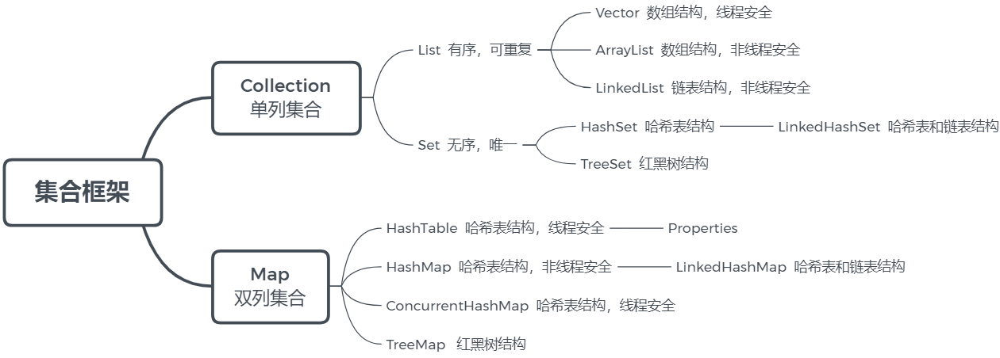
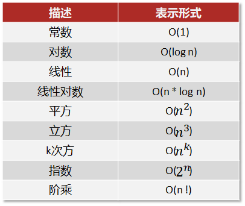
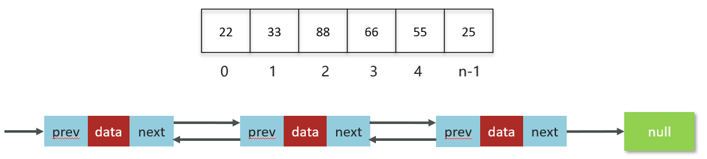
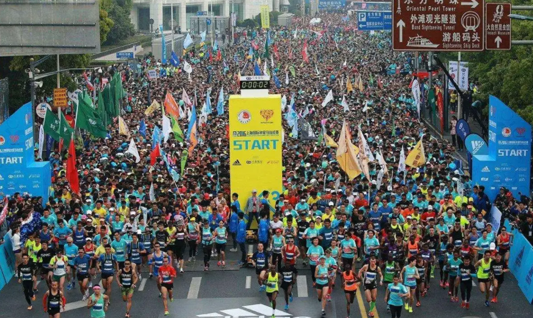
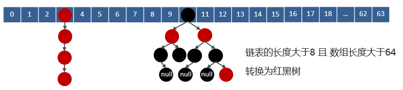
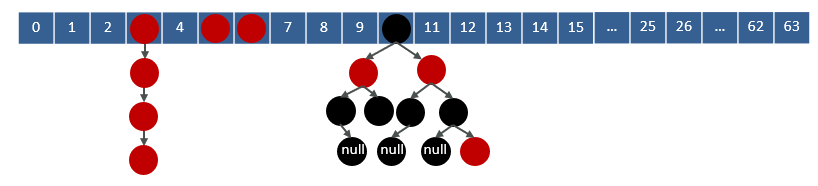
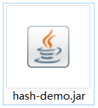

# Java集合相关面试题

## Java集合框架体系



## Java集合框架体系

数组

ArrayList底层实现


操作数据的特点-算法复杂度分析

## 数据结构

数组

链表

二叉树

红黑树

散列表

算法复杂度分析

## 算法复杂度分析

```java
/**
 * 求1~n的累加和
* @param n
* @return
 */
public int sum(int n) {
int sum = 0;
for ( int i = 1; i <= n; i++) {
        sum = sum + i;
    }
return sum;
}
```

为什么要进行复杂度分析？

指导你编写出性能更优的代码

评判别人写的代码的好坏

时间复杂度分析

空间复杂度分析

## 时间复杂度分析

时间复杂度分析：来评估代码的执行耗时的

```java
/**
 * 求1~n的累加和
* @param n
* @return
 */
public int sum(int n) {
int sum = 0;
for ( int i = 1; i <= n; i++) {
        sum = sum + i;
    }
return sum;
}
```

1.假如每行代码的执行耗时一样：1ms

2.分析这段代码总执行多少行？

3.代码耗时总时间： T(n) = (3n + 3) * 1ms

3n + 3

大O表示法：不具体表示代码真正的执行时间，而是表示**代码执行时间随数据规模增长的变化趋势**

T(n)与代码的执行次数成正比(**代码行数越多，执行时间越长**)

T(n) =O(3n + 3)

T(n) = O(n)

当n很大时，公式中的低阶，常量，系数三部分并不左右其增长趋势，因此可以忽略，我们只需要记录一个最大的量级就可以了

## 常见复杂度表示形式

| **描述**  |
| --- |
| **表示形式**  |
| 常数  |
| O(1)  |
| 对数  |
| O(log n)  |
| 线性  |
| O(n)  |
| 线性对数  |
| O(n * log n)  |
| 平方  |
| O(     )  |
| 立方  |
| O(     )  |
| k次方  |
| O(     )  |
| 指数  |
| O(     )  |
| 阶乘  |
| O(n !)  |

速记口诀：**常对幂指阶**

## 常见复杂度

```java
public void test02(int n){
int i=0;
int sum=0;
for(;i<100;i++){
        sum = sum+i;
    }
System.out.println(sum);
}
```

```java
public int test01(int n){
int i=0;
int j = 1;
return i+j;
}
```

O(1)

O(1)

**总结：只要代码的执行时间不随着****n****的增大而增大，这样的代码复杂度都是****O(1)**

## 常见复杂度

```java
public int sum(int n) {
int sum = 0;
for ( int i = 1; i <= n; i++) {
        sum = sum + i;
    }
return sum;
}
```

O(n)

```java
public int sum2(int n) {
int sum = 0;
for (int i=1; i <= n; ++i) {
for (int j=1; j <= n; ++j) {
            sum = sum +  i * j;
        }
    }
return sum;
}
```

  常量、系数、低阶，可以忽略

## 常见时间复杂度

| 代码的执行次数  |
| --- |
| 变量 i的值  |
| 1  |
| 2  |
| 2  |
| 4  |
| 3  |
| 8  |
| 4  |
| 16  |

```java
public void test04(int n){
int i=1;
while(i<=n){
        i = i * 2;
    }
}
```

**复杂度分析就是要弄清楚代码的执行次数和数据规模****n****之间的关系**

x表示代码执行次数

由以上分析可知，代码的时间复杂度表示为O(log n)

## Slide 11

以下代码的时间复杂度是多少

```java
public void test04(int n){
int i=1;
while(i<=n){
        i = i * 10;
    }
}
```

## 常见时间复杂度

```java
public void test05(int n){
int i=0;
for(;i<=n;i++){
        test04(n);
    }
}

public void test04(int n){
int i=1;
while(i<=n){
        i = i * 2;
    }
}
```

O(n)

O( n * log n )

O(log n)

## Slide 13

常见的时间复杂度

O(1)、O(n)、O(n^2)、O(logn)、O(n * logn)

## 空间复杂度

空间复杂度全称是渐进空间复杂度，表示算法占用的额外存储空间与数据规模之间的增长关系

```java
void print(int n) {
int i = 0;
int[] a = new int[n];
for (i; i <n; ++i) {
a[i] = i * i;
    }
for (i = n-1; i >= 0; --i) {
System.out.println(a[i]);
    }
}
```

```java
public void test(int n){
int i=0;
int sum=0;
for(;i<n;i++){
        sum = sum+i;
    }
System.out.println(sum);
}
```

O(1)

O(n)

我们常见的空间复杂度就是O(1),O(n),O(n ^2)，其他像对数阶的复杂度几乎用不到，因此空间复杂度比时间复杂度分析要简单的多。

## Slide 15

时间复杂度表示了算法的执行时间与数据规模之间的增长关系

1.什么是算法时间复杂度

2.常见的时间复杂度有哪些？

3.什么是算法的空间复杂度？



O(1)、O(n)、O(n^2)、O(logn)

速记口诀：常对幂指阶

表示算法占用的额外存储空间与数据规模之间的增长关系

常见的空间复杂度：O(1),O(n),O(n ^2)

## List相关面试题

01

## List相关面试题

数据结构-数组

ArrayList源码分析

ArrayList底层的实现原理是什么

ArrayList list=new ArrayList(10)中的list扩容几次

如何实现数组和List之间的转换

ArrayList和 LinkedList 的区别是什么？

底层实现

面试问题

## 数组

| 内存地址  |
| --- |
| 数据空间  |
| 0x1110  |
| <br><br>22  |
| 0x1111  |
|   |
| 0x1112  |
|   |
| 0x1113  |
|   |
| 0x1114  |
| <br><br>33  |
| 0x1115  |
|   |
| 0x1116  |
|   |
| 0x1117  |
|   |
| …  |
| …  |

| 22  |
| --- |
| 33  |
| 88  |
| 66  |
| 55  |
| 25  |

数组（Array）是一种用连续的内存空间存储相同数据类型数据的线性数据结构。


```java
int[] array = {22,33,88,66,55,25};
```

指向首地址

     0          1           2          3         4         n-1

array

```java
array[1]
```

栈内存

堆内存

## 数组如何获取其他元素的地址值？

| 内存地址  |
| --- |
| 数据空间  |
| 0x1110  |
| <br><br>22  |
| 0x1111  |
|   |
| 0x1112  |
|   |
| 0x1113  |
|   |
| 0x1114  |
| <br><br>33  |
| 0x1115  |
|   |
| 0x1116  |
|   |
| 0x1117  |
|   |
| …  |
| …  |

| 0x1118  |
| --- |
| <br><br>88  |
| 0x1119  |
|   |
| 0x111A  |
|   |
| 0x111B  |
|   |
| …  |
| …  |

| 22  |
| --- |
| 33  |
| 88  |
| 66  |
| 55  |
| 25  |

```java
int[] array = {22,33,88,66,55,25};
```

0


     0          1           2          3         4         n-1

1

2

## 数组如何获取其他元素的地址值？

| 内存地址  |
| --- |
| 数据空间  |
| 10  |
| <br><br>22  |
| 11  |
|   |
| 12  |
|   |
| 13  |
|   |
| 14  |
| <br><br>33  |
| 15  |
|   |
| 16  |
|   |
| 17  |
|   |
| …  |
| …  |

| 18  |
| --- |
| <br><br>88  |
| 19  |
|   |
| 20  |
|   |
| 21  |
|   |
| …  |
| …  |

| 22  |
| --- |
| 33  |
| 88  |
| 66  |
| 55  |
| 25  |

```java
int[] array = {22,33,88,66,55,25};
```

0


     0          1           2          3         4         n-1

1

2

baseAddress： 数组的首地址

dataTypeSize：代表数组中元素类型的大小，int型的数据，dataTypeSize=4个字节

为什么数组索引从0开始呢？假如从1开始不行吗？

## 为什么数组索引从0开始呢？假如从1开始不行吗？

| 内存地址  |
| --- |
| 数据空间  |
| 10  |
| <br><br>22  |
| 11  |
|   |
| 12  |
|   |
| 13  |
|   |
| 14  |
| <br><br>33  |
| 15  |
|   |
| 16  |
|   |
| 17  |
|   |
| …  |
| …  |

| 18  |
| --- |
| <br><br>88  |
| 19  |
|   |
| 20  |
|   |
| 21  |
|   |
| …  |
| …  |

**胜出**

1


baseAddress： 数组的首地址

dataTypeSize：代表数组中元素类型的大小，int型的数据，dataTypeSize=4个字节

2

对于cpu来说，增加了一个减法指令

3

在根据数组索引获取元素的时候，会用索引和寻址公式来计算内存所对应的元素数据，寻址公式是：数组的首地址+索引乘以存储数据的类型大小

如果数组的索引从1开始，寻址公式中，就需要增加一次减法操作，对于CPU来说就多了一次指令，性能不高。

## 操作数组的时间复杂度（查找）

**1.****随机查询****(****根据索引查询****)**

数组元素的访问是通过下标来访问的，计算机通过数组的首地址和寻址公式能够很快速的找到想要访问的元素

```java
public int test01(int[] a,int i){
return a[i];
// a[i] = baseAddress + i * dataSize
}
```

O(1)

**2.**** 未知索引查询**

情况一：查找数组内的元素，查找55号数据

11

55

9

5

22

33

88

O(n)

  0          1         2          3         4         5          6

## 操作数组的时间复杂度（查找）

**1.****随机查询****(****根据索引查询****)**

数组元素的访问是通过索引来访问的，计算机通过数组的首地址和寻址公式能够很快速的找到想要访问的元素

```java
public int test01(int[] a,int i){
return a[i];
// a[i] = baseAddress + i * dataSize
}
```

O(1)

**2.**** 未知索引查询**

情况二：查找排序后数组内的元素，查找55号数据

55

88

5

9

11

22

33

二分查找：O(logn)

  0          1         2          3         4         5          6

## 操作数组的时间复杂度（插入、删除）

数组是一段连续的内存空间，因此为了保证数组的连续性会使得数组的插入和删除的效率变的很低。

x

a1

a2

a3

a4

a5

a6

最好情况下是O(1)的，最坏情况下是O(n)的，平均情况下的时间复杂度是O(n)。

## Slide 25

数组（Array）是一种用连续的内存空间存储相同数据类型数据的线性数据结构。

数组下标为什么从0开始

查找的时间复杂度

插入和删除时间复杂度

寻址公式是：baseAddress+ i * dataTypeSize，计算下标的内存地址效率较高

随机(通过下标)查询的时间复杂度是O(1)

查找元素（未知下标）的时间复杂度是O(n)

查找元素（未知下标但排序）通过二分查找的时间复杂度是O(logn)

插入和删除的时候，为了保证数组的内存连续性，需要挪动数组元素，平均时间复杂度为O(n)

## List相关面试题

数据结构-数组

ArrayList源码分析

ArrayList底层的实现原理是什么

如何实现数组和List之间的转换

ArrayList list=new ArrayList(10)中的list扩容几次

ArrayList和 LinkedList 的区别是什么？

底层实现

面试问题

## ArrayList源码分析

源码如何分析？

```java
List<Integer> list = new ArrayList<Integer>();
list.add(1);
```

成员变量

构造函数

关键方法

说明：以下源码都来源于jdk1.8

## ArrayList源码分析-成员变量

```java
/**
 * 默认初始的容量(CAPACITY)
 */
private static final int DEFAULT_CAPACITY = 10;
/**
 * 用于空实例的共享空数组实例
*/
private static final Object[] EMPTY_ELEMENTDATA = {};
/**
 * 用于默认大小的空实例的共享空数组实例。
* 我们将其与 EMPTY_ELEMENTDATA 区分开来，以了解添加第一个元素时要膨胀多少
*/
private static final Object[] DEFAULTCAPACITY_EMPTY_ELEMENTDATA = {};
/**
 * 存储 ArrayList 元素的数组缓冲区。 ArrayList 的容量就是这个数组缓冲区的长度。
* 当添加第一个元素时，任何具有 elementData == DEFAULTCAPACITY_EMPTY_ELEMENTDATA 的空 ArrayList
 * 都将扩展为 DEFAULT_CAPACITY
 * 当前对象不参与序列化
 */
transient Object[] elementData; // non-private to simplify nested class access
/**
 * ArrayList 的大小（它包含的元素数量）
 * @serial
 */
private int size;
```

## ArrayList源码分析-构造方法

带初始化容量的构造函数

```java
public ArrayList(int initialCapacity) {
if (initialCapacity > 0) {
this.elementData = new Object[initialCapacity];
    } else if (initialCapacity == 0) {
this.elementData = EMPTY_ELEMENTDATA;
    } else {
throw new IllegalArgumentException("Illegal Capacity: "+
                                           initialCapacity);
    }
}

/**
 * Constructs an empty list with an initial capacity of ten.
 */
public ArrayList() {
this.elementData = DEFAULTCAPACITY_EMPTY_ELEMENTDATA;
}
```

```java
public ArrayList(Collection<? extends E> c) {
Object[] a = c.toArray();
if ((size = a.length) != 0) {
if (c.getClass() == ArrayList.class) {
elementData = a;
        } else {
elementData = Arrays.copyOf(a, size, Object[].class);
        }
    } else {
// replace with empty array.
elementData = EMPTY_ELEMENTDATA;
    }
}
```

无参构造函数，默认创建空集合

将collection对象转换成数组，然后将数组的地址的赋给elementData

## ArrayList源码分析-添加和扩容操作(第1次添加数据)

```java
public boolean add(E e) {
    ensureCapacityInternal(size + 1);  
elementData[size++] = e;
return true;
}
```

计算容量

```java
DEFAULT_CAPACITY=10
```

S

```java
private static int calculateCapacity(Object[] elementData, int minCapacity) {
if (elementData == DEFAULTCAPACITY_EMPTY_ELEMENTDATA) {
return Math.max(DEFAULT_CAPACITY, minCapacity);
    }
return minCapacity;
}
```

1

确保内部容量

```java
private void ensureCapacityInternal(int minCapacity) {
    ensureExplicitCapacity(calculateCapacity(elementData, minCapacity));
}
```

扩容方法

10

```java
private void grow(int minCapacity) {
// overflow-conscious code
int oldCapacity = elementData.length;
int newCapacity = oldCapacity + (oldCapacity >> 1);
if (newCapacity - minCapacity < 0)
        newCapacity = minCapacity;
if (newCapacity - MAX_ARRAY_SIZE > 0)
        newCapacity = hugeCapacity(minCapacity);
// minCapacity is usually close to size, so this is a win:
elementData = Arrays.copyOf(elementData, newCapacity);
}
```

10

```java
private void ensureExplicitCapacity(int minCapacity) {
modCount++;

// overflow-conscious code
if (minCapacity - elementData.length > 0)
        grow(minCapacity);
}
```

增加原来容量的1.5倍

如果大于0，说明容量不够，需扩容

第一次初始化数组长度

数组拷贝

## ArrayList源码分析-添加和扩容操作(第2至10次添加数据)

```java
public boolean add(E e) {
    ensureCapacityInternal(size + 1);  
elementData[size++] = e;
return true;
}
```

计算容量

```java
DEFAULT_CAPACITY=10
```

S

```java
private static int calculateCapacity(Object[] elementData, int minCapacity) {
if (elementData == DEFAULTCAPACITY_EMPTY_ELEMENTDATA) {
return Math.max(DEFAULT_CAPACITY, minCapacity);
    }
return minCapacity;
}
```

10

确保内部容量

```java
private void ensureCapacityInternal(int minCapacity) {
    ensureExplicitCapacity(calculateCapacity(elementData, minCapacity));
}
```

扩容方法

```java
private void grow(int minCapacity) {
// overflow-conscious code
int oldCapacity = elementData.length;
int newCapacity = oldCapacity + (oldCapacity >> 1);
if (newCapacity - minCapacity < 0)
        newCapacity = minCapacity;
if (newCapacity - MAX_ARRAY_SIZE > 0)
        newCapacity = hugeCapacity(minCapacity);
// minCapacity is usually close to size, so this is a win:
elementData = Arrays.copyOf(elementData, newCapacity);
}
```

10

```java
private void ensureExplicitCapacity(int minCapacity) {
modCount++;

// overflow-conscious code
if (minCapacity - elementData.length > 0)
        grow(minCapacity);
}
```

增加原来容量的1.5倍

如果大于0，说明容量不够，需扩容

第一次初始化数组长度

数组拷贝

## ArrayList源码分析-添加和扩容操作(第11次添加数据)

```java
public boolean add(E e) {
    ensureCapacityInternal(size + 1);  
elementData[size++] = e;
return true;
}
```

计算容量

```java
DEFAULT_CAPACITY=10
```

S

```java
private static int calculateCapacity(Object[] elementData, int minCapacity) {
if (elementData == DEFAULTCAPACITY_EMPTY_ELEMENTDATA) {
return Math.max(DEFAULT_CAPACITY, minCapacity);
    }
return minCapacity;
}
```

11

确保内部容量

```java
private void ensureCapacityInternal(int minCapacity) {
    ensureExplicitCapacity(calculateCapacity(elementData, minCapacity));
}
```

扩容方法

11

```java
private void grow(int minCapacity) {
// overflow-conscious code
int oldCapacity = elementData.length;
int newCapacity = oldCapacity + (oldCapacity >> 1);
if (newCapacity - minCapacity < 0)
        newCapacity = minCapacity;
if (newCapacity - MAX_ARRAY_SIZE > 0)
        newCapacity = hugeCapacity(minCapacity);
// minCapacity is usually close to size, so this is a win:
elementData = Arrays.copyOf(elementData, newCapacity);
}
```

11

```java
private void ensureExplicitCapacity(int minCapacity) {
modCount++;

// overflow-conscious code
if (minCapacity - elementData.length > 0)
        grow(minCapacity);
}
```

增加原来容量的1.5倍

如果大于0，说明容量不够，需扩容

第一次初始化数组长度

数组拷贝

## ArrayList底层的实现原理是什么

底层数据结构

初始容量

扩容逻辑

添加逻辑

## ArrayList底层的实现原理是什么

底层数据结构

初始容量

扩容逻辑

添加逻辑

ArrayList底层是用动态的数组实现的

ArrayList初始容量为0，当第一次添加数据的时候才会初始化容量为10

ArrayList在进行扩容的时候是原来容量的1.5倍，每次扩容都需要拷贝数组

确保数组已使用长度（size）加1之后足够存下下一个数据​	

计算数组的容量，如果当前数组已使用长度+1后的大于当前的数组长度，则调用grow方法扩容（原来的1.5倍）

确保新增的数据有地方存储之后，则将新元素添加到位于size的位置上。​

返回添加成功布尔值。

## Slide 35

ArrayList list=new ArrayList(10)中的list扩容几次

## ArrayList list=new ArrayList(10)中的list扩容几次

```java
/**
 * 构造一个具有指定初始容量的空列表。
* 参数：initialCapacity - 列表的初始容量
* 抛出：IllegalArgumentException – 如果指定的初始容量为负
*/
public ArrayList(int initialCapacity) {
if (initialCapacity > 0) {
this.elementData = new Object[initialCapacity];
    } else if (initialCapacity == 0) {
this.elementData = EMPTY_ELEMENTDATA;
    } else {
throw new IllegalArgumentException("Illegal Capacity: "+
                initialCapacity);
    }
}
```

参考回答：

该语句只是声明和实例了一个 ArrayList，指定了容量为 10，未扩容 

## Slide 37

如何实现数组和List之间的转换

难易程度：

出现频率：

## 如何实现数组和List之间的转换

```java
//数组转List
public static void testArray2List(){
String[] strs = {"aaa","bbb","ccc"};
List<String> list = Arrays.asList(strs);
for (String s : list) {
System.out.println(s);
    }
}
//List转数组
public static void testList2Array(){
List<String> list = new ArrayList<String>();
list.add("aaa");
list.add("bbb");
list.add("ccc");
String[] array = list.toArray(new String[list.size()]);
for (String s : array) {
System.out.println(s);
    }
}
```

参考回答：

数组转List ，使用JDK中java.util.Arrays工具类的asList方法

List转数组，使用List的toArray方法。无参toArray方法返回 Object数组，传入初始化长度的数组对象，返回该对象数组

面试官再问：

用Arrays.asList转List后，如果修改了数组内容，list受影响吗

List用toArray转数组后，如果修改了List内容，数组受影响吗

## 如何实现数组和List之间的转换

```java
//数组转List
public static void testArray2List(){
String[] strs = {"aaa","bbb","ccc"};
List<String> list = Arrays.asList(strs);
for (String s : list) {
System.out.println(s);
    }
strs[1]="ddd";
System.out.println("================");
for (String s : list) {
System.out.println(s);
    }
}
//List转数组
public static void testList2Array(){
List<String> list = new ArrayList<String>();
list.add("aaa");
list.add("bbb");
list.add("ccc");
String[] array = list.toArray(new String[list.size()]);
for (String s : array) {
System.out.println(s);
    }
list.add("ddd");
System.out.println("================");
for (String s : array) {
System.out.println(s);
    }
}
```

面试官再问：

用Arrays.asList转List后，如果修改了数组内容，list受影响吗

List用toArray转数组后，如果修改了List内容，数组受影响吗

再答：

Arrays.asList转换list之后，如果修改了数组的内容，list会受影响，因为它的底层使用的Arrays类中的一个内部类ArrayList来构造的集合，在这个集合的构造器中，把我们传入的这个集合进行了包装而已，最终指向的都是同一个内存地址

list用了toArray转数组后，如果修改了list内容，数组不会影响，当调用了toArray以后，在底层是它是进行了数组的拷贝，跟原来的元素就没啥关系了，所以即使list修改了以后，数组也不受影响

受影响

不受影响

## List相关面试题

数据结构-数组

ArrayList源码分析

ArrayList底层的实现原理是什么

如何实现数组和List之间的转换

ArrayList list=new ArrayList(10)中的list扩容几次

ArrayList和 LinkedList 的区别是什么？

底层实现

面试问题

单向链表

双向链表

## 单向链表

链表中的每一个元素称之为结点（Node）

物理存储单元上，非连续、非顺序的存储结构

单向链表：每个结点包括两个部分：一个是存储数据元素的数据域，另一个是存储下一个结点地址的指针域。记录下个结点地址的指针叫作后继指针 next

next

data

next

next

next

data

data

data

null

头节点

尾节点

## 单向链表

Java代码实现

```java
private static class Node<E> {
E item;
Node<E> next;

Node(E element, Node<E> next) {
this.item = element;
this.next = next;
}
}
```

链表中的某个节点为B，B的下一个节点为C

表示：B.next==C

null

next

B

next

next

next

A

C

D

尾节点

头节点

## 单向链表时间复杂度分析

查询操作

null

next

data

next

next

next

data

data

data

尾节点

头节点

只有在查询头节点的时候不需要遍历链表，时间复杂度是O(1)

查询其他结点需要遍历链表，时间复杂度是O(n)

## 链表时间复杂度分析

插入\删除操作

next

X

null

next

A

next

next

next

head

B

C

尾节点

头节点

只有在添加和删除头节点的时候不需要遍历链表，时间复杂度是O(1)

添加或删除其他结点需要遍历链表找到对应节点后，才能完成新增或删除节点，时间复杂度是O(n)

## 双向链表

```java
private static class Node<E> {
E item;
Node<E> next;
Node<E> prev;

Node(Node<E> prev, E element, Node<E> next) {
this.item = element;
this.next = next;
this.prev = prev;
    }
}
```

而双向链表，顾名思义，它支持两个方向

每个结点不止有一个后继指针 next 指向后面的结点

有一个前驱指针 prev指向前面的结点

null

prev

next

data

next

data

prev

next

data

prev

对比单链表：

双向链表需要额外的两个空间来存储后继结点和前驱结点的地址

支持双向遍历，这样也带来了双向链表操作的灵活性

## 双向链表时间复杂度分析

null

prev

next

data

next

data

prev

next

data

prev

last

first

查询操作

增删操作

查询头尾结点的时间复杂度是O(1)

平均的查询时间复杂度是O(n)

给定节点找前驱节点的时间复杂度为O(1)

头尾结点增删的时间复杂度为O(1)

其他部分结点增删的时间复杂度是 O(n)

给定节点增删的时间复杂度为O(1)

## Slide 47

|   |
| --- |
| 查询  |
| 新增删除  |
| 单向链表  |
| 头O(1),其他O(n)  |
| 头O(1),其他O(n)  |
| 双向链表  |
| 头尾O(1),其他O(n),给定节点O(1)  |
| 头尾O(1),给定节点O(1),其他O(n)  |

单向链表和双向链表的区别是什么

链表操作数据的时间复杂度是多少

单向链表只有一个方向，结点只有一个后继指针 next。

双向链表它支持两个方向，每个结点不止有一个后继指针next指向后面的结点，还有一个前驱指针prev指向前面的结点

## Slide 48

ArrayList和LinkedList的区别是什么？

底层数据结构

效率

空间

线程是否安全

## ArrayList和 LinkedList 的区别是什么？



1.  底层数据结构

ArrayList是动态数组的数据结构实现

LinkedList 是双向链表的数据结构实现

2.  操作数据效率

ArrayList按照下标查询的时间复杂度O(1)【内存是连续的，根据寻址公式】， LinkedList不支持下标查询

查找（未知索引）：ArrayList需要遍历，链表也需要链表，时间复杂度都是O(n)

新增和删除

ArrayList尾部插入和删除，时间复杂度是O(1)；其他部分增删需要挪动数组，时间复杂度是O(n)

LinkedList头尾节点增删时间复杂度是O(1)，其他都需要遍历链表，时间复杂度是O(n)

## ArrayList和 LinkedList 的区别是什么？


3.  内存空间占用

ArrayList底层是数组，内存连续，节省内存

LinkedList 是双向链表需要存储数据，和两个指针，更占用内存

4.  线程安全

ArrayList和LinkedList都不是线程安全的

如果需要保证线程安全，有两种方案：

在方法内使用，局部变量则是线程安全的

使用线程安全的ArrayList和LinkedList

```java
List<Object> syncArrayList = Collections.synchronizedList(new ArrayList<>());
List<Object> syncLinkedList = Collections.synchronizedList(new LinkedList<>());
```

## Slide 51

ArrayList和 LinkedList 的区别是什么？

底层数据结构

效率

空间

线程是否安全

## HashMap相关面试题

02

## HashMap相关面试题

二叉树

红黑树

散列表

数据结构

HashMap实现原理

HashMap的put方法的具体流程

hashMap的寻址算法

讲一讲HashMap的扩容机制

为何HashMap的数组长度一定是2的次幂？

hashmap在1.7情况下的多线程死循环问题

HashSet与HashMap的区别

HashTable与HashMap的区别

面试问题

## 二叉树

二叉树，顾名思义，每个节点最多有两个“叉”，也就是两个子节点，分别是左子节点和右子节点。不过，二叉树并不要求每个节点都有两个子节点，有的节点只有左子节点，有的节点只有右子节点。

二叉树每个节点的左子树和右子树也分别满足二叉树的定义。

## 二叉树

Java中有两个方式实现二叉树：数组存储，链式存储。

基于链式存储的树的节点可定义如下：

```java
public class TreeNode {
int val;
TreeNode left;
TreeNode right;

TreeNode() {}
TreeNode(int val) { this.val = val; }
TreeNode(int val, TreeNode left, TreeNode right) {
this.val = val;
this.left = left;
this.right = right;
    }
}
```

## 二叉树分类

在二叉树中，比较常见的二叉树有：

满二叉树

完全二叉树

二叉搜索树

红黑树

A

B

J

E

C

K

L

## 二叉搜索树

二叉搜索树(Binary Search Tree,BST)又名二叉查找树，有序二叉树或者排序二叉树，是二叉树中比较常用的一种类型

二叉查找树要求，在树中的任意一个节点，其左子树中的每个节点的值，都要小于这个节点的值，而右子树节点的值都大于这个节点的值

10

8

6

6

16

11

4

5

8

7

12

18

10

13

4

12

14

9

## 二叉搜索树-时间复杂度分析

实际上由于二叉查找树的形态各异，时间复杂度也不尽相同，我画了几棵树我们来看一下插入，查找，删除的时间复杂度

10

10

6

6

16

16

4

8

4

8

12

18

12

18

3

5

插入，查找，删除的时间复杂度O(logn)

## 二叉搜索树-时间复杂度分析

对于图中这种情况属于最坏的情况，二叉查找树已经退化成了链表，左右子树极度不平衡，此时查找的时间复杂度肯定是O(n)。

## Slide 60

什么是二叉树

什么是二叉搜索树

每个节点最多有两个“叉”，分别是左子节点和右子节点。

不要求每个节点都有两个子节点，有的节点只有左子节点，有的节点只有右子节点。

二叉树每个节点的左子树和右子树也分别满足二叉树的定义

二叉搜索树(Binary Search Tree,BST)又名二叉查找树，有序二叉树

在树中的任意一个节点，其左子树中的每个节点的值，都要小于这个节点的值而右子树节点的值都大于这个节点的值

没有键值相等的节点

通常情况下二叉树搜索的时间复杂度为O(logn)

## 红黑树

**红黑树（Red Black Tree）**：也是一种自平衡的二叉搜索树(BST)，之前叫做平衡二叉B树（Symmetric Binary B-Tree）

## 红黑树的特质

**保证平衡**

性质1：节点要么是**红色**,要么是**黑色**

性质2：根节点是**黑色**

性质3：叶子节点都是黑色的空节点

性质4：红黑树中红色节点的子节点都是黑色

性质5：从任一节点到叶子节点的所有路径都包含相同数目的黑色节点

**在添加或删除节点的时候，如果不符合这些性质会发生旋转，以达到所有的性质**

## 红黑树的复杂度

查找：

红黑树也是一棵BST（二叉搜索树）树，查找操作的时间复杂度为：O(log n)

添加：

添加先要从根节点开始找到元素添加的位置，时间复杂度O(log n)

     添加完成后涉及到复杂度为O(1)的旋转调整操作

     故整体复杂度为：O(log n)

删除：

     首先从根节点开始找到被删除元素的位置，时间复杂度O(log n)

     删除完成后涉及到复杂度为O(1)的旋转调整操作

     故整体复杂度为：O(log n)

## Slide 64

什么是红黑树

红黑树（Red Black Tree）：也是一种自平衡的二叉搜索树(BST)

所有的红黑规则都是希望红黑树能够保证平衡

红黑树的时间复杂度：查找、添加、删除都是O(logn)

## 散列表

在HashMap中的最重要的一个数据结构就是散列表，在散列表中又使用到了红黑树和链表

## 散列表（Hash Table）

散列表(Hash Table)又名哈希表/Hash表，是根据键（Key）直接访问在内存存储位置值（Value）的数据结构，它是由数组演化而来的，利用了数组支持按照下标进行随机访问数据的特性

假设有100个人参加马拉松，编号是1-100，如果要编程实现根据选手的编号迅速找到选手信息？



选手信息

## 散列表（Hash Table）

假设有100个人参加马拉松，不采用1-100的自然数对选手进行编号，编号有一定的规则比如：2023ZHBJ001，其中2023代表年份，ZH代表中国，BJ代表北京，001代表原来的编号，那此时的编号2023ZHBJ001不能直接作为数组的下标，此时应该如何实现呢？

转换为数组下标

## 散列表（Hash Table）

将键(key)映射为数组下标的函数叫做散列函数。可以表示为：hashValue = hash(key)

散列函数的基本要求：

散列函数计算得到的散列值必须是大于等于0的正整数，因为hashValue需要作为数组的下标。

如果key1==key2，那么经过hash后得到的哈希值也必相同即：hash(key1) == hash(key2）

**如果****key1 != key2****，那么经过****hash****后得到的哈希值也必不相同即：****hash(key1) != hash(key2)**

## 散列冲突

实际的情况下想找一个散列函数能够做到对于不同的key计算得到的散列值都不同几乎是不可能的，即便像著名的MD5,SHA等哈希算法也无法避免这一情况，这就是散列冲突(或者哈希冲突，哈希碰撞，就是指多个key映射到同一个数组下标位置)

散列函数

2023ZHBJ0876

hash(key)

2

2

冲突啦

2023ZHBJ9527

## 散列冲突-链表法（拉链）

在散列表中，数组的每个下标位置我们可以称之为桶（bucket）或者槽（slot），每个桶(槽)会对应一条链表，所有散列值相同的元素我们都放到相同槽位对应的链表中。

散列函数

2023ZHBJ0876

hash(key)

2023ZHBJ9527

## 散列冲突-链表法（拉链）

在散列表中，数组的每个下标位置我们可以称之为桶（bucket）或者槽（slot），每个桶(槽)会对应一条链表，所有散列值相同的元素我们都放到相同槽位对应的链表中。

散列函数

2023ZHBJ0876

hash(key)

2023ZHBJ9527

## 散列冲突-链表法（拉链）

在散列表中，数组的每个下标位置我们可以称之为桶（bucket）或者槽（slot），每个桶(槽)会对应一条链表，所有散列值相同的元素我们都放到相同槽位对应的链表中。

散列函数

2023ZHBJ0876

hash(key)

2023ZHBJ9527

## 散列冲突-链表法（拉链）- 时间复杂度

（1）插入操作，通过散列函数计算出对应的散列槽位，将其插入到对应链表中即可，插入的时间复杂度是 O(1)

散列函数

2023ZHBJ0875

2023ZHBJ0876

hash(key)

2023ZHBJ9527

2023ZHBJ9528

## 散列冲突-链表法（拉链）

(2）当查找、删除一个元素时，我们同样通过散列函数计算出对应的槽，然后遍历链表查找或者删除

平均情况下基于链表法解决冲突时查询的时间复杂度是O(1)

散列表可能会退化为链表,查询的时间复杂度就从 O(1) 退化为 O(n)

将链表法中的链表改造为其他高效的动态数据结构，比如红黑树，查询的时间复杂度是 O(logn)

2023ZHBJ0875

2023ZHBJ0876

2023ZHBJ0877

2023ZHBJ0878

2023ZHBJ0879

2023ZHBJ0880

2023ZHBJ0881

2023ZHBJ0882

2023ZHBJ0883

…….

散列函数

hash(key)

## 散列冲突-链表法（拉链）

2023ZHBJ0875

2023ZHBJ0876

2023ZHBJ0877

2023ZHBJ0878

2023ZHBJ0879

2023ZHBJ0880

2023ZHBJ0881

2023ZHBJ0882

2023ZHBJ0883

…….

散列函数

hash(key)

将链表法中的链表改造红黑树还有一个非常重要的原因，可以防止DDos攻击

DDos攻击:

分布式拒绝服务攻击(英文意思是Distributed Denial of Service，简称DDoS）

指处于不同位置的多个攻击者同时向一个或数个目标发动攻击，或者一个攻击者控制了位于不同位置的多台机器并利用这些机器对受害者同时实施攻击。由于攻击的发出点是分布在不同地方的，这类攻击称为分布式拒绝服务攻击，其中的攻击者可以有多个

## Slide 76

什么是散列表？

散列冲突

散列冲突-链表法（拉链）

散列表(Hash Table)又名哈希表/Hash表

根据键（Key）直接访问在内存存储位置值（Value）的数据结构

由数组演化而来的，利用了数组支持按照下标进行随机访问数据

散列冲突又称哈希冲突，哈希碰撞

指多个key映射到同一个数组下标位置

数组的每个下标位置称之为桶（bucket）或者槽（slot）

每个桶(槽)会对应一条链表

hash冲突后的元素都放到相同槽位对应的链表中或红黑树中

## HashMap相关面试题

二叉树

红黑树

散列表

数据结构

说一下HashMap的实现原理？

HashMap的put方法的具体流程

hashMap的寻址算法

讲一讲HashMap的扩容机制

为何HashMap的数组长度一定是2的次幂？

hashmap在1.7情况下的多线程死循环问题

HashSet与HashMap的区别

HashTable与HashMap的区别

面试问题

## Slide 78

说一下HashMap的实现原理？

## HashMap实现原理

| …  |
| --- |
| 25  |
| 26  |
| …  |
| 62  |
| 63  |

| 0  |
| --- |
| 1  |
| 2  |
| 3  |
| 4  |
| 5  |
| 6  |
| 7  |
| 8  |
| 9  |
| 10  |
| 11  |
| 12  |
| 13  |
| 14  |
| 15  |

HashMap的数据结构： 底层使用hash表数据结构，即数组和链表或红黑树

1. 当我们往HashMap中put元素时，利用key的hashCode重新hash计算出当前对象的元素在数组中的下标 

2. 存储时，如果出现hash值相同的key，此时有两种情况。

a. 如果key相同，则覆盖原始值；

b. 如果key不同（出现冲突），则将当前的key-value放入链表或红黑树中 

3. 获取时，直接找到hash值对应的下标，在进一步判断key是否相同，从而找到对应值。

链表的长度大于8 且数组长度大于64

转换为红黑树

面试官追问：HashMap的jdk1.7和jdk1.8有什么区别

## HashMap的jdk1.7和jdk1.8有什么区别

| 0  |
| --- |
| 1  |
| 2  |
| 3  |
| 4  |
| 5  |
| 6  |
| 7  |
| 8  |
| 9  |
| 10  |
| 11  |
| 12  |
| 13  |
| 14  |
| 15  |

| 16  |
| --- |
| 17  |
| 18  |
| …  |
| 62  |
| 63  |

JDK1.8之前采用的是拉链法。拉链法：将链表和数组相结合。也就是说创建一个链表数组，数组中每一格就是一个链表。若遇到哈希冲突，则将冲突的值加到链表中即可。

jdk1.8在解决哈希冲突时有了较大的变化，当链表长度大于阈值（默认为8） 时并且数组长度达到64时，将链表转化为红黑树，以减少搜索时间。扩容 resize( ) 时，红黑树拆分成的树的结点数小于等于临界值6个，则退化成链表

链表的长度大于8 且数组长度大于64

转换为红黑树

null

null

null

## Slide 81

说一下HashMap的实现原理？

HashMap的jdk1.7和jdk1.8有什么区别

底层使用hash表数据结构，即数组+（链表 | 红黑树）

添加数据时，计算key的值确定元素在数组中的下标

key相同则替换

不同则存入链表或红黑树中

获取数据通过key的hash计算数组下标获取元素

JDK1.8之前采用的拉链法，数组+链表

JDK1.8之后采用数组+链表+红黑树，链表长度大于8且数组长度大于64则会从链表转化为红黑树

## Slide 82

HashMap的put方法的具体流程

## HashMap源码分析 – 常见属性

```java
static class Node<K, V> implements Map.Entry<K, V> {
final int hash;
final K key;
V value;
HashMap.Node<K, V> next;

Node(int hash, K key, V value, HashMap.Node<K, V> next) {
this.hash = hash;
this.key = key;
this.value = value;
this.next = next;
    }
}
```

```java
static final int DEFAULT_INITIAL_CAPACITY = 1 << 4; // aka 16
static final float DEFAULT_LOAD_FACTOR = 0.75f;
transient HashMap.Node<K,V>[] table;
transient int size;
```

```java
DEFAULT_INITIAL_CAPACITY默认的初始容量
DEFAULT_LOAD_FACTOR默认的加载因子

**扩容阈值 ****== ****数组容量  *****  ****加载因子**

```

## HashMap源码分析

```java
public HashMap() {
this.loadFactor = DEFAULT_LOAD_FACTOR; // all other fields defaulted
}
```

```java
Map<String, String> map = new HashMap<>();
map.put("name", "itheima");
```

HashMap是懒惰加载，在创建对象时并没有初始化数组

在无参的构造函数中，设置了默认的加载因子是0.75

## HashMap源码分析-添加数据

添加数据流程图

table[i]是否是红黑树

在红黑树中添加

开始

table是否为空

遍历链表

key是否存在

链尾插入结点

resize()

key是否存在

链表长度是否大于8

直接覆盖value

转换为红黑树

table[i]==null

直接覆盖value

否

直接插入

++size > threshold

threshold = 数组长度 * 0.75

## HashMap的put方法的具体流程

1. 判断键值对数组table是否为空或为null，否则执行resize()进行扩容（初始化）

2. 根据键值key计算hash值得到数组索引

3. 判断table[i]==null，条件成立，直接新建节点添加

4. 如果table[i]==null ,不成立

4.1 判断table[i]的首个元素是否和key一样，如果相同直接覆盖value

4.2 判断table[i] 是否为treeNode，即table[i] 是否是红黑树，如果是红黑树，则直接在树中插入键值对

4.3 遍历table[i]，链表的尾部插入数据，然后判断链表长度是否大于8，大于8的话把链表转换为红黑树，在红黑树中执行插入操 作，遍历过程中若发现key已经存在直接覆盖value

5. 插入成功后，判断实际存在的键值对数量size是否超多了最大容量threshold（数组长度*0.75），如果超过，进行扩容。

## Slide 87

讲一讲HashMap的扩容机制

## HashMap源码分析-扩容



扩容的流程

oldCap > 0

设置数组容量为16

设置扩容阈值12

开始

newCap=oldCap * 2

e.next == null

newTab[j + oldCap] = oldTab[j]

是否是红黑树

红黑树添加

遍历链表

拆分链表

## 讲一讲HashMap的扩容机制

在添加元素或初始化的时候需要调用resize方法进行扩容，第一次添加数据初始化数组长度为16，以后每次每次扩容都是达到了扩容阈值（数组长度 * 0.75）

每次扩容的时候，都是扩容之前容量的2倍； 

扩容之后，会新创建一个数组，需要把老数组中的数据挪动到新的数组中

没有hash冲突的节点，则直接使用 e.hash & (newCap - 1) 计算新数组的索引位置

如果是红黑树，走红黑树的添加

如果是链表，则需要遍历链表，可能需要拆分链表，判断(e.hash & oldCap)是否为0，该元素的位置要么停留在原始位置，要么移动到原始位置+增加的数组大小这个位置上



## HashMap源码分析

动画演示，见资料中的 hash-demo.jar

运行需要 jdk14 以上环境，进入 jar 包目录，执行下面命令



黑马Java研究员-满一航老师

java -jar --add-exports java.base/jdk.internal.misc=ALL-UNNAMED hash-demo.jar

## Slide 91

hashMap的寻址算法

## hashMap的寻址算法


```java
public V put(K key, V value) {
return putVal(hash(key), key, value, false, true);
}
```

```java
static final int hash(Object key) {
int h;
return (key == null) ? 0 : (h = key.hashCode()) ^ (h >>> 16);
}
```

扰动算法，是hash值更加均匀，减少hash冲突

```java
final V putVal(int hash, K key, V value, boolean onlyIfAbsent,
boolean evict) {
……
if ((p = tab[i = (n - 1) & hash]) == null)
……
}
```

(n-1)&hash : 得到数组中的索引，代替取模，性能更好

数组长度必须是2的n次幂

为何HashMap的数组长度一定是2的次幂？

## 为何HashMap的数组长度一定是2的次幂？

1. 计算索引时效率更高：如果是 2 的 n 次幂可以使用位与运算代替取模

2. 扩容时重新计算索引效率更高： hash & oldCap == 0 的元素留在原来位置 ，否则新位置 = 旧位置 + oldCap

## Slide 94

hashMap的寻址算法

2.  为何HashMap的数组长度一定是2的次幂？

计算对象的 hashCode()

再进行调用 hash() 方法进行二次哈希， hashcode值右移16位再异或运算，让哈希分布更为均匀

最后 (capacity – 1) & hash 得到索引

计算索引时效率更高：如果是 2 的 n 次幂可以使用位与运算代替取模

扩容时重新计算索引效率更高： hash & oldCap == 0 的元素留在原来位置 ，否则新位置 = 旧位置 + oldCap

## Slide 95

hashmap在1.7情况下的多线程死循环问题

## hashmap在1.7情况下的多线程死循环问题

jdk7的的数据结构是：数组+链表

在数组进行扩容的时候，因为链表是头插法，在进行数据迁移的过程中，有可能导致死循环

```java
void transfer(Entry[] newTable, boolean rehash) {
int newCapacity = newTable.length;
for (Entry<K,V> **e** : table) {
while(null != e) {
            Entry<K,V> **next**= e.next;
if (rehash) {
e.hash = null == e.key ? 0 : hash(e.key);
            }
int i = indexFor(e.hash, newCapacity);
e.next = newTable[i];
            newTable[i] = e;
            e = next;
        }
    }
}
```

0

1

2

3

…

0

1

2

3

…

B

B

变量e指向的是需要迁移的对象

变量next指向的是下一个需要迁移的对象

Jdk1.7中的链表采用的头插法

在数据迁移的过程中并没有新的对象产生，只是改变了对象的引用

## hashmap在1.7情况下的多线程死循环问题

线程1和线程2的变量e和next都引用了这个两个节点

线程1

e

B

next

线程2

e

next

## hashmap在1.7情况下的多线程死循环问题

线程2扩容后，由于头插法，链表顺序颠倒，但是线程1的临时变量e和next还引用了这两个节点

线程1

0

1

2

3

…

e

第1次循环

next

第2次循环

线程2

第3次循环

由于线程2迁移的时候，已经把B的next指向了A

## 参考回答：

在jdk1.7的hashmap中在数组进行扩容的时候，因为链表是头插法，在进行数据迁移的过程中，有可能导致死循环

比如说，现在有两个线程

线程一：读取到当前的hashmap数据，数据中一个链表，在准备扩容时，线程二介入

线程二：也读取hashmap，直接进行扩容。因为是头插法，链表的顺序会进行颠倒过来。比如原来的顺序是AB，扩容后的顺序是BA，线程二执行结束。

线程一：继续执行的时候就会出现死循环的问题。

线程一先将A移入新的链表，再将B插入到链头，由于另外一个线程的原因，B的next指向了A，所以B->A->B,形成循环。

当然，JDK 8 将扩容算法做了调整，不再将元素加入链表头（而是保持与扩容前一样的顺序），**尾插法**，就避免了jdk7中死循环的问题。

## Slide 100
