# Java集合相关面试题

## 导学

这次课程主要涉及到的是List和Map相关的面试题，比较高频就是

- ArrayList

- LinkedList

- HashMap

- ConcurrentHashMap

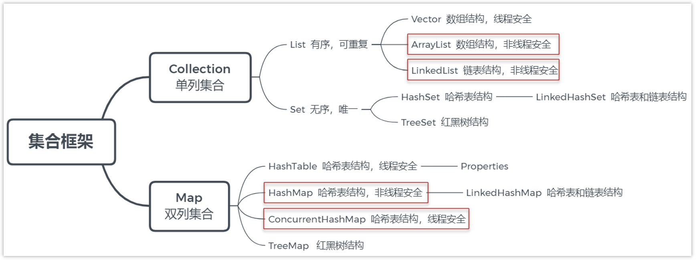

- ArrayList底层实现是数组
- LinkedList底层实现是双向链表
- HashMap的底层实现使用了众多数据结构，包含了数组、链表、散列表、红黑树等

在讲解这些集合之后，我们会讲解数据结构，知道了数据结构的特点之后，熟悉集合就更加简单了。在讲解数据结构之前，我们也会简单普及一下算法复杂度分析，让大家能够评判代码的好坏，也能更加深入去理解数据结构和集合。

## 1 算法复杂度分析

### 1.1 为什么要进行复杂度分析？

我们先来看下面这个代码，你能评判这个代码的好坏吗？

```java
/**
 ** *求**1~n**的累加和
 ** @param* *n
 ** @return
*/
public int sum(int n) {
   int sum = 0;
   for ( int i = 1; i <= n; i++) {
     sum = sum + i;
   }
   return sum;
}
```

其实学习算法复杂度的好处就是：

- 指导你编写出性能更优的代码

- 评判别人写的代码的好坏

>相信你学完了算法复杂度分析，就有能力评判上面代码的好坏了

关于算法复杂度分析，包含了两个内容，一个是时间复杂度，一个是空间复杂度，通常情况下说复杂度，都是指时间复杂度，我们也会重点讲解时间复杂度、


> 时间复杂度--评估代码耗时
>
> 空间复杂度--指代码运行所需要占用的内存空间


### 1.2 时间复杂度

#### 1.2.1 案例

`时间复杂度分析`：简单来说就是评估`代码的执行耗时`的，大家还是看刚才的代码：

```java
/**
 ** *求**1~n**的累加和
 ** @param* *n
 ** @return
*/
public int sum(int n) {
   int sum = 0;
   for ( int i = 1; i <= n; i++) {
     sum = sum + i;
   }
   return sum;
}
```

> 在这个例子里，可以看到：
>
> * int sum = 0 、 int i = 1 、return sum   这三行是固定的三行代码
> * i <= n 、 i++ 、 sum = sum + i  这三行代码是不一样的，是和n值有关的。n有多大，这个for循环就要执行多少次，这三行代码就要跟着执行多少次。
>   * 比如说n是10，那么for循环要执行10次，这三行代码也要执行10次

分析这个代码的时间复杂度，分析过程如下：

1.假如每行代码的执行耗时一样：1ms

2.分析这段代码总执行多少行？3n+3

3.代码耗时总时间： T(n) = (3n + 3) * 1ms

>T(n):就是代码总耗时

我们现在有了总耗时，需要借助大O表示法来计算这个代码的时间复杂度

#### 1.2.2 大O表示法

**大O表示法**：不具体表示代码真正的执行时间，而是表示**代码执行时间随数据规模增长的变化趋势**。

刚才的代码示例总耗时公式为：T(n) = (3n + 3) * 1ms

>其中 (3n + 3) 是代码的总行数，每行执行的时间都一样，所以得出结论：
>
>**T(n)与代码的执行次数成正比(代码行数越多，执行时间越长)**

不过，大O表示法只需要代码执行时间与数据规模的增长趋势，公式可以简化如下：

T(n) =O(3n + 3)------------> T(n) = O(n)

>当n很大时，公式中的低阶，常量，系数三部分并不左右其增长趋势，因此可以忽略，我们只需要记录一个最大的量级就可以了

下图也能表明数据的趋势

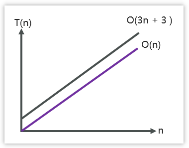

#### 1.2.3 常见复杂度表示形式

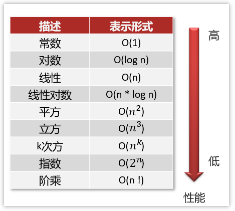

速记口诀：**常对幂指阶**

越在上面的性能就越高，越往下性能就越低

下图是一些比较常见时间复杂度的时间与数据规模的趋势：

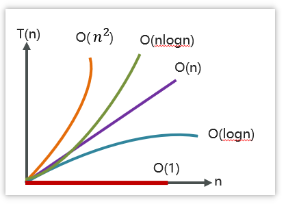

#### 1.2.4 时间复杂度O(1)

实例代码：

```java
public int test01(int n){
    int i=0;
    int j = 1;
    return i+j;
}
```

代码只有三行，它的复杂度也是O(1)，而不是O(3)

再看如下代码：

```java
public void test02(int n){
    int i=0;
    int sum=0;
    for(;i<100;i++){
        sum = sum+i;
    }
    System.out.println(sum);
}
```

整个代码中因为循环次数是固定的就是100次，这样的代码复杂度我们认为也是O(1)

一句话总结：**只要代码的执行时间不随着n的增大而增大，这样的代码复杂度都是O(1)**

#### 1.2.5 时间复杂度O(n)

实例代码1：

```java
/**
 * 求1~n的累加和
 * @param n
 * @return
 */
public int sum(int n) {
    int sum = 0;
    for ( int i = 1; i <= n; i++) {
        sum = sum + i;
    }
    return sum;
}
```

一层for循序时间复杂度就是O(n)

实例代码2：

```java
public static int sum2(int n){
    int sum = 0;
    for (int i = 1; i < n; ++i) {
        for (int j = 1; j < n; ++j) {
            sum = sum + i * j;
        }
    }
    return sum;
}
```

这个代码的`执行行数`为：O( 3n^2  + 3n + 3 )，不过，依据大O表示的规则：**常量、系数、低阶，可以忽略**

所以这个代码最终的时间复杂度为：O(n^2)


> 来，把每一行执行了多少次数一遍，就能对上 `3n² + 3n + 3`。
>
> 
>
> 🔹**逐行统计**
>
> ```java
> public int sum2(int n) {
>     int sum = 0;                              // ① 执行 1 次
>     for (int i=1; i <= n; ++i) {              // ② 外循环跑 n 次
>         for (int j=1; j <= n; ++j) {          // ③ 内循环每次外循环跑 n 次
>             sum = sum + i * j;                // ④ 内循环体
>         }
>     }
>     return sum;
> }
> ```
>
> | 语句                | 执行次数 | 备注                              |
> | ------------------- | -------- | --------------------------------- |
> | `int sum = 0`       | `1`      | 只进入一次                        |
> | `int i = 1`         | `1`      | 外循环初始化，只 1 次             |
> | `i <= n`            | `n + 1`  | 判断 n 次 + 最后 1 次失败才退出   |
> | `++i`               | `n`      | 外循环每次进位                    |
> | `int j = 1`         | `n`      | 内循环初始化，外循环每轮执行 1 次 |
> | `j <= n`            | `n(n+1)` | 外循环 n 轮 × 内循环判断 n+1 次   |
> | `++j`               | `n²`     | 每次内循环都进位                  |
> | `sum = sum + i * j` | `n²`     | 内循环体                          |
>
> 
>
> 🔹**加起来**
> $$
> T(n) = 1 + 1 + (n+1) + n + n + n(n+1) + n^2 + n^2
> $$
>
> 合项整理：
>
> - **n² 项**：`n²`（`++j`） + `n²`（内循环体） + `n²`（来自 `n(n+1)` 展开） = `3n²`
> - **n 项**：`1`（`i<=n`）+ `n`（`++i`）+ `n`（`int j=1`）+ `n`（`n(n+1)` 展开） = `3n`
> - **常数项**：`1`（`sum=0`）+ `1`（`i=1`）+ `1`（`i<=n` 末尾那次） = `3`
>
> 所以：
> $$
> T(n) = 3n^2 + 3n + 3
> $$
>
> 🔹**这是 O(…)**
>
> 大 O 只看**最高阶项**并忽略系数：
>
> $$
> O(3n^2 + 3n + 3) = O(n^2)
> $$
>
> 所以这个 `sum2` 是 **平方阶**算法，跟你看到的 `O(n²)` 是一致的——`3n² + 3n + 3` 是把每一句的真实执行次数全列出来得到的精确计数，化简后就只剩 `n²` 这一项了。

#### 1.2.6 时间复杂度O(logn)

对数复杂度非常的常见，但相对比较难以分析，实例代码：

```java
public void test04(int n){
    int i=1;
    while(i<=n){
        i = i * 2;
    }
}
```

分析这个代码的复杂度，我们必须要再强调一个前提：**复杂度分析就是要弄清楚代码的执行次数和数据规模n之间的关系**

以上代码最关键的一行是：`i = i * 2`，这行代码可以决定这个while循环执行代码的行数，`i`的值是可以无限接近`n`的值的。如果`i` 一旦大于等于了`n`则循环条件就不满足了。也就说达到了最大的行数。我们可以分析一下`i`这个值变化的过程

分析过程如下：

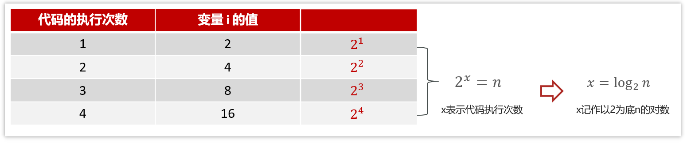

由此可知，代码的时间复杂度表示为O(log n)

#### 1.2.7 时间复杂度O(n * log n)

分析完O( log n )，那O( n * log n )就很容易理解了，比如下列代码：

```java
public void test05(int n){
    int i=0;
    for(;i<=n;i++){
        test04(n);
    }
}

public void test04(int n){
    int i=1;
    while(i<=n){
        i = i * 2;
    }
}
```

### 1.3 空间复杂度

空间复杂度全称是渐进空间复杂度，表示算法占用的额外**存储空间**与**数据规模**之间的增长关系

看下面代码

```java
public void test(int n){
    int i=0;
    int sum=0;
    for(;i<n;i++){
        sum = sum+i;
    }
    System.out.println(sum);
}
```

`代码执行并不需要占用额外的存储空间，只需要常量级的内存空间大小，因此空间复杂度是O(1)`


再来看一个其他例子：

```java
void print(int n) {
    int i = 0;
    int[] a = new int[n];
    for (i; i <n; ++i) {
        a[i] = i * i;
    }
    for (i = n-1; i >= 0; --i) {
        System.out.println(a[i]);
    }
}
```

传入一个变量n，决定申请多少的int数组空间内存，此段代码的`空间复杂度为O(n)`

我们常见的空间复杂度就是O(1),O(n),O(n ^2)，其他像对数阶的复杂度几乎用不到，因此空间复杂度比时间复杂度分析要简单的多。

> 这个方法的**空间复杂度是 O(n)**。
>
> 
>
> 🔹**逐行看占用的空间**
>
> ```java
> void print(int n) {
>     int i = 0;                  // ① 1 个 int 变量
>     int[] a = new int[n];       // ② 一个长度为 n 的 int 数组（重点）
>     for (i; i < n; ++i) {
>         a[i] = i * i;           // ③ 不新增空间，只是写数组
>     }
>     for (i = n-1; i >= 0; --i) {
>         System.out.println(a[i]); // ④ 只读取，不新增空间
>     }
> }
> ```
>
> | 占用项                 | 空间                 |
> | ---------------------- | -------------------- |
> | `int i`                | O(1)（1 个 int）     |
> | `int[] a = new int[n]` | **O(n)**（n 个 int） |
> | 两个循环               | 不额外分配空间       |
>
> 🔹**合起来**
> $$
> \text{Space} = O(1) + O(n) = O(n)
> $$
>
> 
>
> 🔹**几个要点**
>
> 1. **关键在数组 `a`**。不管 n 多大，方法里真正"跟着 n 长大"的只有这个数组——它存了 n 个整数，所以空间随 n 线性增长，就是 `O(n)`。
> 2. **循环变量 i 是常数级**。只有 1 个 int，跟 n 无关，记为 O(1)，被 O(n) 盖掉了。
> 3. **`System.out.println` 不计入**。它只是把数据输出出去，没有在算法内部再开辟跟 n 相关的缓冲区，分析时忽略。
> 4. 顺便区分一下：这段代码的**时间复杂度是 O(n)**（两个并列的 for 循环，各跑 n 次），但**空间复杂度是 O(n)**（因为开了一个大小为 n 的数组）。两者不一样，别搞混。
>
> 一句话总结：这个方法是**线性空间 O(n)**——它用了一个和输入规模成正比的数组。

## 2 List相关面试题

### 2.1 数组

#### 2.1.1 数组概述

数组（Array）是一种用**连续的内存空间**存储**相同数据类型**数据的线性数据结构。

```java
int[] array = {22,33,88,66,55,25};
```

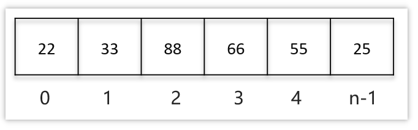

我们定义了这么一个数组之后，在内存的表示是这样的：

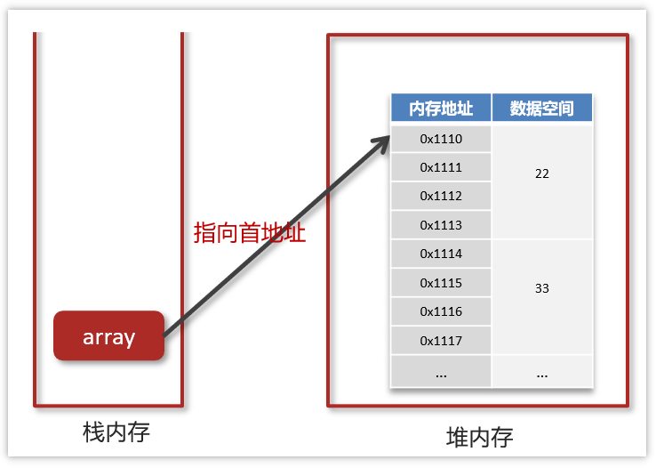

> ⭐**为什么22这个值有四个地址？**
>
> * 每个内存地址只能存 **1 个字节（1 byte = 8 bit）**，而一个 `int` 类型本身就是 **4 个字节（32 bit）**。所以一个整数值天然要占 4 个连续的内存地址。


现在假如，我们通过`arrar[1]`，想要获得下标为1这个元素，但是现在栈内存中指向的堆内存数组的首地址，它是如何获取下标为1这个数据的？

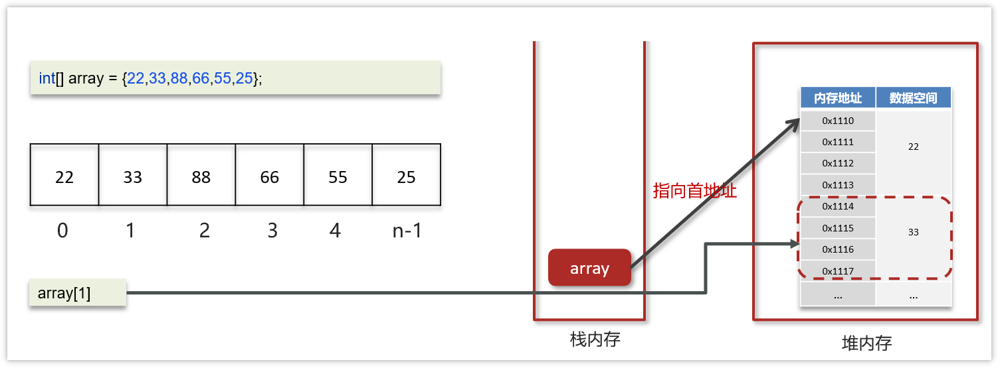

#### 2.1.2 寻址公式

为了方便大家理解，我们把数组的内存地址稍微改了一下，都改成了数字，如下图

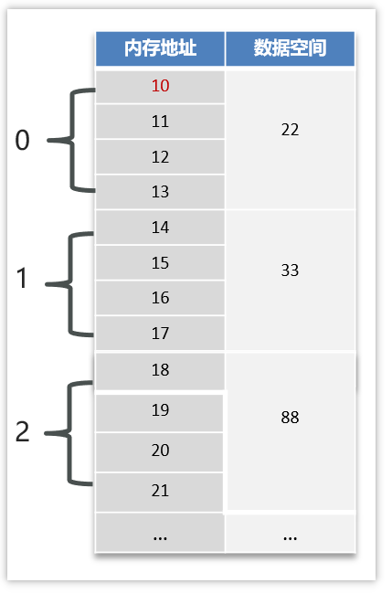

在数组在内存中查找元素的时候，是有一个`寻址公式`的，如下：

```java
arr[i] = baseAddress + i * dataTypeSize
```

>⭐**注意：**
>
>* baseAddress：数组的首地址，目前是10
>
>* dataTypeSize：代表数组中元素类型的大小，目前数组重存储的是int型的数据，dataTypeSize=4个字节
>
>* arr：指的是数组
>
>* i：指的是数组的下标

有了寻址公式以后，我们再来获取一下下标为1的元素，这个是原来的数组

```java
int[] array = {22,33,88,66,55,25};
```

套入公式：

```java
array[1] =10 + i * 4 = 14
```

获取到14这个地址，就能获取到下标为1的这个元素了。


#### 2.1.3 操作数组的时间复杂度

**1.随机查询(根据索引查询)**

数组元素的访问是通过下标来访问的，计算机通过数组的**首地址**和**寻址公式**能够很快速的找到想要访问的元素

```java
public int test01(int[] a,int i){
   return a[i];
   // a[i] = baseAddress + i \* dataSize
}
```

代码的执行次数并不会随着数组的数据规模大小变化而变化，是常数级的，所以查询数据操作的`时间复杂度是O(1)`


**2. 未知索引查询O(n)或O(log2n)**

**情况一：**查找数组内的元素，查找55号数据，遍历数组时间复杂度为O(n)

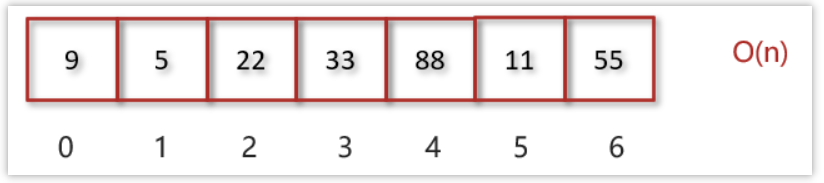

**情况二：**查找`排序后`数组内的元素，通过二分查找算法查找55号数据时间复杂度为O(logn)

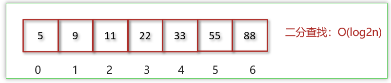

> ⭐**为什么情况一时间复杂度为O(n)？**
>
> * 最坏情况（55 在末尾，或根本不存在）：要比 **n 次**
> * 平均情况：要比约 **n/2 次**
> * 最好情况（恰巧在第一个）：只要 1 次
>
> 
>
> **大 O 看的是渐进上界**
>
> * 大 O 记号描述「当 n 很大时，步数随 n 增长的速度」。最好 1 次、平均 n/2 次、最坏 n 次——**这些都与 n 成线性关系**，常数倍（比如 ÷2）在 O 记号里被忽略。所以不管哪种情况，都记作 **O(n)**。
> * 为什么不能是 O(1)？因为 O(1) 要求「无论 n 多大，步数都不变」。而线性查找的步数会随 n 一起涨，所以永远到不了 O(1)。
>
> 
>
> `一句话总结`
>
> * 因为「按值找」没有捷径可走，只能从左到右逐个试，最多试 n 个，比较次数和 n 成正比，所以时间复杂度是 **O(n)**。如果想做到 O(1)，得换成哈希表（用空间换时间）。


**3.插入O(n)**

数组是一段连续的内存空间，因此为了保证数组的连续性会使得数组的插入和删除的效率变的很低。

假设数组的长度为 n，现在如果我们需要将一个数据插入到数组中的第 k 个位置。为了把第 k 个位置腾出来给新来的数据，我们需要将第 k～n 这部分的元素都顺序地往后挪一位。如下图所示：

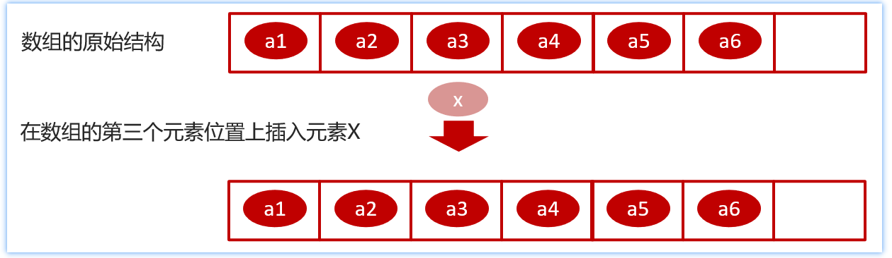

新增之后的数据变化，如下

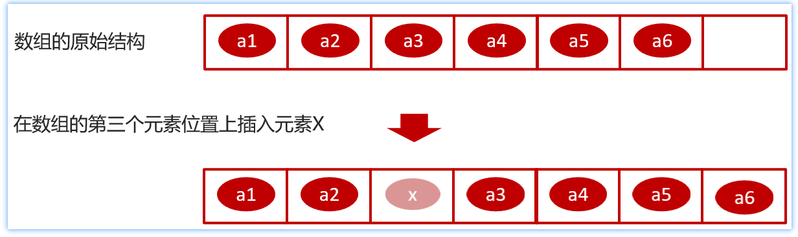

所以：

插入操作，最好情况下是O(1)的，最坏情况下是O(n)的，**平均情况下的时间复杂度是O(n)**。


> ⭐**插入示例代码**
>
> ~~~java
> public static int[] insertAt(int[] arr, int k, int x) { // 在数组下标 k 处插入元素 x
>     int n = arr.length; // 获取原数组长度 n
>     int[] newArr = new int[n + 1]; // 创建一个长度为 n + 1 的新数组
> 
>     for (int i = 0; i < k; i++) { // 复制插入位置前的 k 个元素
>         newArr[i] = arr[i]; // 将原数组元素复制到新数组
>     }
> 
>     newArr[k] = x; // 在下标 k 处放入新元素 x
> 
>     for (int i = k; i < n; i++) { // 复制插入位置后的剩余元素
>         newArr[i + 1] = arr[i]; // 元素在新数组中向后移动一位
>     }
> 
>     return newArr; // 返回插入后的新数组
> }
> ~~~
>
> 
>
> ⭐**那要是这样写的话，比如说arr长度是10，那在下标9处插入元素，时间复杂度也是O(n)？**
>
> 对，按你这段代码的写法，在下标 `9` 插入时也是 `O(n)`。
>
> 因为它每次都会创建一个新数组 `new int[n + 1]`，并复制原数组元素：
>
> ```java
> for (int i = 0; i < k; i++) { // 复制前面的元素
>     newArr[i] = arr[i];
> }
> ```
>
> 例如 `n = 10`、`k = 9`：
>
> - 第一个循环复制 `9` 次
> - 第二个循环复制 `1` 次
> - 总共复制 `10` 次，约为 `n` 次
>
> 即使在末尾插入，即 `k = 10`，第一个循环也要复制 `10` 个元素，所以仍然是 `O(n)`。
>
> 只有数组本身还有预留空间、并且`直接在末尾赋值时`，末尾插入才可能是 `O(1)`。


**4.删除O(n)**

同理可得：如果我们要删除第 k 个位置的数据，为了内存的连续性，也需要搬移数据，不然中间就会出现空洞，内存就不连续了，时间复杂度仍然是O(n)。


#### 2.1.4.小结

1. 数组（Array）是一种用连续的内存空间存储相同数据类型数据的线性数据结构。
2. 数组下标为什么从0开始
   * 寻址公式是：baseAddress+ i * dataTypeSize，计算下标的内存地址效率较高
3. 查找的时间复杂度

   - 随机（通过下标）查询的时间复杂度是O(1)
   - 查找元素（未知下标）的时间复杂度是O(n)
   - 查找元素（未知下标但排序）通过二分查找的时间复杂度是O(logn)
4. 插入和删除时间复杂度
   * 插入和删除的时候，为了保证数组的内存连续性，需要挪动数组元素，平均时间复杂度为O(n)

### 2.2 ArrayList源码分析

分析ArrayList源码主要从三个方面去翻阅：成员变量，构造函数，关键方法

>以下源码都来源于jdk1.8

#### 2.2.1 成员变量


>*DEFAULT_CAPACITY* = 10; 
>
>* 默认初始的容量(CAPACITY)
>
>*EMPTY_ELEMENTDATA* = {}; 
>
>* 用于空实例的共享空数组实例
>
>*DEFAULTCAPACITY_EMPTY_ELEMENTDATA* = {};
>
>* 用于默认大小的空实例的共享空数组实例
>
>Object[] elementData;  
>
>* 存储元素的数组缓冲区
>
>int size;   
>
>* ArrayList的大小（它包含的元素数量）

#### 2.2.2 构造方法

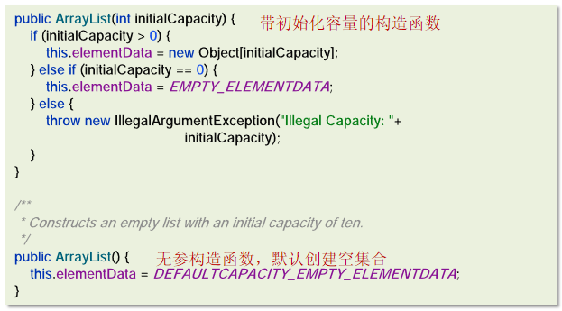

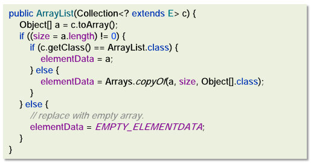

>**有三个构造函数：**
>
>- 第一个构造是带初始化容量的构造函数，可以按照指定的容量初始化数组
>
>- 第二个是无参构造函数，默认创建一个空集合

>将collection对象转换成数组，然后将数组的地址的赋给`elementData`


#### 2.2.3 ArrayList源码分析

~~~java
List<Integer> list = new ArrayList<Integer>();
list.add(1);
for (int i = 2; i <= 10; i++) {
    list.add(i);
}
list.add(11);
~~~


添加数据的流程

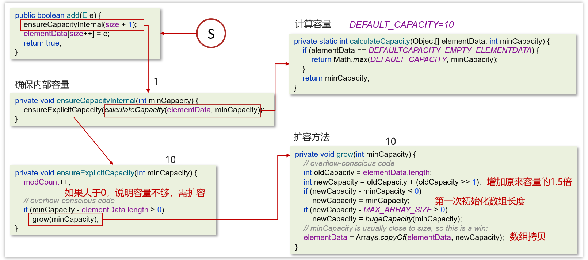

**结论：**

- 底层数据结构
  - ArrayList底层是用动态的数组实现的


- 初始容量
  - ArrayList初始容量为0，当第一次添加数据的时候才会初始化容量为10


- 扩容逻辑
  - ArrayList在进行扩容的时候是原来容量的1.5倍，每次扩容都需要拷贝数组


- 添加逻辑

  - 确保数组已使用长度（size）加1之后足够存下下一个数据 
  - 计算数组的容量，如果当前数组已使用长度+1后的大于当前的数组长度，则调用grow方法扩容（原来的1.5倍）

  - 确保新增的数据有地方存储之后，则将新元素添加到位于size的位置上。
  - 返回添加成功布尔值。


#### 2.2.4 面试题-ArrayList list=new ArrayList(10)中的list扩容几次

>难易程度：☆☆☆
>
>出现频率：☆☆

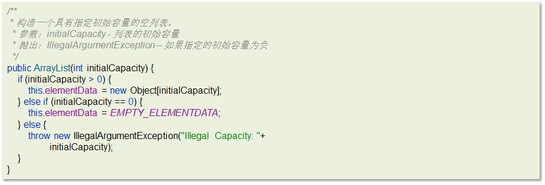

**参考回答：**

* 该语句只是声明和实例了一个 ArrayList，指定了容量为 10，未扩容 

#### 2.2.4 面试题-如何实现数组和List之间的转换

>难易程度：☆☆☆
>
>出现频率：☆☆

如下代码：

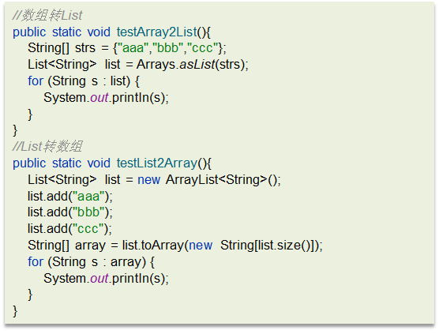

参考回答：

- 数组转List ，使用JDK中java.util.Arrays工具类的asList方法

- List转数组，使用List的toArray方法。无参toArray方法返回 Object数组，传入初始化长度的数组对象，返回该对象数组

面试官再问：

1，用Arrays.asList转List后，如果修改了数组内容，list受影响吗

2，List用toArray转数组后，如果修改了List内容，数组受影响吗

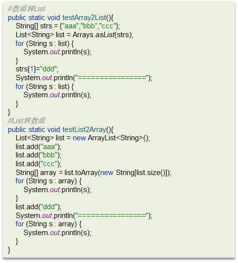

>数组转List受影响
>
>List转数组不受影响

再答：

1，用Arrays.asList转List后，如果修改了数组内容，list受影响吗

Arrays.asList转换list之后，如果修改了数组的内容，list会受影响，因为它的底层使用的Arrays类中的一个内部类ArrayList来构造的集合，在这个集合的构造器中，把我们传入的这个集合进行了包装而已，最终指向的都是同一个内存地址

2，List用toArray转数组后，如果修改了List内容，数组受影响吗

list用了toArray转数组后，如果修改了list内容，数组不会影响，当调用了toArray以后，在底层是它是进行了数组的拷贝，跟原来的元素就没啥关系了，所以即使list修改了以后，数组也不受影响

### 2.3 链表

#### 2.3.1 单向链表

- 链表中的每一个元素称之为结点（Node）

- 物理存储单元上，非连续、非顺序的存储结构

- 单向链表：每个结点包括两个部分：一个是存储数据元素的数据域，另一个是存储下一个结点地址的指针域。记录下个结点地址的指针叫作后继指针 next

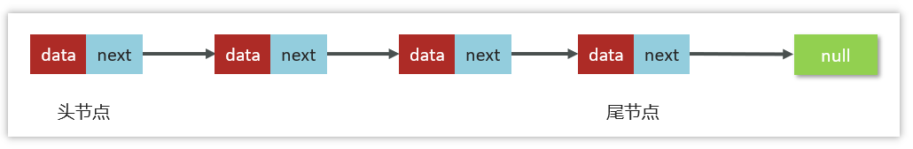

代码实现参考：


链表中的某个节点为B，B的下一个节点为C         表示： B.next==C

#### 2.3.2 单向链表时间复杂度分析

（1）查询操作

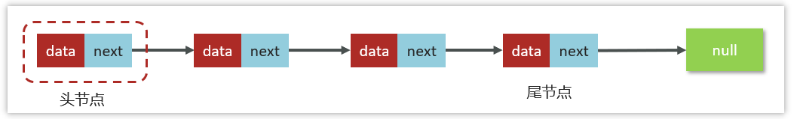

- 只有在查询头节点的时候不需要遍历链表，时间复杂度是O(1)

- 查询其他结点需要遍历链表，时间复杂度是O(n)

（2）插入和删除操作

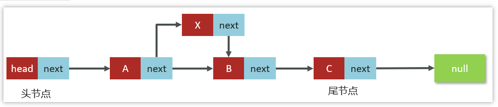

- 只有在添加和删除头节点的时候不需要遍历链表，时间复杂度是O(1)
- 添加或删除其他结点需要遍历链表找到对应节点后，才能完成新增或删除节点，时间复杂度是O(n)

#### 2.3.3 双向链表

而双向链表，顾名思义，它支持两个方向

- 每个结点不止有一个后继指针 next 指向后面的结点

- 有一个前驱指针 prev 指向前面的结点

参考代码

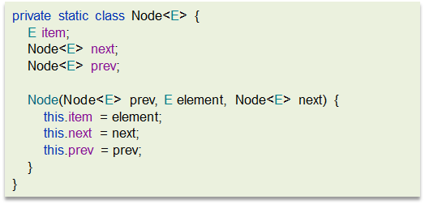

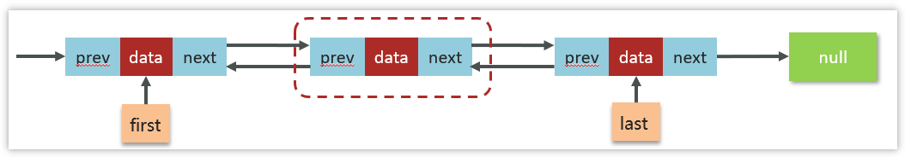

对比单链表：

- 双向链表需要额外的两个空间来存储后继结点和前驱结点的地址

- 支持双向遍历，这样也带来了双向链表操作的灵活性

#### 2.3.4 双向链表时间复杂度分析

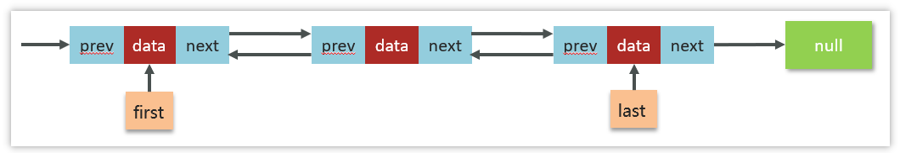

（1）查询操作

- 查询头尾结点的时间复杂度是O(1)

- 平均的查询时间复杂度是O(n)

- 给定节点找前驱节点的时间复杂度为O(1)

（2）增删操作

- 头尾结点增删的时间复杂度为O(1)

- 其他部分结点增删的时间复杂度是 O(n)

- 给定节点增删的时间复杂度为O(1)

#### 2.3.5 面试题-ArrayList和LinkedList的区别是什么？

- 底层数据结构

  - ArrayList 是动态数组的数据结构实现

  - LinkedList 是双向链表的数据结构实现

- 操作数据效率
  - ArrayList按照下标查询的时间复杂度O(1)【内存是连续的，根据寻址公式】， LinkedList不支持下标查询
  - 查找（未知索引）： ArrayList需要遍历，链表也需要链表，时间复杂度都是O(n)
  - 新增和删除
    - ArrayList尾部插入和删除，时间复杂度是O(1)；其他部分增删需要挪动数组，时间复杂度是O(n)
    - LinkedList头尾节点增删时间复杂度是O(1)，其他都需要遍历链表，时间复杂度是O(n)

- 内存空间占用

  - ArrayList底层是数组，内存连续，节省内存

  - LinkedList 是双向链表需要存储数据，和两个指针，更占用内存

- 线程安全
  - ArrayList和LinkedList都不是线程安全的
  - 如果需要保证线程安全，有两种方案：
    - 在方法内使用，局部变量则是线程安全的
    - 使用线程安全的ArrayList和LinkedList

## 3 HashMap相关面试题

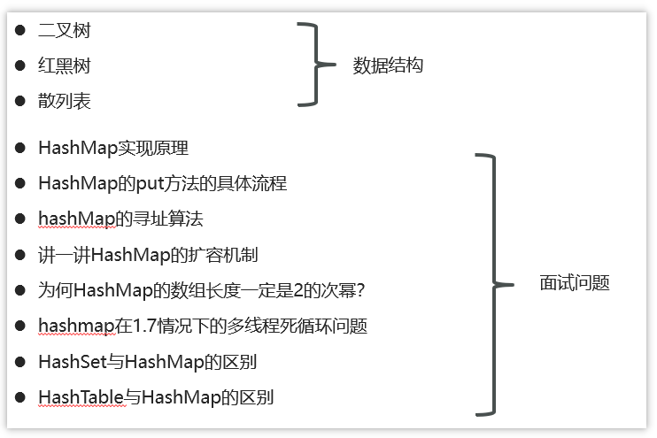

### 3.1 二叉树

#### 3.1.1 二叉树概述

**二叉树**，顾名思义，每个节点最多有两个“叉”，也就是两个子节点，分别是左子节点和右子节点。不过，二叉树并不要求每个节点都有两个子节点，有的节点只有左子节点，有的节点只有右子节点。

二叉树每个节点的`左子树和右子树也分别满足二叉树的定义`。


Java中有`两个方式实现二叉树：数组存储，链式存储`。

基于`链式存储`的树的节点可定义如下：

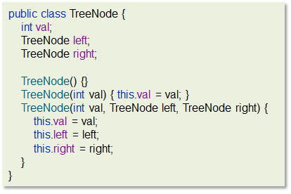


#### 3.1.2 二叉搜索树

在二叉树中，比较常见的二叉树有：

- 满二叉树

- 完全二叉树

- **二叉搜索树**

- **红黑树**

我们重点讲解二叉搜索树和红黑树

（1）二叉搜索树概述

`二叉搜索树(Binary Search Tree,BST)又名二叉查找树，有序二叉树或者排序二叉树`，是二叉树中比较常用的一种类型


二叉查找树要求，在树中的任意一个节点，其左子树中的每个节点的值，都要小于这个节点的值，而右子树节点的值都大于这个节点的值

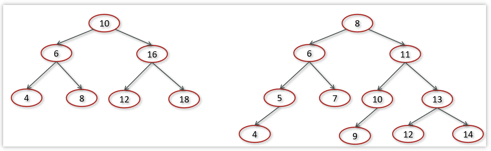

（2）二叉搜索树-**时间复杂度分析**

实际上由于二叉查找树的形态各异，时间复杂度也不尽相同，我画了几棵树我们来看一下插入，查找，删除的时间复杂度


插入，查找，删除的时间复杂度**O(logn)**

> ⭐⭐**注意**
>
> * 如果是根节点，就可以直接定位
> * 如果是第二层，就需要对比1次，第三层，就需要对比2次，以此类推
> * 2的几次方所得到的值就是当前这一层的节点数量
> * 这个2的几次方的次方就是对比的次数


> ⭐⭐`前置条件：`
>
> **二叉搜索树（BST）的查找代码**
>
> ~~~java
> public static TreeNode search(TreeNode root, int x) {
>     while (root != null) {
>         if (x < root.val) {
>             root = root.left;
>         } else if (x > root.val) {
>             root = root.right;
>         } else {
>             return root;
>         }
>     }
>     return null;
> }
> ~~~
>
> 其中：
>
> - `root` 是二叉搜索树根节点，是输入；
> - `x` 是要找的值，是输入；
> - 返回找到的节点；找不到返回 `null`。
>
> 完整函数里，方法声明、参数传入、最终 `return null` 等只执行常数次，记作 `O(1)`；真正会随着数据规模变化的是 `while`。
>
> 
>
> ⭐️⭐️**为什么要用n来代表时间复杂度，你在这里说n是节点数，
> 但在这里又只是随便一个数字,所以说n根本就不是一个统一的变量，而是什么都可以称为n，那这样的话，为什么还要用n来统一代表？**
>
> ~~~java
>  public static int sum2(int n){
>     int sum = 0;
>     for (int i = 1; i < n; ++i) {
>         for (int j = 1; j < n; ++j) {
>             sum = sum + i * j;
>         }
>     }
>     return sum;
> }
> ~~~
>
> 
>
> 对，`n` 不是一个统一的“代码变量”，也不是“时间复杂度专用变量”。它只是算法分析里最常用的数学记号，通常表示：
>
> > **输入规模（input size）**
>
> 它的具体含义必须由题目或分析者先定义。
>
> 你的 `sum2` 中：
>
> ```
> public static int sum2(int n)
> ```
>
> 这里代码参数刚好也叫 `n`，并且循环次数由它决定，所以可以直接定义：
>
> ```
> n = 输入的上界
> T(n) = Θ(n²)
> ```
>
> 而树的查找方法参数是：
>
> ```
> search(TreeNode root, int x)
> ```
>
> 没有叫 `n` 的参数，但我们仍可定义：
>
> ```
> n = root 所代表的树的节点总数
> h = root 所代表的树高
> ```
>
> 这是在描述输入 `root` 的规模，不是在说代码中存在变量 `n`。
>
> 名称完全可以换。下面三种写法表达的是同一件事：
>
> ```java
> T(n) = O(log n)   // n 表示节点数
> T(m) = O(log m)   // m 表示节点数
> T(size) = O(log size)
> ```
>
> 大家习惯用 `n`，只是为了交流方便，类似数学里习惯用 `x` 表示未知数；并不是说任何代码里都必须有一个名为 `n` 的变量。
>
> 
>
> ⭐⭐**上述代码完全没出现树高h，为什么会用树高h来代表时间复杂度，时间复杂度到底是什么？关键点是：**
>
> 
>
> > `时间复杂度不是看代码里有没有写出某个字母，而是看代码实际执行了多少次基本操作。`
>
> 这段代码的输入不是一个普通整数，而是一棵树：
>
> ```
> search(TreeNode root, int x)
> ```
>
> `root` 虽然只是一个引用，但它指向的数据包含很多结构信息：
>
> ```
> 节点数 n
> 树高 h
> 目标节点所在深度 d
> ```
>
> `代码每次循环只做一件事：从当前节点走到下一层。`
>
> ```java
> root = root.left;
> // 或
> root = root.right;
> ```
>
> 假设要查找的节点在第 `d` 层，那么循环大约执行 `d` 次：
>
> ```
> 实际运行时间 T(root, x) = O(d)
> ```
>
> 因为目标节点最多不会超过树高，所以：
>
> ```java
> d <= h
> ```
>
> 因此，在分析最坏情况时：
>
> ```java
> T(root, x) = O(h)
> ```
>
> 这里的 `h` 不是代码中的变量，而是**对输入树结构的描述**。就像下面的代码中没有写 `length`，我们仍然可以用数组长度分析：
>
> ```java
> int find(int[] arr, int x) {
>     for (int value : arr) {
>         if (value == x) return value;
>     }
>     return -1;
> }
> ```
>
> `arr` 是参数，`arr.length` 是输入的属性。循环次数最多是 `arr.length`，所以复杂度是 `O(n)`，即使代码里没有变量 `n`。
>
> 同理：
>
> ```
> root 是输入
> h 是 root 所指向树的高度
> 循环最多执行 h 次
> 所以查找复杂度是 O(h)
> ```
>
> 如果进一步知道这是一棵平衡树，并且树中有 `n` 个节点：
>
> ```
> h = O(log n)
> ```
>
> 于是才得到：
>
> ```
> 平衡 BST 查找：O(h) = O(log n)
> ```
>
> 因此完整的分析过程是：
>
> ```
> 代码实际执行次数：由循环次数决定
> 循环次数：最多沿树的一条路径走 h 层
> 所以：O(h)
> 平衡树的高度：h = O(log n)
> 所以：O(log n)
> ```
>
> 还要注意不同情况：
>
> ```
> 目标就在根节点：最好情况 O(1)
> 目标在较深位置：O(d)
> 最坏需要走到最深叶子：O(h)
> 平衡树中：O(log n)
> 退化成链表时：O(n)
> ```
>
> 所以“时间复杂度”本质上是：**随着输入规模或输入结构变化，程序执行的基本操作次数如何增长**。`h`、`n` 等只是用来描述输入的数学参数，不要求它们必须出现在代码里。

> ⭐**为什么二叉搜索树时间复杂度是log2n ？**
>
> 
>
> 图中假设二叉搜索树是**平衡的**，每一层节点数量大约翻倍：
>
> ```
> 第 0 层：1 个节点 = 2^0
> 第 1 层：2 个节点 = 2^1
> 第 2 层：4 个节点 = 2^2
> 第 h 层：2^h 个节点
> ```
>
> 如果树高为 `h`，最多能容纳约 `2^h` 个节点：
>
> ```
> 2^h ≈ n
> ```
>
> 两边取对数：
>
> ```
> h ≈ log₂n
> ```
>
> 搜索、插入和删除时，每次只选择左子树或右子树，相当于每次排除一半节点，最多沿着树高走 `h` 层，因此时间复杂度是：
>
> ```
> O(log₂n)
> ```
>
> 通常写成：
>
> ```
> O(log n)
> ```
>
> 因为对数的底数只差一个常数，不影响大 O 表示。
>
> 需要注意：只有树比较平衡时才是 `O(log n)`。如果二叉搜索树退化成链表：
>
> ```
> 10
>   \
>    16
>      \
>       18
> ```
>
> 每次只能向下走一个节点，时间复杂度会退化为 `O(n)`。


> ⭐**有个问题，就是时间复杂度不是通过代码看出来的吗，为什么可以直接通过一个图看出来？**
>
> 
>
> 时间复杂度本质上看的是：**随着输入规模 `n` 增大，算法执行的关键操作次数如何增长**。代码和图只是两种不同的分析方式。
>
> 对二叉搜索树，代码通常是这样的：
>
> ```
> while (node != null) {
>     if (target < node.value) {
>         node = node.left;   // 走左边
>     } else if (target > node.value) {
>         node = node.right;  // 走右边
>     } else {
>         return node;
>     }
> }
> ```
>
> 单看代码，你会发现循环次数取决于什么？
>
> 取决于从根节点走到目标节点要走多少层，也就是树高 `h`：
>
> ```
> 循环次数 = 树高 h
> 时间复杂度 = O(h)
> ```
>
> 这时图的作用是帮你推导 `h` 和节点总数 `n` 的关系。
>
> 平衡二叉树每层节点数翻倍：
>
> ```
> 第 0 层：1 = 2^0
> 第 1 层：2 = 2^1
> 第 2 层：4 = 2^2
> ...
> 第 h 层：2^h
> ```
>
> 所以一棵高度约为 `h` 的平衡树，节点总数约为：
>
> ```
> n ≈ 2^h
> ```
>
> 反推得到：
>
> ```
> h ≈ log₂n
> ```
>
> 代回代码分析：
>
> ```
> O(h) = O(log₂n) = O(log n)
> ```
>
> 所以不是“只通过图就凭空判断 `O(log n)`”，而是：
>
> ```
> 代码决定：执行次数 = 树高 h
> 图决定：平衡时树高 h = log₂n
> 结论：时间复杂度 = O(log n)
> ```
>
> 同一段代码放在退化成链表的二叉搜索树中，树高 `h = n`，时间复杂度就变成 `O(n)`。

极端情况下二叉搜索的时间复杂度

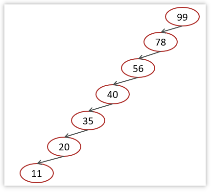

对于图中这种情况属于最坏的情况，二叉查找树已经退化成了链表，左右子树极度不平衡，此时查找的时间复杂度肯定是`O(n)`。


##### 3.1.2.1.总结

1. **什么是二叉树**

   - 每个节点最多有两个"叉"，分别是左子节点和右子节点。

   - 不要求每个节点都有两个子节点，有的节点只有左子节点，有的节点只有右子节点。

   - 二叉树每个节点的左子树和右子树也分别满足二叉树的定义

2. **什么是二叉搜索树**

   - 二叉搜索树(Binary Search Tree, BST) 又名二叉查找树，有序二叉树

   - 在树中的任意一个节点，其左子树中的每个节点的值，都要小于这个节点的值，而右子树节点的值都大于这个节点的值

   - 没有键值相等的节点

   - 通常情况下二叉树搜索的时间复杂度为 O(logn)

#### 3.1.3 红黑树

（1）概述

* **红黑树（Red Black Tree）**：也是一种自平衡的二叉搜索树(BST)，之前叫做平衡二叉B树（Symmetric Binary B-Tree）

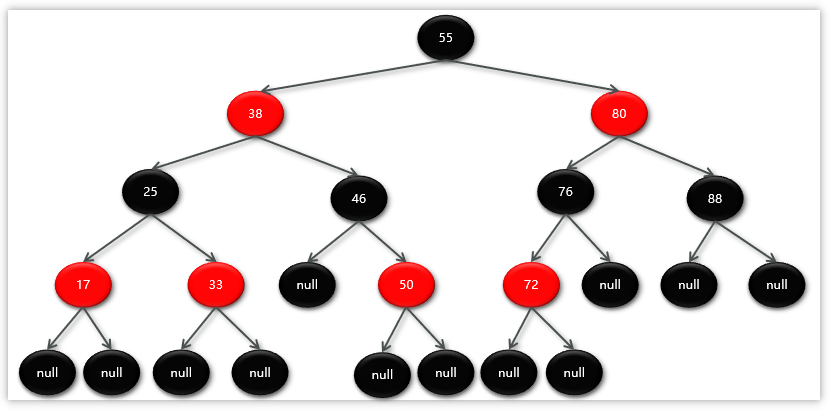

⭐⭐（2）**红黑树的特质**

* `性质1：`节点要么是**红色**,要么是**黑色**
* `性质2：`根节点是**黑色**
* `性质3：`叶子节点都是黑色的空节点
* `性质4：`红黑树中红色节点的子节点都是黑色
* `性质5：`从任一节点到叶子节点的所有路径都包含相同数目的黑色节点

> **在添加或删除节点的时候，如果不符合这些性质会发生旋转，以达到所有的性质，`保证红黑树的平衡`**

> 这个值为null的也算是黑色节点

（3）红黑树的复杂度

- 查找：
  - 红黑树也是一棵BST（二叉搜索树）树，查找操作的时间复杂度为：`O(log n)`

- 添加：
  - 添加先要从根节点开始找到元素添加的位置，时间复杂度`O(log n)`
  - 添加完成后涉及到复杂度为O(1)的旋转调整操作
  - 故整体复杂度为：`O(log n)`

- 删除：
  - 首先从根节点开始找到被删除元素的位置，时间复杂度O(log n)
  - 删除完成后涉及到复杂度为O(1)的旋转调整操作
  - 故整体复杂度为：`O(log n)`


##### 3.1.3.1.总结

**什么是红黑树？**

- 红黑树（Red Black Tree）：也是一种自平衡的二叉搜索树（BST）
- 所有的红黑规则都是希望红黑树能够保证平衡
- 红黑树的时间复杂度：查找、添加、删除都是 O(logn)

### 3.2 散列表

在HashMap中的最重要的一个数据结构就是散列表，在散列表中又使用到了红黑树和链表

#### 3.2.1 散列表（Hash Table）概述

散列表(Hash Table)又名`哈希表`/Hash表，是`根据键（Key）直接访问`在内存存储位置`值（Value）`的数据结构，它是`由数组演化而来`的，利用了数组支持按照下标进行随机访问数据的特性

举个例子：

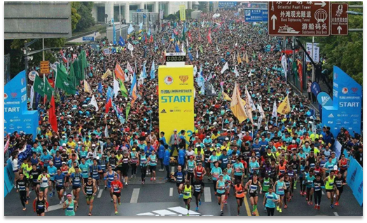

假设有100个人参加马拉松，编号是1-100，如果要编程实现根据选手的编号迅速找到选手信息？


可以把选手信息存入数组中，选手编号就是数组的下标，数组的元素就是选手的信息。

当我们查询选手信息的时候，只需要根据选手的编号到数组中查询对应的元素就可以快速找到选手的信息，如下图：


现在需求升级了：

假设有100个人参加马拉松，`不采用1-100`的自然数对选手进行编号，编号有一定的规则比如：2023ZHBJ001，其中2023代表年份，ZH代表中国，BJ代表北京，001代表原来的编号，那此时的编号2023ZHBJ001不能直接作为数组的下标，此时应该如何实现呢？


我们目前是把选手的信息存入到数组中，不过选手的编号不能直接作为数组的下标，不过，可以把选手的选号进行转换，转换为数值就可以继续作为数组的下标了？

转换可以使用散列函数进行转换

#### 3.2.2 散列函数和散列冲突

`将键(key)映射为数组下标的函数叫做散列函数`。可以表示为：`hashValue = hash(key)`


**散列函数的基本要求：**

- 散列函数计算得到的散列值必须是大于等于0的正整数，因为hashValue需要作为数组的下标。

- 如果key1==key2，那么经过hash后得到的哈希值也必相同即：hash(key1) == hash(key2）

- **如果key1 != key2，那么经过hash后得到的哈希值也必不相同即：hash(key1) != hash(key2)**


实际的情况下想找一个散列函数能够做到对于不同的key计算得到的散列值都不同几乎是不可能的，即便像著名的MD5,SHA等哈希算法也无法避免这一情况，这就是`散列冲突(或者哈希冲突，哈希碰撞，就是指多个key映射到同一个数组下标位置)`

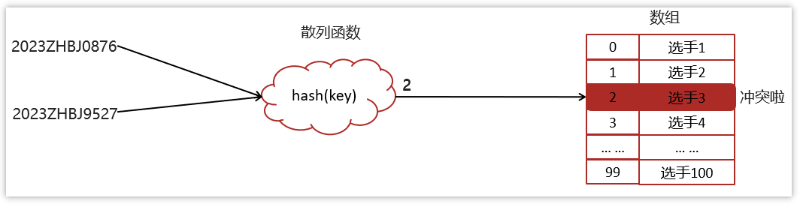

#### 3.2.3 散列冲突-链表法（拉链）

在散列表中，数组的每个下标位置我们可以称之为`桶（bucket）`或者`槽（slot）`，每个桶(槽)会对应一条链表，所有散列值相同的元素我们都放到相同槽位对应的链表中。

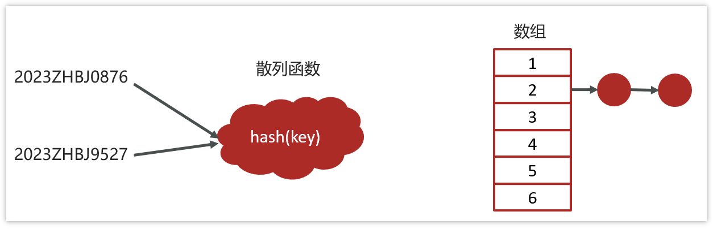

简单就是，如果有多个key最终的hash值是一样的，就会存入数组的同一个下标中，下标中挂一个链表存入多个数据

#### 3.2.4 时间复杂度-散列表

1. 插入操作，通过散列函数计算出对应的散列槽位，将其插入到对应链表中即可，插入的`时间复杂度是 O(1)`

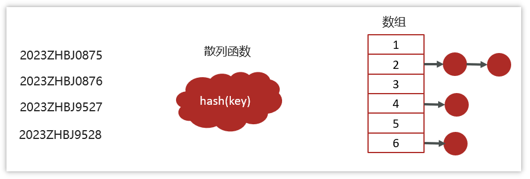

>通过计算就可以找到元素

2. 当`查找、删除`一个元素时，我们同样通过散列函数计算出对应的槽，然后遍历链表查找或者删除

   - 平均情况下基于链表法解决冲突时查询的时间复杂度是O(1)


   - 散列表可能会退化为链表,查询的时间复杂度就从 O(1) 退化为 O(n)


- 将链表法中的链表改造为其他高效的动态数据结构，比如红黑树，查询的时间复杂度是 O(logn)

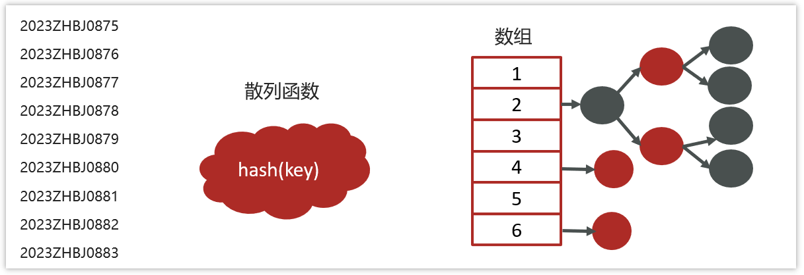

将链表法中的**链表改造红黑树**还有一个非常重要的原因，可以`防止DDos攻击`

>**DDos 攻击:**
>
>* 分布式拒绝服务攻击(英文意思是Distributed Denial of Service，简称DDoS）
>* 指处于不同位置的多个攻击者同时向一个或数个目标发动攻击，或者一个攻击者控制了位于不同位置的多台机器并利用这些机器对受害者同时实施攻击。由于攻击的发出点是分布在不同地方的，这类攻击称为分布式拒绝服务攻击，其中的攻击者可以有多个


#### 3.2.5 总结

1. 什么是散列表？

   - 散列表（Hash Table）又名哈希表/Hash 表

   - 根据键（Key）直接访问在内存存储位置值（Value）的数据结构

   - 由数组演化而来的，利用了数组支持按照下标进行随机访问数据

2. 散列冲突

   - 散列冲突又称哈希冲突，哈希碰撞

   - 指多个 key 映射到同一个数组下标位置

3. 散列冲突-链址法（拉链）

   - 数组的每个下标位置称之为桶（bucket）或者槽（slot）

   - 每个桶(槽)会对应一条链表

   - hash 冲突后的元素都放到相同槽位对应的链表中或红黑树中


### 3.3 面试题-说一下HashMap的实现原理？

HashMap的数据结构： 底层使用hash表数据结构，即数组和链表或红黑树

1. 当我们往HashMap中put元素时，利用key的hashCode重新hash计算出当前对象的元素在数组中的下标 

2. 存储时，如果出现hash值相同的key，此时有两种情况。

  a. 如果key相同，则覆盖原始值；

  b. 如果key不同（出现冲突），则将当前的key-value放入链表或红黑树中 

3. 获取时，直接找到hash值对应的下标，在进一步判断key是否相同，从而找到对应值。

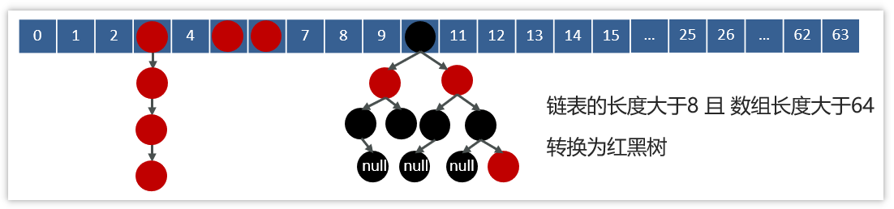

面试官追问：HashMap的jdk1.7和jdk1.8有什么区别

- JDK1.8之前采用的是拉链法。拉链法：将链表和数组相结合。也就是说创建一个链表数组，数组中每一格就是一个链表。若遇到哈希冲突，则将冲突的值加到链表中即可。

- jdk1.8在解决哈希冲突时有了较大的变化，当链表长度大于阈值（默认为8） 时并且数组长度达到64时，将链表转化为红黑树，以减少搜索时间。扩容 resize( ) 时，红黑树拆分成的树的结点数小于等于临界值6个，则退化成链表

### 3.4 面试题-HashMap的put方法的具体流程

#### 3.4.1 hashMap常见属性

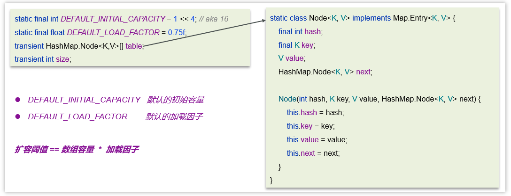

#### 3.4.2 源码分析

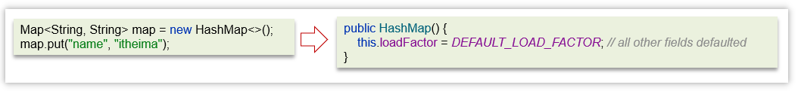

- HashMap是懒惰加载，在创建对象时并没有初始化数组

- 在无参的构造函数中，设置了默认的加载因子是0.75

添加数据流程图

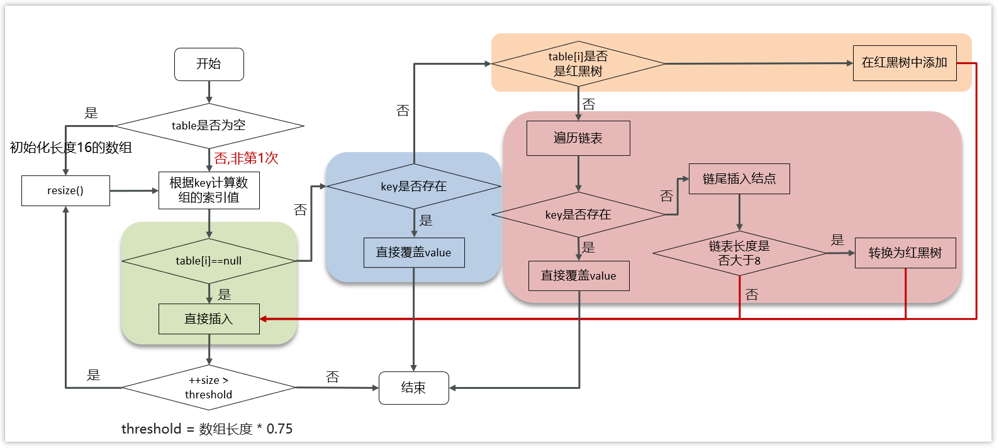

具体的源码：

```java
public V put(K key, V value) {
    return putVal(hash(key), key, value, false, true);
}

final V putVal(int hash, K key, V value, boolean onlyIfAbsent,
                   boolean evict) {
    Node<K,V>[] tab; Node<K,V> p; int n, i;
    //判断数组是否未初始化
    if ((tab = table) == null || (n = tab.length) == 0)
        //如果未初始化，调用resize方法 进行初始化
        n = (tab = resize()).length;
    //通过 & 运算求出该数据（key）的数组下标并判断该下标位置是否有数据
    if ((p = tab[i = (n - 1) & hash]) == null)
        //如果没有，直接将数据放在该下标位置
        tab[i] = newNode(hash, key, value, null);
    //该数组下标有数据的情况
    else {
        Node<K,V> e; K k;
        //判断该位置数据的key和新来的数据是否一样
        if (p.hash == hash &&
            ((k = p.key) == key || (key != null && key.equals(k))))
            //如果一样，证明为修改操作，该节点的数据赋值给e,后边会用到
            e = p;
        //判断是不是红黑树
        else if (p instanceof TreeNode)
            //如果是红黑树的话，进行红黑树的操作
            e = ((TreeNode<K,V>)p).putTreeVal(this, tab, hash, key, value);
        //新数据和当前数组既不相同，也不是红黑树节点，证明是链表
        else {
            //遍历链表
            for (int binCount = 0; ; ++binCount) {
                //判断next节点，如果为空的话，证明遍历到链表尾部了
                if ((e = p.next) == null) {
                    //把新值放入链表尾部
                    p.next = newNode(hash, key, value, null);
                    //因为新插入了一条数据，所以判断链表长度是不是大于等于8
                    if (binCount >= TREEIFY_THRESHOLD - 1) // -1 for 1st
                        //如果是，进行转换红黑树操作
                        treeifyBin(tab, hash);
                    break;
                }
                //判断链表当中有数据相同的值，如果一样，证明为修改操作
                if (e.hash == hash &&
                    ((k = e.key) == key || (key != null && key.equals(k))))
                    break;
                //把下一个节点赋值为当前节点
                p = e;
            }
        }
        //判断e是否为空（e值为修改操作存放原数据的变量）
        if (e != null) { // existing mapping for key
            //不为空的话证明是修改操作，取出老值
            V oldValue = e.value;
            //一定会执行  onlyIfAbsent传进来的是false
            if (!onlyIfAbsent || oldValue == null)
                //将新值赋值当前节点
                e.value = value;
            afterNodeAccess(e);
            //返回老值
            return oldValue;
        }
    }
    //计数器，计算当前节点的修改次数
    ++modCount;
    //当前数组中的数据数量如果大于扩容阈值
    if (++size > threshold)
        //进行扩容操作
        resize();
    //空方法
    afterNodeInsertion(evict);
    //添加操作时 返回空值
    return null;
}
```

1. 判断键值对数组table是否为空或为null，否则执行resize()进行扩容（初始化）

2. 根据键值key计算hash值得到数组索引

3. 判断table[i]==null，条件成立，直接新建节点添加

4. 如果table[i]==null ,不成立

   4.1 判断table[i]的首个元素是否和key一样，如果相同直接覆盖value

   4.2 判断table[i] 是否为treeNode，即table[i] 是否是红黑树，如果是红黑树，则直接在树中插入键值对

   4.3 遍历table[i]，链表的尾部插入数据，然后判断链表长度是否大于8，大于8的话把链表转换为红黑树，在红黑树中执行插入操 作，遍历过程中若发现key已经存在直接覆盖value

5. 插入成功后，判断实际存在的键值对数量size是否超多了最大容量threshold（数组长度*0.75），如果超过，进行扩容。


### 3.5 面试题-讲一讲HashMap的扩容机制

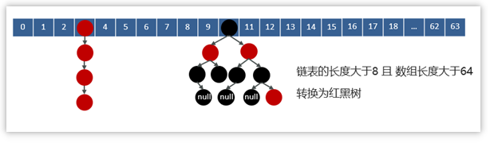

扩容的流程：

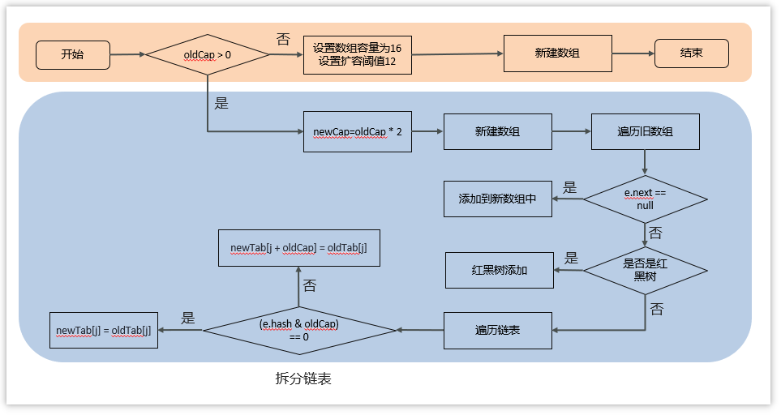

源码：

```java
//扩容、初始化数组
final Node<K,V>[] resize() {
        Node<K,V>[] oldTab = table;
    	//如果当前数组为null的时候，把oldCap老数组容量设置为0
        int oldCap = (oldTab == null) ? 0 : oldTab.length;
        //老的扩容阈值
    	int oldThr = threshold;
        int newCap, newThr = 0;
        //判断数组容量是否大于0，大于0说明数组已经初始化
    	if (oldCap > 0) {
            //判断当前数组长度是否大于最大数组长度
            if (oldCap >= MAXIMUM_CAPACITY) {
                //如果是，将扩容阈值直接设置为int类型的最大数值并直接返回
                threshold = Integer.MAX_VALUE;
                return oldTab;
            }
            //如果在最大长度范围内，则需要扩容  OldCap << 1等价于oldCap*2
            //运算过后判断是不是最大值并且oldCap需要大于16
            else if ((newCap = oldCap << 1) < MAXIMUM_CAPACITY &&
                     oldCap >= DEFAULT_INITIAL_CAPACITY)
                newThr = oldThr << 1; // double threshold  等价于oldThr*2
        }
    	//如果oldCap<0，但是已经初始化了，像把元素删除完之后的情况，那么它的临界值肯定还存在，       			如果是首次初始化，它的临界值则为0
        else if (oldThr > 0) // initial capacity was placed in threshold
            newCap = oldThr;
        //数组未初始化的情况，将阈值和扩容因子都设置为默认值
    	else {               // zero initial threshold signifies using defaults
            newCap = DEFAULT_INITIAL_CAPACITY;
            newThr = (int)(DEFAULT_LOAD_FACTOR * DEFAULT_INITIAL_CAPACITY);
        }
    	//初始化容量小于16的时候，扩容阈值是没有赋值的
        if (newThr == 0) {
            //创建阈值
            float ft = (float)newCap * loadFactor;
            //判断新容量和新阈值是否大于最大容量
            newThr = (newCap < MAXIMUM_CAPACITY && ft < (float)MAXIMUM_CAPACITY ?
                      (int)ft : Integer.MAX_VALUE);
        }
    	//计算出来的阈值赋值
        threshold = newThr;
        @SuppressWarnings({"rawtypes","unchecked"})
        //根据上边计算得出的容量 创建新的数组       
    	Node<K,V>[] newTab = (Node<K,V>[])new Node[newCap];
    	//赋值
    	table = newTab;
    	//扩容操作，判断不为空证明不是初始化数组
        if (oldTab != null) {
            //遍历数组
            for (int j = 0; j < oldCap; ++j) {
                Node<K,V> e;
                //判断当前下标为j的数组如果不为空的话赋值个e，进行下一步操作
                if ((e = oldTab[j]) != null) {
                    //将数组位置置空
                    oldTab[j] = null;
                    //判断是否有下个节点
                    if (e.next == null)
                        //如果没有，就重新计算在新数组中的下标并放进去
                        newTab[e.hash & (newCap - 1)] = e;
                   	//有下个节点的情况，并且判断是否已经树化
                    else if (e instanceof TreeNode)
                        //进行红黑树的操作
                        ((TreeNode<K,V>)e).split(this, newTab, j, oldCap);
                    //有下个节点的情况，并且没有树化（链表形式）
                    else {
                        //比如老数组容量是16，那下标就为0-15
                        //扩容操作*2，容量就变为32，下标为0-31
                        //低位：0-15，高位16-31
                        //定义了四个变量
                        //        低位头          低位尾
                        Node<K,V> loHead = null, loTail = null;
                        //        高位头		   高位尾
                        Node<K,V> hiHead = null, hiTail = null;
                        //下个节点
                        Node<K,V> next;
                        //循环遍历
                        do {
                            //取出next节点
                            next = e.next;
                            //通过 与操作 计算得出结果为0
                            if ((e.hash & oldCap) == 0) {
                                //如果低位尾为null，证明当前数组位置为空，没有任何数据
                                if (loTail == null)
                                    //将e值放入低位头
                                    loHead = e;
                                //低位尾不为null，证明已经有数据了
                                else
                                    //将数据放入next节点
                                    loTail.next = e;
                                //记录低位尾数据
                                loTail = e;
                            }
                            //通过 与操作 计算得出结果不为0
                            else {
                                 //如果高位尾为null，证明当前数组位置为空，没有任何数据
                                if (hiTail == null)
                                    //将e值放入高位头
                                    hiHead = e;
                                //高位尾不为null，证明已经有数据了
                                else
                                    //将数据放入next节点
                                    hiTail.next = e;
                               //记录高位尾数据
                               	hiTail = e;
                            }
                            
                        } 
                        //如果e不为空，证明没有到链表尾部，继续执行循环
                        while ((e = next) != null);
                        //低位尾如果记录的有数据，是链表
                        if (loTail != null) {
                            //将下一个元素置空
                            loTail.next = null;
                            //将低位头放入新数组的原下标位置
                            newTab[j] = loHead;
                        }
                        //高位尾如果记录的有数据，是链表
                        if (hiTail != null) {
                            //将下一个元素置空
                            hiTail.next = null;
                            //将高位头放入新数组的(原下标+原数组容量)位置
                            newTab[j + oldCap] = hiHead;
                        }
                    }
                }
            }
        }
    	//返回新的数组对象
        return newTab;
    }
```

- 在添加元素或初始化的时候需要调用resize方法进行扩容，第一次添加数据初始化数组长度为16，以后每次每次扩容都是达到了扩容阈值（数组长度 * 0.75）

- 每次扩容的时候，都是扩容之前容量的2倍； 

- 扩容之后，会新创建一个数组，需要把老数组中的数据挪动到新的数组中
  - 没有hash冲突的节点，则直接使用 e.hash & (newCap - 1) 计算新数组的索引位置
  - 如果是红黑树，走红黑树的添加
  - 如果是链表，则需要遍历链表，可能需要拆分链表，判断(e.hash & oldCap)是否为0，该元素的位置要么停留在原始位置，要么移动到原始位置+增加的数组大小这个位置上


### 3.6 面试题-hashMap的寻址算法

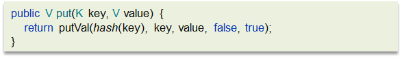

在putVal方法中，有一个hash(key)方法，这个方法就是来去计算key的hash值的，看下面的代码

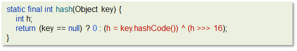

首先获取key的hashCode值，然后右移16位 异或运算 原来的hashCode值，主要作用就是使原来的hash值更加均匀，减少hash冲突

有了hash值之后，就很方便的去计算当前key的在数组中存储的下标，看下面的代码：

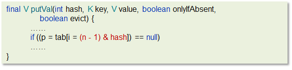

(n-1)&hash : 得到数组中的索引，代替取模，性能更好，数组长度必须是2的n次幂


**关于hash值的其他面试题：为何HashMap的数组长度一定是2的次幂？**

1.  计算索引时效率更高：如果是 2 的 n 次幂可以使用位与运算代替取模

2.  扩容时重新计算索引效率更高： hash & oldCap == 0 的元素留在原来位置 ，否则新位置 = 旧位置 + oldCap


### 3.7 面试题-hashmap在1.7情况下的多线程死循环问题

jdk7的的数据结构是：数组+链表

在数组进行扩容的时候，因为链表是头插法，在进行数据迁移的过程中，有可能导致死循环


- 变量e指向的是需要迁移的对象

- 变量next指向的是下一个需要迁移的对象

- Jdk1.7中的链表采用的头插法

- 在数据迁移的过程中并没有新的对象产生，只是改变了对象的引用


产生死循环的过程：

线程1和线程2的变量e和next都引用了这个两个节点


线程2扩容后，由于头插法，链表顺序颠倒，但是线程1的临时变量e和next还引用了这两个节点

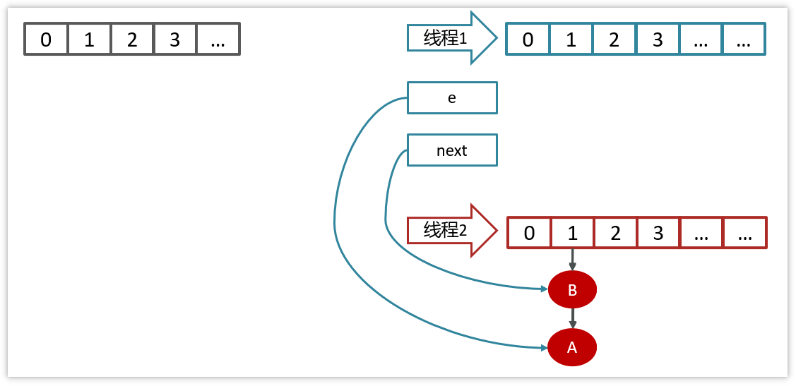

第一次循环

由于线程2迁移的时候，已经把B的next执行了A


第二次循环

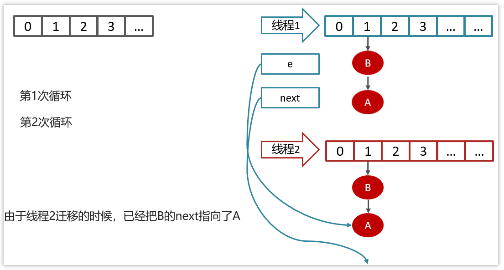

第三次循环

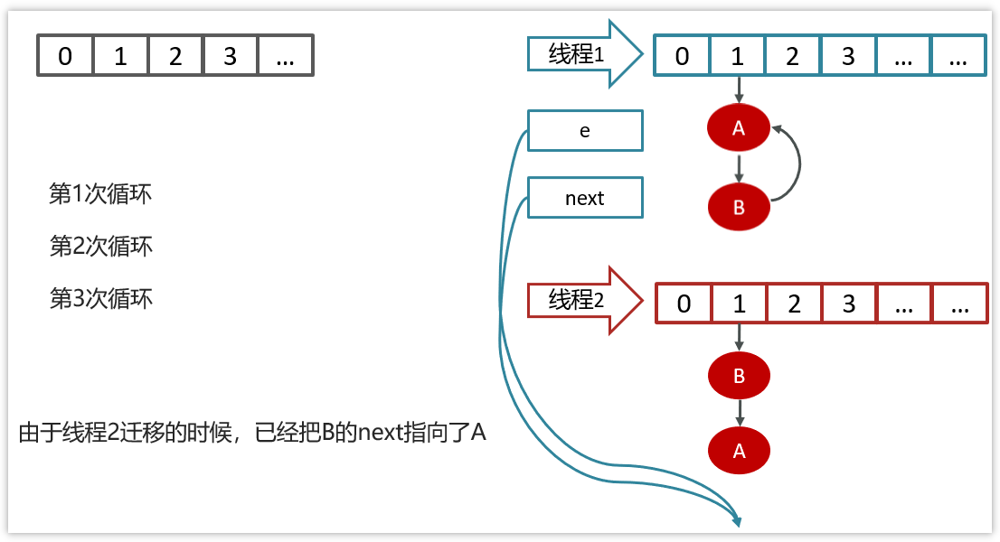

参考回答：

在jdk1.7的hashmap中在数组进行扩容的时候，因为链表是头插法，在进行数据迁移的过程中，有可能导致死循环

比如说，现在有两个线程

线程一：读取到当前的hashmap数据，数据中一个链表，在准备扩容时，线程二介入

线程二：也读取hashmap，直接进行扩容。因为是头插法，链表的顺序会进行颠倒过来。比如原来的顺序是AB，扩容后的顺序是BA，线程二执行结束。

线程一：继续执行的时候就会出现死循环的问题。

线程一先将A移入新的链表，再将B插入到链头，由于另外一个线程的原因，B的next指向了A，

所以B->A->B,形成循环。

当然，JDK 8 将扩容算法做了调整，不再将元素加入链表头（而是保持与扩容前一样的顺序），**尾插法**，就避免了jdk7中死循环的问题。


### 3.8 面试题-HashSet与HashMap的区别

(1)HashSet实现了Set接口, 仅存储对象; HashMap实现了 Map接口, 存储的是键值对.

(2)HashSet底层其实是用HashMap实现存储的, HashSet封装了一系列HashMap的方法. 依靠HashMap来存储元素值,(利用hashMap的key键进行存储), 而value值默认为Object对象. 所以HashSet也不允许出现重复值, 判断标准和HashMap判断标准相同, 两个元素的hashCode相等并且通过equals()方法返回true.

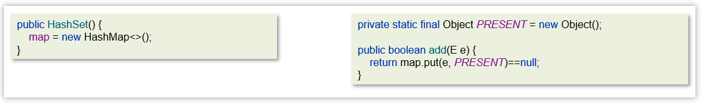

### 3.9 面试题-HashTable与HashMap的区别

>难易程度：☆☆
>
>出现频率：☆☆

主要区别：

| **区别**       | **HashTable**                  | **HashMap**      |
| -------------- | ------------------------------ | ---------------- |
| 数据结构       | 数组+链表                      | 数组+链表+红黑树 |
| 是否可以为null | Key和value都不能为null         | 可以为null       |
| hash算法       | key的hashCode()                | 二次hash         |
| 扩容方式       | 当前容量翻倍 +1                | 当前容量翻倍     |
| 线程安全       | 同步(synchronized)的，线程安全 | 非线程安全       |

在实际开中不建议使用HashTable，在多线程环境下可以使用ConcurrentHashMap类

## 3 真实面试还原

### 3.1 Java常见的集合类

>**面试官**：说一说Java提供的常见集合？（画一下集合结构图）
>
>**候选人**：
>
>嗯~~，好的。
>
>在java中提供了量大类的集合框架，主要分为两类：
>
>第一个是Collection  属于单列集合，第二个是Map  属于双列集合
>
>- 在Collection中有两个子接口List和Set。在我们平常开发的过程中用的比较多像list接口中的实现类ArrarList和LinkedList。  在Set接口中有实现类HashSet和TreeSet。
>- 在map接口中有很多的实现类，平时比较常见的是HashMap、TreeMap，还有一个线程安全的map:ConcurrentHashMap

### 3.2 List

>**面试官**：ArrayList底层是如何实现的？
>
>**候选人**：
>
>嗯~，我阅读过arraylist的源码，我主要说一下add方法吧
>
>第一：确保数组已使用长度（size）加1之后足够存下下一个数据 
>
>第二：计算数组的容量，如果当前数组已使用长度+1后的大于当前的数组长度，则调用grow方法扩容（原来的1.5倍）
>
>第三：确保新增的数据有地方存储之后，则将新元素添加到位于size的位置上。 
>
>第四：返回添加成功布尔值。 
>
>**面试官**：ArrayList list=new ArrayList(10)中的list扩容几次
>
>**候选人**：
>
>​	是new了一个ArrarList并且给了一个构造参数10，对吧？(问题一定要问清楚再答)
>
>**面试官**：是的
>
>**候选人**：
>
>​    好的，在ArrayList的源码中提供了一个带参数的构造方法，这个参数就是指定的集合初始长度，所以给了一个10的参数，就是指定了集合的初始长度是10，这里面并没有扩容。
>
>-------------------------------------------
>
>**面试官**：如何实现数组和List之间的转换
>
>**候选人**：
>
>​	嗯，这个在我们平时开发很常见
>
>​    数组转list，可以使用jdk自动的一个工具类里的方法Arrays.asList转换为数组;List 转数组，可以直接调用list中的toArray方法，需要给一个参数，指定数组的类型，需要指定数组的长度。
>
>**面试官**：用Arrays.asList转List后，如果修改了数组内容，list受影响吗？List用toArray转数组后，如果修改了List内容，数组受影响吗
>
>**候选人**：
>
>Arrays.asList转换list之后，如果修改了数组的内容，list会受影响，因为它的底层使用的Arrays类中的一个内部类ArrayList来构造的集合，在这个集合的构造器中，把我们传入的这个集合进行了包装而已，最终指向的都是同一个内存地址
>
>list用了toArray转数组后，如果修改了list内容，数组不会影响，当调用了toArray以后，在底层是它是进行了数组的拷贝，跟原来的元素就没啥关系了，所以即使list修改了以后，数组也不受影响
>
>-----
>
>**面试官**：ArrayList 和 LinkedList 的区别是什么？
>
>**候选人**：
>
>嗯，它们两个主要是底层使用的数据结构不一样，ArrayList 是动态数组，LinkedList 是双向链表，这也导致了它们很多不同的特点。
>
>1，从操作数据效率来说
>
>ArrayList按照下标查询的时间复杂度O(1)【内存是连续的，根据寻址公式】， LinkedList不支持下标查询
>
>查找（未知索引）： ArrayList需要遍历，链表也需要链表，时间复杂度都是O(n)
>
>新增和删除
>
>- ArrayList尾部插入和删除，时间复杂度是O(1)；其他部分增删需要挪动数组，时间复杂度是O(n)
>- LinkedList头尾节点增删时间复杂度是O(1)，其他都需要遍历链表，时间复杂度是O(n)
>
>2，从内存空间占用来说
>
>ArrayList底层是数组，内存连续，节省内存
>
>LinkedList 是双向链表需要存储数据，和两个指针，更占用内存
>
>3，从线程安全来说，ArrayList和LinkedList都不是线程安全的
>
>**面试官**：嗯，好的，刚才你说了ArrayList 和 LinkedList 不是线程安全的，你们在项目中是如何解决这个的线程安全问题的？
>
>**候选人**：
>
>嗯，是这样的，主要有两种解决方案：
>
>第一：我们使用这个集合，优先在方法内使用，定义为局部变量，这样的话，就不会出现线程安全问题。
>
>第二：如果非要在成员变量中使用的话，可以使用线程安全的集合来替代
>
>ArrayList可以通过Collections 的 synchronizedList 方法将 ArrayList 转换成线程安全的容器后再使用。
>
>LinkedList 换成ConcurrentLinkedQueue来使用

### 3.4 HashMap

>**面试官**：说一下HashMap的实现原理？
>
>**候选人**：
>
>​	嗯。它主要分为了一下几个部分：
>
>1，底层使用hash表数据结构，即数组+（链表 | 红黑树）
>
>2，添加数据时，计算key的值确定元素在数组中的下标
>
>​	key相同则替换
>
>​	不同则存入链表或红黑树中
>
>3，获取数据通过key的hash计算数组下标获取元素
>
>**面试官**：HashMap的jdk1.7和jdk1.8有什么区别
>
>**候选人**：
>
>- JDK1.8之前采用的拉链法，数组+链表
>
>- JDK1.8之后采用数组+链表+红黑树，链表长度大于8且数组长度大于64则会从链表转化为红黑树
>
>**面试官**：好的，你能说下HashMap的put方法的具体流程吗？
>
>**候选人**：
>
>嗯好的。
>
>1. 判断键值对数组table是否为空或为null，否则执行resize()进行扩容（初始化）
>
>2. 根据键值key计算hash值得到数组索引
>
>3. 判断table[i]==null，条件成立，直接新建节点添加
>
>4. 如果table[i]==null ,不成立
>
>   4.1 判断table[i]的首个元素是否和key一样，如果相同直接覆盖value
>
>   4.2 判断table[i] 是否为treeNode，即table[i] 是否是红黑树，如果是红黑树，则直接在树中插入键值对
>
>   4.3 遍历table[i]，链表的尾部插入数据，然后判断链表长度是否大于8，大于8的话把链表转换为红黑树，在红黑树中执行插入操 作，遍历过程中若发现key已经存在直接覆盖value
>
>5. 插入成功后，判断实际存在的键值对数量size是否超多了最大容量threshold（数组长度*0.75），如果超过，进行扩容。
>
>**面试官**：好的，刚才你多次介绍了hsahmap的扩容，能讲一讲HashMap的扩容机制吗？
>
>**候选人**：
>
>好的
>
>- 在添加元素或初始化的时候需要调用resize方法进行扩容，第一次添加数据初始化数组长度为16，以后每次每次扩容都是达到了扩容阈值（数组长度 * 0.75）
>
>- 每次扩容的时候，都是扩容之前容量的2倍； 
>
>- 扩容之后，会新创建一个数组，需要把老数组中的数据挪动到新的数组中
>  - 没有hash冲突的节点，则直接使用 e.hash & (newCap - 1) 计算新数组的索引位置
>  - 如果是红黑树，走红黑树的添加
>  - 如果是链表，则需要遍历链表，可能需要拆分链表，判断(e.hash & oldCap)是否为0，该元素的位置要么停留在原始位置，要么移动到原始位置+增加的数组大小这个位置上
>
>**面试官**：好的，刚才你说的通过hash计算后找到数组的下标，是如何找到的呢，你了解hashMap的寻址算法吗？
>
>**候选人**：
>
>这个哈希方法首先计算出key的hashCode值，然后通过这个hash值右移16位后的二进制进行按位**异或运算**得到最后的hash值。
>
>在putValue的方法中，计算数组下标的时候使用hash值与数组长度取模得到存储数据下标的位置，hashmap为了性能更好，并没有直接采用取模的方式，而是使用了数组长度-1 得到一个值，用这个值按位与运算hash值，最终得到数组的位置。
>
>**面试官**：为何HashMap的数组长度一定是2的次幂？
>
>**候选人**：
>
>嗯，好的。hashmap这么设计主要有两个原因：
>
>第一：
>
>计算索引时效率更高：如果是 2 的 n 次幂可以使用位与运算代替取模
>
>第二：
>
>扩容时重新计算索引效率更高：在进行扩容是会进行判断 hash值按位与运算旧数组长租是否 == 0 
>
>如果等于0，则把元素留在原来位置 ，否则新位置是等于旧位置的下标+旧数组长度
>
>
>
>**面试官**：好的，我看你对hashmap了解的挺深入的，你知道hashmap在1.7情况下的多线程死循环问题吗？
>
>**候选人**：
>
>嗯，知道的。是这样
>
>jdk7的的数据结构是：数组+链表
>
>在数组进行扩容的时候，因为链表是**头插法**，在进行数据迁移的过程中，有可能导致死循环
>
>比如说，现在有两个线程
>
>线程一：**读取**到当前的hashmap数据，数据中一个链表，在准备扩容时，线程二介入
>
>线程二也读取hashmap，直接进行扩容。因为是头插法，链表的顺序会进行颠倒过来。比如原来的顺序是AB，扩容后的顺序是BA，线程二执行结束。
>
>当线程一再继续执行的时候就会出现死循环的问题。
>
>线程一先将A移入新的链表，再将B插入到链头，由于另外一个线程的原因，B的next指向了A，所以B->A->B,形成循环。
>
>当然，JDK 8 将扩容算法做了调整，不再将元素加入链表头（而是保持与扩容前一样的顺序），**尾插法**，就避免了jdk7中死循环的问题。
>
>**面试官**：好的，hashmap是线程安全的吗？
>
>**候选人**：不是线程安全的
>
>**面试官**：那我们想要使用线程安全的map该怎么做呢？
>
>**候选人**：我们可以采用ConcurrentHashMap进行使用，它是一个线程安全的HashMap
>
>**面试官**：那你能聊一下ConcurrentHashMap的原理吗？
>
>**候选人**：好的，请参考《多线程相关面试题》中的ConcurrentHashMap部分的讲解
>
>-----
>
>**面试官**：HashSet与HashMap的区别？
>
>**候选人**：嗯，是这样。
>
>HashSet底层其实是用HashMap实现存储的, HashSet封装了一系列HashMap的方法. 依靠HashMap来存储元素值,(利用hashMap的key键进行存储), 而value值默认为Object对象. 所以HashSet也不允许出现重复值, 判断标准和HashMap判断标准相同, 两个元素的hashCode相等并且通过equals()方法返回true.
>
>**面试官**：HashTable与HashMap的区别
>
>**候选人**：
>
>嗯，他们的主要区别是有几个吧
>
>第一，数据结构不一样，hashtable是数组+链表，hashmap在1.8之后改为了数组+链表+红黑树
>
>第二，hashtable存储数据的时候都不能为null，而hashmap是可以的
>
>第三，hash算法不同，hashtable是用本地修饰的hashcode值，而hashmap经常了二次hash
>
>第四，扩容方式不同，hashtable是当前容量翻倍+1，hashmap是当前容量翻倍
>
>第五，hashtable是线程安全的，操作数据的时候加了锁synchronized，hashmap不是线程安全的，效率更高一些
>
>在实际开中不建议使用HashTable，在多线程环境下可以使用ConcurrentHashMap类


