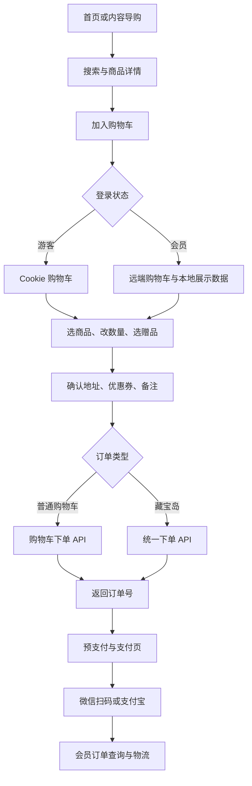

# Ailai.ShopWeb 业务全景与流程梳理

> 分析日期：2026-09-15。依据当前工作区代码进行静态梳理，未连接生产 API、数据库或支付平台。文中“已接入”表示能找到页面行为及对应调用，不表示已经通过线上联调。

## 目录

1. [范围与系统定位](#一范围与系统定位)
2. [角色与业务全景](#二角色与业务全景)
3. [核心业务流程](#三核心业务流程)
4. [商品、内容与导购](#四商品内容与导购)
5. [账号、认证与个人资料](#五账号认证与个人资料)
6. [购物车、结算与订单](#六购物车结算与订单)
7. [支付与收款](#七支付与收款)
8. [会员等级与权益](#八会员等级与权益)
9. [积分、优惠券与余额](#九积分优惠券与余额)
10. [客服、公益与运营](#十客服公益与运营)
11. [业务对象与代码值](#十一业务对象与代码值)
12. [页面与后端入口索引](#十二页面与后端入口索引)
13. [业务 API 索引](#十三业务-api-索引)
14. [实现边界与待核实事项](#十四实现边界与待核实事项)
15. [总结与阅读建议](#十五总结与阅读建议)
16. [总结（面试介绍）](#总结)

## 一、范围与系统定位

### 1.1 分析范围

主体是解决方案中的 **`Ailai.ShopWeb` 项目**，不是整个 `Ailai.ShopWeb.sln` 下所有站点。覆盖：

- `Controllers/` 下的 Home、Product、Member、Order、Service 控制器及登录过滤器。
- `Views/` 下全部业务页面、共享片段，以及位于该目录中的 `MobileProductController.cs`。
- `wwwroot/product/`、`wwwroot/js/` 中与业务相关的脚本，并检查页面实际引用方式。
- `Models/` 中商品、店铺、文章、问答和 SEO 数据结构。
- `Startup.cs`、项目引用与通用组件的使用位置。

解决方案还包含 `Ailai.M.ShopWeb`、`Ailai.ShopWeb_New`、白名单站点、SEM/SEO 站点等独立项目。它们不自动计入本项目业务；只有本项目直接出现的移动端跳转、静态页更新和外链在本文说明。

### 1.2 产品定位

这是面向消费者的美容、营养健康类电商 PC 商城，结合商品销售、内容导购、会员经营和客服转化。代码及页面使用“美容美体网”等品牌名称，部分运营能力同时处理 ilife 与 ailai 活动页面。

### 1.3 前后端职责

| 层次 | 当前项目承担的职责 | 不能从本项目推定的能力 |
| --- | --- | --- |
| Razor 页面与 JavaScript | 展示商品和会员信息、表单校验、购物车交互、发起下单/支付/兑换请求 | 服务端最终价格、扣减和资格判断 |
| ASP.NET Core MVC（net5.0） | 页面路由、会员页面登录验证、商品聚合、商品缓存、SEO 跳转、静态页更新 | 完整订单、会员账户、支付后台 |
| 外部业务 API | 页面调用 customer、order、market、product、payment、adapay 等服务 | API 内部数据库、事务、风控、退款和履约实现 |
| MongoDB | 本项目商品详情聚合缓存 | 商品主数据和订单主数据存储 |
| OSS/CDN 与外部页面 | 图片、脚本、公共页头页尾、活动落地页、扫码支付落地页 | CDN 当前内容与仓库脚本完全一致 |

默认 MVC 路由是 `Product/Index`，因此商城默认入口由商品控制器承担；`Home/Index` 是模板页面，不能当作主商城首页。

**实现程度约定：**

- **已接入**：存在实际页面逻辑和 API 调用。
- **展示/导流**：展示说明、链接或外部页面，本地不处理完整业务。
- **待核实**：缺少本地接口、依赖未提供的远程代码，或者不同入口行为不一致。

主要依据：[项目文件](../Ailai.ShopWeb.csproj)、[启动配置](../Startup.cs)、[商品控制器](../Controllers/ProductController.cs)。

## 二、角色与业务全景

### 2.1 业务角色

| 角色 | 可见业务 | 说明 |
| --- | --- | --- |
| 游客 | 首页、搜索、商品详情、注册登录、快捷下单、Cookie 购物车、公开权益页、支付入口 | 购物车结算也有未登录分支，最终能否成功依赖地址数据和外部 API |
| 已登录客户 | 会员中心、订单、收货地址、资料、账户记录、积分和优惠券 | `MemberController` 默认继承登录验证 |
| VIP/金卡/钻卡会员 | 对应等级展示、消费升级提示、积分及生日相关权益 | 资格由会员 API 返回 |
| 至尊黑卡会员 | 季卡/年卡、到期时间、会员礼包、专属权益展示 | 购买和权益校验调用外部服务 |
| 客服/健康顾问 | 在线咨询承接、积分兑换提醒、人工服务导流 | 本项目没有客服工作台 |
| 运营或定时调用方 | 首页内容更新、活动页切换、商品缓存刷新 | 是按接口用途归纳的角色；代码没有对应完整运营后台角色体系 |

### 2.2 一级业务清单

| 业务域 | 二级业务 | 实现程度 |
| --- | --- | --- |
| 商品与导购 | 首页楼层、分类/品牌导航、搜索、排序分页、详情、套装、相关推荐 | 已接入，部分楼层为静态展示 |
| 内容与信任 | 品牌知识、营养/减肥/丰胸/百科、问答、评价、证照 | 已接入查询或外部导流 |
| 客户账号 | 注册、登录、记住密码、退出、找回密码、修改密码、注销 | 已接入 |
| 客户资料 | 基础资料、扩展资料、手机认证 | 资料已接入；认证完成接口待核实 |
| 交易 | 游客/会员购物车、促销赠品、地址、优惠券、普通订单、快捷订单、藏宝岛订单 | 已接入，存在分支差异 |
| 支付 | 预支付、微信扫码入口、支付宝、支付失败查询、手机号金额收款 | 已接入外部服务 |
| 订单服务 | 状态筛选、搜索分页、详情、取消、物流 | 已接入；退货为状态查询 |
| 会员经营 | 等级、消费升级提示、黑卡购买、季卡年卡、生日、礼包 | 已接入 |
| 积分与资产 | 积分明细、现金券兑换、礼品兑换、优惠券查询、余额流水 | 已接入；不同积分入口流程不同 |
| 客服与公益 | 在线客服、联系人信息、公益商品、公益证书 | 已接入或展示/导流 |
| 运营支撑 | 静态首页更新、促销页切换、SEO、缓存、浏览记录、统计 | 已实现本地部分并依赖外部系统 |
| 留存旧功能 | 收藏页、电话回拨、部分移动端和旧路径 | 展示或待核实，不计为已完成闭环 |

## 三、核心业务流程

### 3.1 普通购物流程

图中支付后到订单查询表示用户后续操作，不表示本项目实现支付回调或自动发货。游客流程在前端存在，但依赖服务端是否接受无令牌请求及结算地址是否完备。

### 3.2 快捷下单流程

商品入口打开快捷表单 → 填写姓名、电话、区域、详细地址、数量和备注 → 前端校验 → `unified-order`，`OrderType=2` → 返回订单号 → 展示成功提示并提供付款入口。

此路径不要求先进入购物车，属于独立交易入口。

### 3.3 会员与积分流程

注册 → 登录 → 查询会员等级和账户 → 选择购买黑卡或继续购物升级 → 创建会员订单 → 支付；积分可进入现金券兑换、自助礼品加购或健康顾问提醒流程。生日登记与礼品选择是另一条独立权益流程。

## 四、商品、内容与导购

### 4.1 首页与频道导购

- 展示商品楼层、品牌入口、精选商品、热销/秒杀等运营内容，引导进入搜索和详情。
- 首页后端查询 SEO 链接配置，并组织品牌、营养、减肥、丰胸、百科五组文章。
- Razor 中有大量固定商品、图片和外链；另有外部静态首页更新机制，不能把所有首页内容都视为实时数据库配置。
- 公共导航包含搜索、登录状态、购物车、会员服务和内容入口。

依据：[ProductController.Index](../Controllers/ProductController.cs)、[首页](../Views/Product/Index.cshtml)、[公共商品脚本](../wwwroot/product/index/main.js)。

### 4.2 搜索与筛选

| 能力 | 业务行为 |
| --- | --- |
| 关键词兼容 | 接收 `key`、`subcat`、`cat`、`keyword` 等参数 |
| 品牌筛选 | 根据返回品牌集合展示条件，更新品牌搜索值 |
| 分类筛选 | 展示二级分类，并支持导航传入分类信息 |
| 价格区间 | 使用 `PriceArea` 参数筛选 |
| 排序 | 使用 `SortType` 切换排序，枚举含义以页面按钮和服务端约定为准 |
| 分页与加载 | 请求携带页码/页大小，页面支持翻页、跳页，并存在 `loadCount` 加载路径 |
| 热销推荐 | 与搜索结果分别请求 |
| 下单转化 | 搜索结果支持商品跳转，并有快捷下单逻辑 |

筛选状态部分存于 `sessionStorage`。主搜索调用 `product-list-new/page/{loadCount}`；旧 `product-list/page` 调用已注释。

依据：[Search.cshtml](../Views/Product/Search.cshtml)。

### 4.3 商品详情

详情聚合以下信息：

1. **商品身份**：商品 ID、名称、卖点、品牌、店铺、分类、SEO 标题/关键词/描述。
2. **展示素材**：主图、图片组、图文说明、品牌说明、部分视频或相关媒体入口。
3. **销售数据**：市场价、促销价、会员价等字段，销量、评论数、积分、库存相关数据。
4. **购买辅助**：数量选择、套装列表、搭配推荐、看了又看、热销推荐。
5. **信任内容**：商品证照、品牌知识、问答、用户评价及图片。
6. **转化动作**：加购物车、快捷下单、在线客服。

商品模型含大促、超低价、秒杀标记；这些字段不等价于本项目具备独立秒杀库存和抢购控制。最终成交价及可售性依赖业务 API。

数量输入与加减按钮按元素的 `min`、`max` 限制，最小值缺省为 1；商品二维码提供跨端访问入口。不能将输入框上限直接解释为服务端库存锁定。

### 4.4 详情可访问规则与缓存

- 商品编号大于 `80000` 时先减去 `80000`，并重定向到归一后的路径。
- 无 `.html` 的详情地址永久重定向到 `.html`；带查询参数时重定向去除参数。
- `refresh=true` 会先删除对应 MongoDB 缓存，并请求外部刷新，然后发生重定向。
- 优先读取集合 `AilaiShop_ProductDetail`；缓存未命中时获取商品详情、知识和问答，并写入聚合缓存。
- 商品缺失、详情为空、`ProductDetail.Status == -1` 返回 404。
- 商品名称包含“威纳德”或不区分大小写的 `WELNADS`，返回 404。这是当前代码明确的品牌屏蔽规则。
- `supplement/{productId}` 提供补充分类与进口标记；进口提示来自返回数据。
- `notneedcache` 参数虽然存在，但带查询参数的请求提前重定向，不能直接认定通过 URL 就能命中后面的无缓存分支。

### 4.5 内容、评价与证照

- 品牌知识和商品问答用于购买前说明；相关内容详情多通过其他页面或站点承接。
- 评价通过 `product-comment/grade/page` 分页查询，支持页面的评价类别条件、图片查看和分页 HTML。
- 套装通过 `productsuit` 查询；品牌说明通过 `Brandinfo` 查询；证照通过 `productcertificate` 查询。
- 代码可确认评价阅读，未发现本项目完整的评价发布、追评或商家回复后台。

依据：[Detail.cshtml](../Views/Product/Detail.cshtml)、[商品聚合模型](../Models/WebSingleProduct.cs)、[品牌知识模型](../Models/BrandKnowledge.cs)、[问答模型](../Models/ShopQuestionSortDto.cs)。

## 五、账号、认证与个人资料

### 5.1 注册

1. 输入手机号、密码与确认密码。
2. 阅读并同意注册协议。
3. 可补充姓名、性别、邮箱、生日和省市区地址。
4. 提交客户注册 API，携带来源页与入口页信息。
5. 成功提示后进入登录页。

独立注册页将手机号拼接为 `手机号@ilife.cn` 形式的 `LoginName`。其他页面也有注册弹窗，字段处理不可假定完全一致。页面协议说明不能替代实际实现证据。

### 5.2 登录、登录态与退出

- 使用登录账号和密码调用登录 API，同时尝试获取客户端公网 IP，并传递登录域名。
- 成功后解析返回的令牌信息，写入 `token`、`UserId`、`LoginName`、`TimeOut` 等 Cookie；独立登录页设置约 1 小时 Cookie。
- “记住密码”分支将用户名和密码写入 7 天 Cookie，这是代码现状，应作为账号实现问题另行处理。
- 登录成功返回上一页；退出调用 `logout`，并清理相关 Cookie/刷新页面。
- 会员控制器继承 `[AppAuth]`；过滤器从查询参数或 Cookie 取令牌，调用外部 `auth/decrypt`，失败重定向 `/login`。
- 过滤器还有写入 180 分钟 Cookie 的逻辑，与独立登录页时长不同。实际会话有效期仍受外部令牌约束。
- 未看到统一的本地用户权限、岗位权限或管理端 RBAC 业务。

### 5.3 密码管理与手机认证

| 功能 | 业务流程 | 状态 |
| --- | --- | --- |
| 找回密码 | 手机号获取验证码 → 填验证码和新密码 → `retrievepassword` | 已接入 |
| 修改密码 | 登录后填写密码表单 → `customernoauth/password` | 已接入 |
| 手机认证 | 发送验证码 → 提交认证 | 发送已接入；提交指向 `/Member/defineAuthentication`，本地控制器未见该动作 |

验证码有效期、重发频率、尝试次数和账号匹配由外部服务决定；不要从前端倒计时推断完整限制。

### 5.4 个人资料维护

- 查询当前客户资料，显示登录账号、手机号、姓名。
- 可编辑手机号、姓名、性别、生日、微信。
- 扩展资料包括年收入、身高、体重、胸围。
- 前端验证联系电话等信息，使用 `PUT customernoauth/update` 保存。
- 联系地址通过单独的收货地址业务维护。

### 5.5 账号注销

会员首页提供注销弹窗：输入手机号 → 获取验证码 → 勾选注销协议 → 调用 `memberaccount/canceled` → 成功提示并退出。

前端将手机号与 Cookie 中的 `LoginName` 直接比较，而注册页可能产生带 `@ilife.cn` 后缀的登录名，存在兼容性待核实。注销后的数据清理、未完成订单和资产处理规则属于外部服务范围。

依据：[会员控制器](../Controllers/MemberController.cs)、[登录过滤器](../Controllers/_Base/AppAuthorization.cs)、[Login](../Views/Member/Login.cshtml)、[Register](../Views/Member/Register.cshtml)、[会员首页](../Views/Member/Index.cshtml)、[个人资料](../Views/Member/PersonalInformation.cshtml)。

## 六、购物车、结算与订单

### 6.1 购物车

| 场景 | 处理方式 |
| --- | --- |
| 游客加购 | 商品信息写入 `cartList` Cookie；常见入口设约 1 小时有效期 |
| 会员加购 | 向 `shopping-cart` POST 商品 ID、数量和 `ItemType` |
| 会员查看 | GET 远端购物车并转换为本地显示对象；结算使用 sessionStorage 中的购物车快照 |
| 分组展示 | 按品牌/店铺组织商品 |
| 商品选择 | 全选、店铺选择、单品选择，计算选中数量和金额 |
| 数量修改 | 加减/输入数量；登录后同步服务端 |
| 删除 | 删除本地条目或调用购物车 DELETE |
| 顶部购物车 | 公共脚本提供商品预览、数量及删除功能 |
| 积分商品数量 | `ItemType=8` 增量或修改时存在 `enoughintegral` 校验分支 |

游客与登录客户采用不同存储路径，不应据此推断所有入口均实现了无损合并；需要以各入口和远端接口实际行为为准。

### 6.2 满额赠品

1. 根据购物金额请求 `promotionproduct/level/{totalPrice}/`。
2. 显示对应档位赠品，记录活动门槛 `condition`。
3. 赠品以 `ItemType=7` 加入购物车。
4. 选择逻辑检查已有赠品；结算再次检查数量和金额门槛。
5. 赠品数量大于 1、门槛不存在或金额不足时，提示重新选择并返回购物车。

这是前端可见规则，不等价于服务端完整活动互斥、库存或限领策略。

### 6.3 收货地址

会员地址页和结算页均接入：地址查询、新增、编辑、删除、设默认地址。字段包括收货人、手机号、省市区名称和编码、详细地址。结算从 `sessionStorage.DefaultAddress` 读取已选地址。

当前结算因此依赖有效地址快照；未登录路径存在并不自动保证游客地址环节可顺利完成。

### 6.4 普通购物车结算

1. 读取购物车勾选项并展示商品明细。
2. 确认地址，查询当前客户可用优惠券。
3. 查询优惠券时传递客户 ID、订单金额和商品 ID 集合。
4. 选择一张优惠券，展示折扣和预计实收金额，填写备注。
5. 校验赠品及订单类型混合条件，按钮有 500ms 防抖。
6. 向 `order/api/customer/pc/shopping-cart/order` 提交：地址、商品列表、购物车 ID 列表、支付方式、优惠券、备注、来源信息。
7. 成功后跳转 `/order/member_repay?order=订单号`。

提交中的 `Balance` 固定为 `0`，不能将本页归纳为已实现余额抵扣。最终金额和优惠券核销依赖远端服务。

### 6.5 运费与金额规则：按代码实际区分

| 位置 | 当前逻辑 |
| --- | --- |
| 商品总价 | 勾选商品 `Quantity × PromotionPrice` 求和 |
| 市场价总计 | 勾选商品 `Quantity × MarketPrice` 求和 |
| 运费行 | 总价 `>300` 或商品名含“优惠券”时显示 0，否则 15 |
| 初始实收行 | 总价 `>300` 时不加运费，否则加 15；未复用“含优惠券商品”例外 |
| 选券后实收 | 原总价减券金额，再按 `>300` 决定是否加 15 |
| 页面文案 | 提示“不满300元”加运费 |

**结论：**恰好 300 元、购买优惠券类商品、用券后跨门槛这几个场景的展示口径存在差异。文档不将其统一为“满300包邮”，成交金额需核对后端。

### 6.6 藏宝岛订单

- 购物车远端字段 `Type` 映射至本地 `OrderType`。
- `OrderType=7` 分支展示为藏宝岛商品；前端尝试阻止与普通商品混合结算。
- 特殊分支向 `unified-order` 提交 `OrderType` 与 JSON 字符串形式的 `OrderParam`。
- 普通分支仅提交勾选商品；特殊分支组装商品时遍历整个 `proList`，需要核对是否可能带入未勾选项。
- 游客与会员的混合检查算法不同，不能认定类型互斥规则已在所有路径得到一致保证。

### 6.7 快捷订单

首页公共脚本、搜索页、详情页均有快捷下单能力。统一订单类型为 `2`，提交单个 `OrderProduct`、地址、备注与来源 URL。成功返回 `OrderNo`，展示支付跳转，不依赖购物车 ID。

### 6.8 订单查询、取消与物流

| 能力 | 说明 |
| --- | --- |
| 会员首页最近订单 | 查询订单列表，展示支付入口 |
| 订单列表 | 按时间范围、状态、关键词检索并分页 |
| 订单详情 | 展示订单与商品、金额等接口返回信息 |
| 继续支付 | 进入 `member_repay` |
| 取消订单 | 调用 `cancel/{orderId}` |
| 物流查询 | 查询订单数据及 `order-logisticsinfo/{orderId}`，展示物流轨迹 |
| 退货订单查询 | 提供状态 `-1` 筛选；未见自助申请退款/退货完整流程 |

页面状态筛选值：待付款 `21`、待发货 `31`、已发货 `32`、已完成 `41`、已取消 `0`、退货 `-1`。这是查询状态值，不是完整服务端状态机。`o_state` 另用于区分系统取消、正常订单和客户取消，不应与上述筛选值混用。

没有本地证据表明系统实现消费者确认收货、退货审核、退款执行、换货、开票或仓库发货后台。

依据：[购物车](../Views/Order/ShopCart.cshtml)、[结算](../Views/Order/ShopBarking.cshtml)、[地址管理](../Views/Member/Member_Address.cshtml)、[订单列表](../Views/Member/Orderlist.cshtml)、[订单详情](../Views/Member/Member_OrderDetail.cshtml)。

## 七、支付与收款

### 7.1 已有订单支付

- 通过订单号调用 `prepay/{orderId}`，读取订单号和应付金额。
- 微信页生成二维码，内容是外部 `promotion/sale/accountpay.html?order=...` 页面地址；不是本项目直接生成微信原生支付交易。
- 支付宝调用 `payment/api/alipay/...`，将用户跳转至接口返回地址。
- 每 3 秒调用 `adapay/ispayfail/{orderId}`，返回失败标志时显示支付失败弹层。
- “订单提交成功”是创建订单的提示，不等于支付成功。

本项目未见支付成功回调、签名验证、对账、关单和退款实现。失败轮询也不等价于支付成功检测。

### 7.2 按手机号和金额创建收款订单

`/order/` 与 `/order/{num}` 对应 `PayInfo`：

- 路径参数以 `8` 开头时按订单号处理，读取订单手机号与应付金额并锁定输入。
- 否则按手机号入口处理，可输入手机号和充值/收款金额。
- 调用 `order-createpaymentorder` 创建收款订单，再打开付款页。
- 页面提示包含“充值金额”，但入账账户、到账时点和资金用途由外部服务处理，不能仅凭页面断定完整钱包充值规则。

### 7.3 支付方式口径

已确认的付款页主要渠道为微信扫码与支付宝。结算代码含支付方式字段，注释出现微信 `1`、支付宝 `2`、货到付款 `4`；这些注释不能证明货到付款全流程当前可用。

依据：[付款页](../Views/Order/Member_Repay.cshtml)、[收款页](../Views/Order/PayInfo.cshtml)、[订单控制器](../Controllers/OrderController.cs)。

## 八、会员等级与权益

### 8.1 会员中心

会员中心汇总：会员等级、距下一级消费差额、黑卡到期时间、账户余额、积分、近期订单、黑卡购买入口、积分兑换、公益证书和账号注销入口。

页面读取 `MemberShipGrade`：

| 值 | 展示含义 |
| --- | --- |
| 0 | 暂未开通会员 |
| 2 | VIP会员 |
| 3 | 金卡会员 |
| 4 | 钻卡会员 |
| 8 | 至尊黑卡 |

`LackAmount` 由接口返回。消费累计口径、升级阈值、降级条件、退款后的等级调整在本项目没有完整实现。

### 8.2 黑卡购买、续期与礼包

1. 在会员中心或权益页选择季卡/年卡。
2. 季卡商品 ID 为 `46279`，年卡商品 ID 为 `46278`。
3. 页面基于当前到期时间或当前日期，预览增加 3 个月/12 个月后的时间。
4. 调用 `order-creatememberorder`，传客户 ID、商品 ID、购买黑卡备注。
5. 进入预支付与渠道付款。
6. 按会员接口返回的信息展示到期时间、卡类型、可领礼包。

权益页包含季卡/年卡返到账户的金额文案和会员礼品展示；这属于页面营销口径，实际售价、返还金额、可用期限与支付成功后的开通动作应由服务端核实。

### 8.3 生日权益

- 查询会员信息中的生日与生日礼品集合。
- 登记/修改生日调用 `customerbase/birthday`。
- 页面提示一个自然年内生日仅可修改一次；实际强校验由 API 决定。
- 选择生日礼品后调用 `birthday_gift`。
- 生日登记、选择礼物不等于已生成物流订单；发放与履约需结合外部服务。

### 8.4 季卡/年卡礼品

权益页请求 `member_promotionproduct`，展示 `QuarterGifts`、`AnnualGifts`、`Integrals`、`IntegralBuys`。领取卡类礼包前调用 `member_exchange` 校验，允许后将对应礼品加入购物车，再走结算。

### 8.5 权益说明页面

`/service/vip` 是主要权益交互页；`/member/member_vipdetail` 提供会员说明。广告文案、价格图片和固定优惠说明与实时 API 规则应分别管理。

依据：[会员首页](../Views/Member/Index.cshtml)、[VIP服务页](../Views/Service/Vip.cshtml)、[会员说明](../Views/Member/Member_Vip_Detail.cshtml)。

## 九、积分、优惠券与余额

### 9.1 积分账户与明细

`/member/member_integral` 查询积分累计增加、剩余、已使用，以及每笔变动用途、变动额、时间、备注。积分记录按创建时间倒序分页，页面每页 5 条。

积分生成、冻结、过期、退货回退由外部服务承担。商品模型中的积分注释不能作为完整积分发放公式。

### 9.2 积分兑换现金券

- 输入兑换积分，前端计算现金券金额。
- 提交 `customerbase/member_integral`，参数为客户 ID 与积分数。
- 成功后显示兑换金额/结果提示。
- 会员首页请求 `customer-GetIntegralSetting` 获取兑换比例，并校验可用积分、最小兑换量。
- 会员首页金额计算使用 `floor(积分 / 兑换比例)`；比例缺失或转为数值 0 时，计算逻辑回退到 100。
- VIP 服务页仍按 `25` 积分为步长、`floor(积分/25)` 计算。

**规则差异：**会员首页动态比例与权益页固定比例并存，不能给全站归纳出一个确定且一致的兑换比率。

### 9.3 自助积分礼品与积分换购

主要入口是 `/service/vip`、`/service/integral`：

1. 查询积分礼品/换购商品。
2. 用户选择兑换，调用 `enoughintegral` 检查资格。
3. 通过后以 `ItemType=8` 加入购物车；部分分支附带 `GiftType`。
4. 进入购物车、地址和订单流程。

`/service/integral` 使用 `new_integralproduct?orderType=0`，分别展示 `Integral` 与 `Price` 集合；部分换购按钮设为隐藏，不能认定所有展示项都开放直接购买。

### 9.4 会员积分页的顾问提醒流程

`/member/member_integral` 与上述服务页不同：

- 查询 `integralproduct` 并依据剩余积分展示是否可兑换。
- 当前点击兑换的有效分支调用 `SendReminder?CustomerId=...&GiftType=Points`，之后显示提示弹层。
- 旧的“校验积分 → 自动加购”调用链已注释，虽然还保留 `addCartToRemote` 函数。
- 因此此入口应归纳为“提交积分兑换服务提醒”，不能写成点击后自动完成礼品兑换。

### 9.5 优惠券账户

优惠券页支持查询全部、可用、过期、未使用、已使用等统计与分类。展示面额、使用门槛、券号、密码、适用范围、是否可用于最低价商品、到期时间及状态。

券状态显示：`1` 未使用、`2` 被禁用、`3` 已使用，其他值页面显示已过期。这是前端映射，不能补造服务端完整枚举。

购物结算调用 `allcoupon` 获取当前订单可用券，使用单选逻辑；适用商品、门槛和核销以 API 为准。

**命名陷阱：**`/member/integral_detail` 的文件名为 `Member_Integral_Detail`，但实际请求的是优惠券明细接口，不应按名字计入积分流水业务。

### 9.6 余额与账户流水

- 会员首页通过 `memberaccount/search` 查询账户资产。
- 余额页通过 `accountrecord/customeraccountlist/page` 展示累计增加、累计减少、剩余余额及账户变动记录。
- 支持通过 `AccountSearchType` 查询类型；当前请求固定 `PageIndex=1`、`PageSize=10`，不能只因为接口名含 page 就认定 UI 完整分页。
- 收款页有创建充值/收款订单入口，但没有本地提现处理和结算余额抵扣闭环。

依据：[积分明细页](../Views/Member/Member_Integral.cshtml)、[积分服务页](../Views/Service/Integral.cshtml)、[优惠券](../Views/Member/Member_Voucher.cshtml)、[名称为积分详情的券页](../Views/Member/Member_Integral_Detail.cshtml)、[余额页](../Views/Member/Member_Balance.cshtml)。

## 十、客服、公益与运营

### 10.1 客服与服务信息

- 联系我们页面展示联系方式、服务信息和公共导航。
- 商品/会员服务页通过 `shopbrandparam/get` 获取客服配置，并接入美洽或客服聊天链接。
- 商品详情还加载环信客服 SDK，提供客服唤起代码；实际呈现受远程脚本和配置影响。
- 电话回拨弹窗有号码校验，但详情页实际 `CallBack.asp` 提交代码已注释，不能计为当前已接通的回拨流程。
- 公共页头、页尾、帮助和协议链接中有外部内容，本地不具备对应完整内容管理后台。

### 10.2 爱心基金与公益

- `/member/love_fund` 是允许游客访问的公益介绍页。
- 通过固定商品 ID `46855` 加入购物车，随后打开购物车，使用普通商品交易路径。
- 会员首页查询 `gongyicertificate` 获取公益证书相关返回内容，没有证书时提示“暂无证书”。
- 未见本地捐赠清分、公益款项核算或证书生成算法；不得把公益商品加购等同于财务捐赠处理完成。

### 10.3 浏览行为与营销归因

- 共享浏览记录片段在已登录时上报客户 ID、页面 URL、IP、`Type=1` 至 `browsehistory`。
- 登录请求记录 IP 和登录域名，注册/下单携带 `EntranceUrl`、`SourceUrl`、`OrderUrl` 等来源字段。
- 统计脚本涉及百度统计与链接推送，页面还引用 PV/UV/IP 相关远程脚本。
- 本项目提供采集/上报入口，没有本地分析报表后台。

### 10.4 静态首页更新

| 入口 | 数据来源与更新内容 |
| --- | --- |
| `/home/updatehomepage` | 请求 `ilifeindex_pc_config`，要求 12 段；替换精选商品、美容护肤、健康男女、瘦身美胸、个人精品、秒杀商品、最新资讯、更多资讯、健康问答、更多问答、营养健康、滋补养生 |
| `/home/updatehomepage_m` | 请求 `ilifeindex_m_config`，要求 4 段；替换热销产品、推荐产品、最新资讯、最新问答 |
| `/home/updatehomepage_m_product` | 请求 `ilifeindex_m_product_config`，要求 3 段；实际替换热销产品、为您推荐，第三段替换代码已注释 |

这些动作读取配置指定目录的 HTML，按注释标记替换内容，再写回。方法名中的 timer 只说明调用的外部 API 路径，项目内未见自动调度器。

### 10.5 活动页切换

- `/home/changepromotionpage` 同时处理 PC 与移动端活动页。
- `updateType=1` 将 `index_new.html` 切换为 `index.html`，旧页保存为 `index_old.html`。
- `updateType=2` 使用 `index2_new.html` 与 `index2_old.html`。
- 普通活动切换还将对应新图片目录内容复制到目标图片目录。
- `/home/changepromotionpage/ailai` 处理 ailai 配置的 PC/移动页面，未包含同样的图片复制步骤。
- 页面、目录不存在时返回失败；跨 PC、移动页与图片的变更不是一个事务，不能宣称具备一键原子发布或自动回滚。

### 10.6 SEO 与异常页

- 兼容旧 `/product.asp?id=...` 商品地址并永久跳转。
- 商品链接去参数、加 `.html`、归一 ID；公共中间件做 URL 小写重定向。
- 首页 SEO 链接及文章用于内链和内容导购。
- 商品不存在或被屏蔽时返回 404；通用异常过滤器也将异常转为商品错误页与 404。
- `Home/Privacy`、`Home/Index` 属于模板页；`/error.htm` 会主动抛测试异常，不属于客户业务。

依据：[HomeController](../Controllers/HomeController.cs)、[公益页](../Views/Member/Love_Fund.cshtml)、[联系页面](../Views/Service/ContactUs.cshtml)、[浏览记录片段](../Views/Shared/getBrowseHistory.cshtml)、[统计脚本](../wwwroot/js/ilifestat-product.js)。

## 十一、业务对象与代码值

### 11.1 核心对象

| 对象 | 关键字段或结构 | 业务用途 |
| --- | --- | --- |
| 商品聚合 | `WebSingleProduct`、`ProductDetail`、`ShopInfo` | 详情、推荐、品牌及价格展示 |
| 内容 | `BrandKnowledge`、问答 DTO、`HomeInfo`、`SeoLinkConfig` | 知识、问答、首页文章、内链 |
| 登录上下文 | token、UserId、LoginName、TimeOut | 页面准入与 API 请求 |
| 客户资料 | CustomerId、Mobile、RealName、Gender、Birthday 等 | 账号与用户画像 |
| 会员信息 | MemberShipGrade、MemberType、MemberEndTime、LackAmount、BirthdayGifts | 等级、期限与权益 |
| 购物车项 | ProductId、Quantity、ItemType、OrderShopCartId、checkState、OrderType | 购买选择与订单转换 |
| 地址 | Addressee、Mobile/Tel、省市区及编码、DetaileAddress | 配送资料 |
| 普通订单请求 | AddressInfo、OrderProductList、ShoppingCartIdList、CouponNumber、Remark | 购物车下单 |
| 统一订单请求 | OrderType、序列化后的 OrderParam | 快捷单、藏宝岛单 |
| 预支付数据 | OrderNo、PayAmount、Mobile | 支付页与收款页 |
| 优惠券 | CouponNumber、CouponAmount、CouponOrderAmount、CouponStatus、CouponEndTime | 展示、资格筛选、下单使用 |
| 积分/余额流水 | 变动额、累计额、剩余、用途、时间、备注 | 资产查询 |

大部分请求对象直接在 JavaScript 里构造，不能仅统计 C# Models 就得到全部业务实体。

### 11.2 不可混用的类型值

| 字段 | 代码值 | 本项目可确认的含义 |
| --- | --- | --- |
| ItemType | 1 | 普通商品 |
| ItemType | 7 | 促销赠品 |
| ItemType | 8 | 积分/权益礼品类购物车项 |
| OrderType | 2 | 快捷统一下单 |
| OrderType | 7 | 藏宝岛特殊订单 |
| GiftType | 3、4 | 不同礼品/换购调用分支附带的值，不能视为完整后端枚举 |
| MemberShipGrade | 0、2、3、4、8 | 未开通、VIP、金卡、钻卡、至尊黑卡 |

`ItemType=7` 与 `OrderType=7` 含义完全不同。图片路径使用 `MappingProductId` 或商品 ID 加 `80000`，也不应混作订单中的商品 ID。

## 十二、页面与后端入口索引

路径不区分大小写的处理还受中间件影响。表中为显式路由及主要约定路由，页面名与业务名按实际内容归纳。

| 控制器 | 路径 | 页面/动作 | 业务归属 |
| --- | --- | --- | --- |
| Product | `/` | Index | 商城首页 |
| Product | `/search` | Search | 搜索 |
| Product | `/product/{productId}`、`/product/{productId}.html` | Detail | 商品详情与规范地址 |
| Product | `/product.asp` | product_Asp | 旧商品地址跳转 |
| Product | `/product/getPaginHtml` | GetPaginHtml | 评价等分页 HTML |
| Product | `/product/error` | Error | 商品错误页 |
| Member | `/member` | Index | 会员中心，需登录 |
| Member | `/login` | Login | 登录，允许未登录 |
| Member | `/register`、`/member/register` | Register | 注册，允许未登录 |
| Member | `/member/member_getpassword` | Member_Getpassword | 找回密码，允许未登录 |
| Member | `/member/member_vipdetail` | Member_Vip_Detail | 会员说明，允许未登录 |
| Member | `/member/orderlist` | Orderlist | 订单列表 |
| Member | `/member/member_integral` | Member_Integral | 积分明细与兑换提醒 |
| Member | `/member/personal_information` | PersonalInformation | 个人资料 |
| Member | `/member/member_modifypassword` | Member_Modifypassword | 修改密码 |
| Member | `/member/member_mobilecheck` | Member_Mobilecheck | 手机认证 |
| Member | `/member/member_voucher` | Member_Voucher | 优惠券 |
| Member | `/member/member_address` | Member_Address | 收货地址 |
| Member | `/member/member_balance` | Member_Balance | 余额 |
| Member | `/member/member_favorites` | Member_Favorites | 收藏展示页，未见完整闭环 |
| Member | `/member/member_orderdetail` | Member_Orderdetail | 订单详情 |
| Member | `/member/integral_detail` | Member_Integral_Detail | 实际为优惠券查询 |
| Member | `/member/love_fund` | Love_Fund | 公益，允许未登录 |
| Order | `/shop_cart`、`/order/shop_cart` | ShopCart | 购物车 |
| Order | `/order/shop_barking` | ShopBarking | 结算 |
| Order | `/order/member_repay/` | Member_Repay | 支付 |
| Order | `/order/`、`/order/{num}` | PayInfo | 按订单号/手机号收款 |
| Service | `/service/contactus` | ContactUs | 联系我们 |
| Service | `/service/vip` | Vip | 会员权益 |
| Service | `/service/integral` | Integral | 积分服务 |
| Home | `/home/updatehomepage` | UpdateHomepage | PC静态首页更新 |
| Home | `/home/updatehomepage_m` | UpdateHomepage_M | 移动首页更新 |
| Home | `/home/updatehomepage_m_product` | UpdateHomepage_M_Product | 移动产品版首页更新 |
| Home | `/home/changepromotionpage` | ChangePromotionpage | 活动页及图片切换 |
| Home | `/home/changepromotionpage/ailai` | ChangePromotionailaipage | ailai活动页切换 |
| Home | `/home/index`、`/home/privacy`、`/home/error`、`/error.htm` | 模板/错误动作 | 非核心业务 |
| MProduct | `/mproduct/{productId}.html` | Detail | 遗留移动商品入口，视图完整性待核实 |
| MProduct | `/mproduct/index` | Index | 约定路由，视图完整性待核实 |

`MProductController` 位于 `Views/MobileProductController.cs`，不能因其目录位置漏掉。项目没有看到对应 `Views/MProduct` 目录，不能宣称该入口已完整可用。

## 十三、业务 API 索引

以下按业务归并调用路径，参数 `{id}` 等为便于阅读的占位写法。默认前缀为配置 `ApiUrl`；`MarketUrl`、`AuthorizationUrl` 以及部分代码硬编码域名是例外。接口 HTTP 方法和具体请求字段以各页面调用点为准，不推断外部服务内部实现。

### 13.1 商品、内容与运营

| 路径 | 用途 | 主要代码 |
| --- | --- | --- |
| `/market/api/seolinkconfig/search` | 首页SEO链接 | ProductController |
| `MarketUrl/api/home/product-article` | 首页文章分组 | ProductController |
| `MarketUrl/api/detail/single-product/{id}` | 商品聚合详情及刷新 | ProductController、MProductController |
| `/market/api/detail/single-product/{id}` | 前端加购前商品查询 | ShopCart、公共商品脚本 |
| `MarketUrl/api/detail/knowledge/{id}` | 商品知识 | ProductController、MProductController |
| `MarketUrl/api/detail/shopquestion/{id}` | 商品问答 | ProductController、MProductController |
| `/product/api/product/supplement/{id}` | 补充分类、进口标志 | ProductController |
| `/market/api/search/hot-sale-recommendation` | 搜索页热销推荐 | Search |
| `/market/api/search/product-list-new/page/{loadCount}` | 筛选搜索与分页 | Search |
| `/market/api/detail/productsuit/{id}` | 套装 | Detail |
| `/market/api/detail/Brandinfo/{id}` | 品牌说明 | Detail |
| `/market/api/detail/watch-repeat/{id}` | 看了又看 | Detail |
| `/market/api/ailai/detail/collocation-recommendation/{id}` | 搭配推荐 | Detail |
| `/market/api/detail/hot-sale-recommendation/{id}` | 详情热销推荐 | Detail |
| `/market/api/detail/productcertificate/{id}` | 商品证照 | Detail |
| `/product/api/product-comment/grade/page` | 评价列表 | Detail |
| `/market/api/ailai/search/promotionproduct/level/{amount}/` | 满额赠品 | ShopCart |
| `/market/api/home/member_promotionproduct` | 会员礼包与积分商品 | Vip |
| `/product/api/search/integralproduct` | 会员积分礼品 | Member_Integral |
| `/product/api/search/new_integralproduct?orderType=0` | 积分服务页商品 | Integral |
| `/seo/api/timer/ilifeindex_pc_config` | PC首页12段内容 | HomeController |
| `/seo/api/timer/ilifeindex_m_config` | 移动首页4段内容 | HomeController |
| `/seo/api/timer/ilifeindex_m_product_config` | 移动产品版首页内容 | HomeController |

### 13.2 客户、会员与账户

| 路径 | 用途 | 主要代码 |
| --- | --- | --- |
| `AuthorizationUrl/api/auth/decrypt` | 令牌验证 | AppAuthorization |
| `/customer/api/customernoauth/login` | 登录 | Login、Vip、Integral |
| `/customer/api/customernoauth/register` | 注册 | Register、Vip、Integral |
| `/customer/api/customernoauth/logout` | 退出 | 多个页面/公共片段 |
| `/customer/api/customernoauth/{customerId}` | 客户资料查询 | PersonalInformation |
| `/customer/api/customernoauth/update` | 客户资料修改 | PersonalInformation |
| `/customer/api/customernoauth/password` | 修改密码 | Member_Modifypassword |
| `/customer/api/customerbase/getphonecode` | 手机验证码 | 找回密码、手机认证、注销 |
| `/customer/api/customerbase/retrievepassword` | 找回密码 | Member_Getpassword |
| `/customer/api/memberaccount/canceled` | 注销 | Member/Index，硬编码域名 |
| `/customer/api/customerbase/memberinfo/{customerId}` | 等级和权益信息 | Index、Vip、Integral |
| `/customer/api/memberaccount/search` | 账户汇总 | Member/Index |
| `/customer/api/customerbase/birthday` | 登记/修改生日 | Vip、Integral |
| `/customer/api/customerbase/birthday_gift` | 选择生日礼 | Vip、Integral |
| `/customer/api/customerbase/member_exchange` | 卡礼包兑换资格 | Vip |
| `/customer/api/customerbase/member_integral` | 积分换现金券 | Index、Vip、Integral |
| `/customer/api/customer/customer-GetIntegralSetting` | 兑换比例设置 | Member/Index |
| `/customer/api/customerbase/enoughintegral` | 积分资格/数量校验 | Vip、Integral、ShopCart |
| `/customer/api/customer/noauth/SendReminder` | 积分服务提醒 | Member_Integral，硬编码域名 |
| `/customer/api/cintegralrecord/customerintegrallist/page` | 积分流水 | Member_Integral |
| `/customer/api/couponrecord/customercouponlist/page` | 优惠券记录 | Member_Voucher、Member_Integral_Detail |
| `/customer/api/couponrecord/allcoupon` | 当前订单可用券 | ShopBarking |
| `/customer/api/accountrecord/customeraccountlist/page` | 余额流水 | Member_Balance |
| `/customer/api/customeraddress/search` | 地址查询 | Member_Address、ShopBarking |
| `/customer/api/customeraddress/insert` | 新增地址 | Member_Address、ShopBarking |
| `/customer/api/customeraddress/update` | 修改地址 | Member_Address、ShopBarking |
| `/customer/api/customeraddress/setdefault` | 默认地址 | Member_Address、ShopBarking |
| `/customer/api/customeraddress/{addressId}` | 删除地址 | Member_Address、ShopBarking |
| `/customer/api/customerbase/browsehistory` | 浏览记录上报 | 共享片段 |

### 13.3 订单、支付与服务

| 路径 | 用途 | 主要代码 |
| --- | --- | --- |
| `/order/api/customer/shopping-cart` | 查询、添加、更新购物车 | 购物车、商品、会员服务相关页面 |
| `/order/api/customer/shopping-cart/{id}` | 删除购物车项 | ShopCart、Detail、公共脚本 |
| `/order/api/customer/pc/shopping-cart/order` | 普通购物车下单 | ShopBarking |
| `/order/api/manage/unified-order` | 快捷单、藏宝岛单 | Search、Detail、ShopBarking、公共脚本 |
| `/order/api/customer/pc/list` | 订单列表 | Index、Orderlist |
| `/order/api/customer/pc/{orderId}` | 订单详情 | Member_OrderDetail、Orderlist |
| `/order/api/customer/cancel/{orderId}` | 取消订单 | Orderlist |
| `/order/api/mall/order-logisticsinfo/{orderId}` | 物流 | Orderlist |
| `/order/api/manage/order-creatememberorder` | 创建会员卡订单 | Index、Vip、Integral |
| `/order/api/customer/prepay/{orderId}` | 预支付信息 | Member_Repay、PayInfo、Vip、Integral |
| `/payment/api/alipay/{orderId}/{orderId}/{orderId}/{price}/1/1` | 支付宝地址 | Member_Repay、Vip、Integral |
| `/adapay/api/adapay/ispayfail/{orderId}` | 支付失败查询 | Member_Repay |
| `/order/api/mall/order-createpaymentorder` | 创建收款订单 | PayInfo |
| `/order/api/customer/pc/gongyicertificate` | 公益证书查询 | Member/Index |
| `/market/api/shopbrandparam/get` | 客服配置，部分JSONP | Detail、Vip、Integral、Love_Fund、统计脚本 |

外部 API 路径出现 `manage` 或 `noauth` 不代表本地已实施相应管理员权限或完全无需鉴权；这些仅为服务路径名称。

## 十四、实现边界与待核实事项

### 14.1 已有页面但不能计为完整闭环

| 项目 | 代码证据 | 归纳结论 |
| --- | --- | --- |
| 商品收藏 | 详情有收藏入口，会员收藏页含固定商品，未见对应个人收藏增删查 API 闭环 | 收藏展示/遗留能力待核实 |
| 手机认证完成 | 指向 `/Member/defineAuthentication`，本地会员控制器无该方法 | 发送验证码与完成认证须分开评价 |
| 电话回拨 | 实际请求在块注释中 | 当前只能确认弹窗与校验 |
| 退款/退货 | 订单有退货状态筛选 | 不能认定自助售后流程已实现 |
| 余额支付/提现 | 普通结算 Balance=0；余额页主要查询 | 不计为已完成支付抵扣/提现 |
| 支付回调 | 只有前端预支付、渠道跳转及失败查询 | 回调和对账在范围外 |
| 后台运营工作台 | 有更新动作，没有商品/订单/客服管理后台页面 | 不计为完整管理系统 |
| 移动商品入口 | MProduct控制器存在，匹配视图目录缺失 | 需确认实际部署 |
| 旧移动脚本 | `wwwroot/mobile/js` 含许多旧站路由 | 未证明被当前PC页面使用的脚本不扩大业务范围 |

### 14.2 影响业务口径的一致性问题

1. **积分比例**：动态设置与固定 25 积分算法并存。
2. **积分兑换**：会员积分页走提醒；服务页走校验加购，不能混为同一流程。
3. **运费**：300 元边界、优惠券商品例外、用券后金额口径不一致。
4. **藏宝岛结算**：特殊分支遍历全部购物车，与普通分支仅取勾选项不同。
5. **游客失败处理**：结算成功回调中游客分支未像会员分支一样严格检查 `ResultStatus`，可能清空购物车并携带无效订单号跳转。
6. **地址依赖**：结算直接取 DefaultAddress，缺少地址时流程需要单独验证。
7. **注销登录名**：手机号与 LoginName 比较，与注册账号拼接规则可能不兼容。
8. **旧同站接口**：例如 `/common/getArea`，本地未见对应控制器，需确认代理、旧站承接或不可达。
9. **文案与真实业务**：会员赠额、期限、价格及促销说明可能是静态内容，应由业务 API 对照确认。

### 14.3 技术边界对业务的影响

- 大量页面使用 OSS/CDN 脚本，本地源码与实际部署版本可能不同；`membertop.js`、`loginpopup.js` 等远程引用不能从本项目获得完整实现。
- `OrderController` 没有继承会员基础控制器，付款页部分请求未携带 Authorization；不能将会员页鉴权概括为全站所有业务鉴权。
- Home 更新与商品刷新动作未见独立本地操作权限校验，部署层或外部服务的访问控制需另行确认。
- 商品缓存并发未命中时，锁内再次发现缓存已有数据的路径没有明显回填当前请求结果，可能影响详情可用性；这是静态阅读发现，未运行复现。
- 异常统一返回 404 会混淆“商品不存在”和“系统调用失败”，业务监控需分别识别。
- 静态发布包含多个文件操作，部分失败可能造成 PC/M 内容不一致。

上述为记录当前代码与业务解释的边界，本次未修改业务代码，也未做安全审计、支付联调或运行时故障复现。

## 十五、总结与阅读建议

### 15.1 业务归纳

本项目可以归纳为四条主线：

1. **销售转化**：首页与内容导购 → 搜索/详情 → 购物车或快捷订单 → 支付。
2. **客户服务**：账号资料 → 收货地址 → 订单查询/取消 → 物流与客服。
3. **会员复购**：会员等级 → 黑卡购买 → 生日/礼包 → 积分、现金券与账户查询。
4. **运营支撑**：静态内容更新 → 活动切换 → SEO/缓存 → 行为采集与客服归因。

订单、资产、会员权益和支付的最终业务约束大量位于外部 API。理解此项目时，应将“页面有入口”“前端发起请求”“服务端真正完成业务”三个层次分开。

### 15.2 建议按以下顺序阅读代码

1. [商品控制器](../Controllers/ProductController.cs)与[商品详情](../Views/Product/Detail.cshtml)：建立商品和导购概念。
2. [公共商品脚本](../wwwroot/product/index/main.js)、[购物车](../Views/Order/ShopCart.cshtml)、[结算](../Views/Order/ShopBarking.cshtml)：理解商品如何转为订单。
3. [支付页](../Views/Order/Member_Repay.cshtml)、[订单列表](../Views/Member/Orderlist.cshtml)：理解付款与后续服务。
4. [会员首页](../Views/Member/Index.cshtml)、[VIP页](../Views/Service/Vip.cshtml)、[积分页](../Views/Member/Member_Integral.cshtml)：理解等级、权益与积分入口差异。
5. [首页运营控制器](../Controllers/HomeController.cs)、[登录过滤器](../Controllers/_Base/AppAuthorization.cs)：理解运营与访问边界。

本文适合作为业务交接、需求评审和后续接口梳理底稿；若要形成最终业务规则说明，需补充外部 customer/order/payment 等服务源码或接口契约，并对第十四章逐项确认。

## 总结

### 一、用一句话介绍项目

**Ailai.ShopWeb 是一个面向消费者的美容与营养健康类电商商城，围绕商品导购、在线交易、客户服务和会员复购开展业务，并通过内容、促销和客服服务促进销售。**

### 二、所有业务可以这样串起来

面试时可以按照“用户为什么来、怎么买、买完怎么服务、如何再次购买、平台如何运营”的顺序介绍。

| 业务阶段 | 包含的业务 | 业务目的 |
| --- | --- | --- |
| 1. 吸引用户并帮助选购 | 首页商品楼层、品牌和分类导航、关键词搜索、筛选排序、商品详情、套装与搭配推荐、热销推荐、知识文章、问答、评价、商品证照 | 让用户找到合适的商品，了解商品信息并建立信任 |
| 2. 建立客户关系 | 注册、登录、退出、密码找回与修改、个人资料维护、账号注销；手机认证有入口但完成链路待核实 | 建立客户身份，为订单查询、会员权益和后续服务提供基础 |
| 3. 完成购买 | 游客与会员购物车、商品勾选和数量调整、满额赠品、收货地址、优惠券选择、运费展示、普通购物车下单、快捷下单、藏宝岛特殊订单 | 支持多种购买场景，将选购行为转为订单 |
| 4. 付款与订单服务 | 微信扫码支付入口、支付宝跳转、预支付信息、支付失败提示、按手机号和金额创建收款订单、订单筛选与详情、取消订单、物流查询 | 帮助用户付款，并了解和管理自己的订单 |
| 5. 会员与复购 | VIP、金卡、钻卡、至尊黑卡等级展示，消费升级提示，黑卡季卡/年卡购买，生日登记与礼品选择，会员礼包 | 通过等级和权益提升用户持续购买的意愿 |
| 6. 积分和账户资产 | 积分汇总与流水、积分兑换现金券、积分礼品及换购、顾问兑换提醒、优惠券查询和使用、余额与账户流水 | 让用户了解和使用已有权益，推动再次购买 |
| 7. 客服与公益 | 在线客服、联系方式、健康顾问服务提醒、爱心基金商品购买、公益证书查询 | 承接咨询和人工服务，提供公益参与入口 |
| 8. 商城运营 | PC/移动静态首页更新、活动页面切换、SEO链接和规范商品地址、商品详情缓存、浏览记录与来源信息采集 | 支持内容更新、营销活动、搜索引流和用户行为分析 |

概括起来，项目的业务主线是：**内容与商品导购 → 下单支付 → 订单服务 → 会员权益与积分使用 → 再次购买**。账号、客服和运营能力贯穿整个过程。

### 三、面试时可以直接口述的版本（约两分钟）

> 我介绍的这个项目叫 Ailai.ShopWeb，是一个面向消费者的美容和营养健康类电商商城。它的业务主要围绕商品销售和会员复购展开。
>
> 首先是商品导购。用户可以通过首页、品牌分类或者关键词搜索找到商品，在详情页查看价格、图文介绍、套装、相关推荐、用户评价和商品证照。商城还结合品牌知识、健康类文章和问答，帮助用户了解商品。
>
> 第二部分是交易。项目支持游客和登录会员的购物车，也支持直接填写收货信息的快捷下单。购物车结算会涉及商品数量、收货地址、满额赠品、优惠券和运费，并且对藏宝岛这类特殊订单有单独的处理分支。订单创建后接入微信扫码支付入口和支付宝支付，用户之后可以在会员中心查询订单、取消订单以及查看物流。
>
> 第三部分是会员经营。项目有 VIP、金卡、钻卡和至尊黑卡等等级展示，支持黑卡季卡和年卡购买，以及生日礼、会员礼包等权益。用户可以查看积分和账户流水，用积分兑换现金券或者参与礼品兑换。其中部分积分入口会发送服务提醒，由健康顾问继续承接。
>
> 此外，项目还有账号资料管理、在线客服、公益商品和公益证书查询，以及首页内容更新、活动页切换、SEO和浏览行为采集等运营功能。
>
> 从实现上看，这个项目采用 ASP.NET Core MVC 和 Razor 页面，页面通过 JavaScript 调用业务 API。本项目主要负责商城展示、用户交互、页面鉴权、商品数据聚合和缓存，以及部分运营操作；订单、账户、会员权益和支付的核心处理依赖外部业务服务。整体上，它将商品导购、购买和会员复购几条业务链连接起来。

### 四、面试官继续追问时，可以展开的业务场景

#### 1. “这个项目有哪些不同的下单方式？”

可以回答：主要有普通购物车下单、快捷下单，以及藏宝岛特殊订单。普通购物车下单围绕勾选的商品、地址和优惠券组装订单；快捷下单直接收集商品和收货信息；藏宝岛订单走特殊类型分支，前端尝试限制与普通商品混合结算。另外，会员卡购买和按手机号金额创建收款订单也有各自的接口。

#### 2. “会员业务和普通购物有什么联系？”

可以回答：购物和会员权益是相互关联的。页面会根据会员信息展示等级和消费升级差额，客户也可以直接购买黑卡。会员礼包和部分积分礼品会进入购物车，再复用地址、下单和支付流程；积分兑换出的现金券则可以在符合条件的订单中使用。等级计算、积分扣减和权益资格最终由外部服务判断。

#### 3. “你理解的业务复杂点在哪里？”

可以回答：主要是多种交易和权益规则交叉。比如普通商品、促销赠品、积分礼品和特殊订单的类型不同；优惠券会影响实付金额及运费展示；游客和会员的购物车存储方式不同；不同积分入口还可能走自助兑换或人工服务流程。因此需要沿着用户入口核对实际请求，明确每种订单带哪些商品、使用哪些权益、由哪个服务校验，避免把不同规则混在一起。

#### 4. “前后端分别负责什么？”

可以回答：Razor和JavaScript负责页面展示、表单校验、购物车交互和业务请求；MVC控制器负责路由、会员页面登录校验、商品数据聚合和缓存、SEO跳转及部分静态页更新。订单创建、会员账户、积分资格与支付渠道处理通过外部API完成。前端金额和资格提示主要用于交互，最终结果需要以业务服务返回为准。

### 五、介绍时如何保持准确

- 上面的口述介绍描述的是**项目整体业务**。介绍个人工作时，再补充自己实际负责的模块、做过的改动和验证结果，不将项目全部能力表述成个人独立完成。
- 可以重点讲“商品到订单”和“会员权益到复购”两条主线，然后选择自己最熟悉的一条流程展开，比逐个报页面名称更容易让面试官理解。
- 收藏、手机认证完成、电话回拨、自助退货退款等在当前代码中存在实现边界，不作为已完整交付的核心功能介绍。
- 面试中提到业务价值时，可以说“帮助选购、支持转化、促进复购”；转化率、订单量、性能提升等具体数字应使用自己掌握的真实数据。
