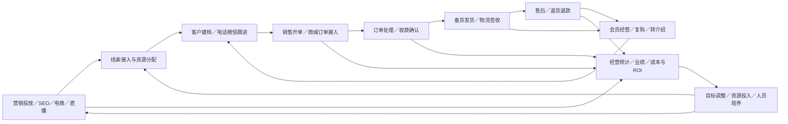

# 公司业务全景梳理（基于 ERP 前后端代码）

> 梳理日期：2026-09-15
>
> 适用范围：当前工作区中的 ERP 管理端、业务后端、面试登记端和面试反馈端。
>
> 阅读对象：业务负责人、产品经理、研发人员及新入职同事。
>
> 定位：以代码可证实的业务能力为边界的业务地图，不等同于公司全部线下业务或线上启用清单。

## 1. 文档说明与阅读方式

### 1.1 本文如何归纳业务

本文按“获客 → 客户经营 → 订单成交与履约 → 财务核算 → 经营分析 → 组织支撑”组织内容。每个模块说明业务目的、子业务、主要操作、上下游关系，并给出前后端代码依据。

证据来自三个层次：

1. **前端页面**：表单、按钮、列表、页签、筛选条件和页面实际调用的 API。
2. **后端接口**：Controller 的路由、参数校验、调用的 Service 及业务方法。
3. **关键实现**：对重要的状态、计算口径和流程，进一步检查 Service、枚举或共享操作定义。

全局扫描覆盖管理端 `src/views` 下 906 个 Vue 文件及 `Apis` 下 21 个服务目录，并补充采购、消息推送、消息队列和两个面试端。扫描数量含组件、演示页、空文件及新旧重复文件，**不是 906 项业务，也不表示每个页面都已完成运行验证**。重点业务做前后端交叉核查，其余以功能组归纳。

文中代码链接均相对本文所在的 `docs` 目录，可在仓库内直接定位。Controller 文件存在只能证明仓库保留相关代码；还需要区分公开方法、私有方法、注释代码和仅返回占位结果的实现，才能判断是否有可供调用的入口。是否已部署、是否有菜单权限、是否仍在使用，需要结合线上配置确认。

### 1.2 判断边界

| 标记或表述 | 含义 |
| --- | --- |
| 前后端有实现 | 已找到相互对应的页面、API 或后端业务实现；不代表已联调验证 |
| 后端能力 | 已找到后端入口，可能由外部系统、小程序或其他服务调用 |
| 阶段性／历史功能 | 代码包含活动期、特定年度或旧版本痕迹，使用状态待确认 |
| 占位／演示／基础设施 | 不计为独立经营业务 |

此次是文档梳理，没有连接数据库、调用业务接口、启动可能连接正式环境的服务，也没有触发真实订单、付款、短信或消息发送。本文不包含真实客户数据和账号密钥。

原规范指定的 `D:/project/ERP/docs/ailai_erp_跨模块数据访问规范.md` 在本机不存在；已读取当前仓库实际文件 [跨模块数据访问规范](ailai_erp_跨模块数据访问规范.md)，按其中的服务归属、跨模块访问和外部调度边界解释代码。

### 1.3 内容导航

- 第 2 章：公司业务全景和核心闭环。
- 第 3～4 章：客户、订单两条核心业务主线。
- 第 5～6 章：产品采购、营销与内容获客。
- 第 7～9 章：财务支付、统计分析、目标与销售运营。
- 第 10～14 章：招聘人事、学习文化、协作工单、资产、权限及集成。
- 第 15～16 章：业务术语、覆盖清单、已知边界与维护建议。

## 2. 公司业务全景

### 2.1 从代码可还原的业务模式

系统围绕商品经营、线上推广、电商及直播渠道、电话／微信客户经营展开：推广带来线索，线索经过分配和跟进形成客户关系，客户购买商品形成订单，订单进入收款、发货、签收及售后流程；成交、资源投入和人员投入再进入统计与绩效管理，推动下一轮投放、排班、客户运营和产品经营。

代码中可见 NMN、麦角硫因、精氨酸、胶原等产品／项目分组，以及电商、直播、电话和微信等经营渠道。这些名称用于说明系统实际分组，不能据此推断公司全部产品线、组织架构或业务资质。

上图是业务关系图，并非所有订单必须依次经过每一步的状态机；货到付款、预付、定金等场景有不同的收款时点。

### 2.2 业务域总表

| 业务域 | 解决的问题 | 主要对象 | 主要协作角色（按功能推定） |
| --- | --- | --- | --- |
| 客户与 SCRM | 谁是客户、由谁服务、如何跟进和复购 | 客户、资源、归属、跟踪、会员、优惠券 | 销售、客服、资源管理员 |
| 订单与售后 | 卖了什么、如何交付、异常如何处理 | 订单、商品明细、收付款、物流、退换货 | 销售、订单处理人员、仓配、财务、售后 |
| 产品与采购 | 卖哪些商品、成本和库存如何支撑销售 | 商品、品牌、成分、价格、库存、采购计划 | 产品、采购、仓配 |
| 营销与内容获客 | 从哪些渠道获取咨询和成交机会 | 推广账户、链接、专题、内容、活动、店铺 | 投放、运营、SEO、品牌 |
| 财务与支付 | 钱如何收退、费用如何归集、账务如何核对 | 支付单、退款、费用、主体账户、结算报表 | 财务、渠道运营 |
| 统计与经营分析 | 业绩、转化、投入产出和组织效率如何变化 | 日月报、快照、报表、目标、成本 | 管理层、业务负责人、财务、运营 |
| 销售运营 | 目标如何拆解、资源如何排班和分配 | 个人／团队目标、工作日、排班、权重 | 销售管理、资源管理 |
| 招聘与人事 | 如何招人、入职、培养、转正和管理异动 | 岗位需求、候选人、面试、花名册、合同 | HR、招聘负责人、用人部门 |
| 学习与企业文化 | 员工如何学习、考试、获取制度和分享经验 | 课程、试题、考试、公告、文章、积分 | 培训、讲师、员工、内容管理员 |
| 内部协作 | 跨部门问题和设计需求如何交接 | 工单、处理节点、附件、设计稿 | 需求发起人、受理部门、设计师 |
| 行政资产 | 资产、号码、域名由谁管理和使用 | 固定资产、耗材、手机卡、域名 | 行政、IT、使用人 |
| 平台支撑 | 账号权限、通知、文件和系统间协作如何工作 | 用户、角色、菜单、配置、消息、日志 | 管理员、IT、各业务模块 |

### 2.3 五条主要业务闭环

1. **新客户成交**：推广／渠道获客 → 资源识别和分配 → 建档跟进 → 下单 → 履约 → 回款及业绩统计。
2. **存量客户经营**：客户画像／健康信息 → 回访与会员服务 → 优惠券／活动／转介绍 → 复购 → 效果统计。
3. **商品经营**：产品资料与成本 → 营销展示 → 采购和库存配合 → 订单发货 → 动销、毛利相关分析与预警。
4. **经营管理**：目标设定 → 排班和投入 → 日常业务发生 → 报表与战报 → 调整人员、资源和投放。
5. **人才经营**：岗位需求 → 招聘与面试 → 入职及下团队 → 学习和阶段考核 → 转正／晋级／留存分析。

## 3. 客户模块：线索、资源、服务与会员经营

### 3.1 客户档案与客户池

**业务目的**：建立统一客户档案，明确客户由谁服务、处于什么跟进阶段，以及下一步应做什么。

| 子业务 | 已见主要操作 | 业务产出／关联 |
| --- | --- | --- |
| 客户建档 | 后台新增、导入、编辑、手机号检查、客户详情、地址建议 | 客户基础档案，供订单和跟进复用 |
| 临时客户 | 新增、记录、处理、编辑、查询、转正式客户 | 把尚未完成建档的线索纳入正式客户管理 |
| 客户合并 | 合并客户档案，并提供订单迁移相关入口 | 统一同一客户的历史关系和订单 |
| 客户池 | 全部客户、我的客户、个人潜力、公共潜力、公共资源、A/B 类资源 | 按资源归属和业务分类形成工作列表 |
| 时效工作台 | 即将过期、刚过期、已过期、待跟进、预约客户、生日客户、提醒任务 | 安排回访、生日服务及资源处理 |
| 客户详情 | 基础信息、购买情况、跟进、预约、微信、意向等记录 | 为销售和客服提供连续服务上下文 |

客户池是查询条件和权限共同形成的工作视图，不应直接等同于客户的一套互斥生命周期状态。

**代码依据**：[客户列表组件](../sources/Manage.Web/src/views/customers/component/customerTable.vue)、[客户详情](../sources/Manage.Web/src/views/customers/component/customer-detail.vue)、[客户管理接口](../sources/ERP.API/Apis/Ailai.Customer/Controllers/ManagerOperationController.cs) 的 `CustomerPageList`、`GetDetail`、`PhoneCheck`、`AddByAdmin`、`Upload`、`Merging`、`TransCustomerTemp`。

### 3.2 资源接入、分配与归属

客户“资源”指销售可跟进的客户或线索机会，与商品库存中的“资源”无关。

主要能力：

- 获客助手记录新增、批量新增、导入、编辑和查询。
- 按业务规则分配资源，支持认领、强制分配、客服归属查看及调整。
- 区分销售客服、营销客服、资源归属以及组织范围。
- 按个人、团队、系列、部门和业务渠道配置资源目标、排班及权重。
- 记录分配日志、异常记录、资源转移和审批过程。
- 临保转客保、资源延期、释放和重新流转。

**流程概括**：获客接入 → 进入资源池 → 按规则分配／认领 → 跟进和保护 → 延期、转移或释放 → 重新分配。

**代码依据**：[获客助手接口](../sources/ERP.API/Apis/Ailai.Customer/Controllers/CustomerAcquisitionAssistantController.cs)、[客户管理接口](../sources/ERP.API/Apis/Ailai.Customer/Controllers/ManagerOperationController.cs) 的 `DistributionResources`、`SetOwnerForce`、`ResourceBelong`、`TransferCustomer`、`ApprovalResourceTransfer`、`TempProtectedCusToPersonProtectedRequestHandler`；[资源接口](../sources/ERP.API/Apis/Ailai.Customer/Controllers/CustomerResourcesController.cs)。

### 3.3 跟进、回访与保护期

| 子业务 | 主要动作 | 已核实的规则边界 |
| --- | --- | --- |
| 日常跟进 | 添加跟踪记录、有效跟进、电话联系、微信联系 | 客户存在、人员状态及资源权限影响是否可操作 |
| 预约回访 | 预约、回访、提醒任务 | 形成后续待办，不等于自动成交或续保 |
| 客户保护 | 个人保护、临时保护、保护延期 | 按资源类型、归属和组织执行不同规则 |
| 资源释放 | 手工／业务入口释放，保留日志 | 普通销售及主管受到资源所属人的限制 |
| 保护延期 | 填写延期说明、更新到期时间、记录操作 | 实际期限以当前配置和执行分支为准 |

重点规则：有效跟进会检查在职身份，黑名单资源不可跟进；新客、跨组织资源、管理层个人保护资源和过期未成交资源的边界不同；部分过期资源受每日跟进额度限制。源码中的已注释“最长 60 天”校验不作为现行规则。

**代码依据**：[有效跟进服务](../sources/ERP.API/Apis/Ailai.Customer/Models/Service/CustomerResources/EffectiveFollowService.cs)、[资源释放服务](../sources/ERP.API/Apis/Ailai.Customer/Models/Service/CustomerResources/ReleaseResourcesService.cs)、[保护延期服务](../sources/ERP.API/Apis/Ailai.Customer/Models/Service/CustomerResources/ExtendProtectionService.cs)。

### 3.4 微信经营、防撞单与风险控制

- **微信经营**：微信号、好友资料、加微时间、加微记录、聊天记录、服务客服及加粉上报。
- **防撞单助手**：通过手机号或第三方单号查询客户／跟进判定，保留查询历史，并确认已知晓，帮助销售避免重复或冲突跟进。
- **客户风险**：号码屏蔽、黑名单、地址风险、客户评价与反馈、操作痕迹追溯。
- **客户信息补充**：标签、健康信息、意向记录、手机备注及相关附件，为咨询和会员服务提供依据。

防撞单助手页面仍有设计期文案，但源码已经包含真实 API 调用及后端入口，应归类为“源码有实现，启用待核验”，而非仅凭文案判断为静态原型。

**代码依据**：[防撞单页面](../sources/Manage.Web/src/views/customers/customerSeas/anti-collision-query-assistant.vue)、[防撞单接口](../sources/ERP.API/Apis/Ailai.Customer/Controllers/AntiCollisionQueryAssistantController.cs) 的 `Query`、`History`、`Acknowledge`；[客户健康信息接口](../sources/ERP.API/Apis/Ailai.Customer/Controllers/CustomerHealthInformationController.cs)、[微信好友记录接口](../sources/ERP.API/Apis/Ailai.Customer/Controllers/WechatFriendRecordController.cs)。

### 3.5 会员、账户、优惠券与客户活跃

| 子业务 | 已见能力 | 与其他模块的关系 |
| --- | --- | --- |
| 会员身份 | VIP 设置、等级和生日权益相关入口 | 影响客户服务和订单权益 |
| 会员账户 | 查询余额、余额调整、账户变更流水 | 与订单消费、退款等场景关联 |
| 客户积分 | 查询、增减、流水、兑换配置 | 与发券、会员活动关联 |
| 优惠券 | 可用券查询、领取、批量发券、积分兑换、作废返积分 | 订单侧提供用券入口 |
| 发券运营 | 自动发券规则查询、保存、启停，员工券额度相关能力 | 规则入口由外部调度平台按需触发 |
| 转介绍 | 邀请、邀请数量、领取和奖励记录 | 带来新客户并激励存量客户 |
| 会员活跃 | 生日礼品、历史客户消费金、健康打卡、客户评价 | 提高回访和复购触点 |
| 小太阳权益 | 视频领取、兑换、换购和退回 | 和具体会员／商品规则关联 |
| 专项活动 | 抽奖、节庆红包、黑卡等代码 | 有阶段性痕迹，是否继续运营待确认 |

“客户积分／余额”“小太阳”“员工积分”是不同业务对象，不能在统计或权益说明中混用。历史 `CusApprove` 已明确标注“认证会员（已废除）”，不纳入当前主流程。

**代码依据**：[客户账户操作](../sources/ERP.API/Apis/Ailai.Customer/Controllers/CustomerOperationController.cs)、[自动发券规则](../sources/ERP.API/Apis/Ailai.Customer/Controllers/CouponAutoIssueRuleController.cs)、[转介绍](../sources/ERP.API/Apis/Ailai.Customer/Controllers/CustomerIntroduceController.cs)、[VIP 健康打卡](../sources/ERP.API/Apis/Ailai.Customer/Controllers/PremiumEditionVIPHealthCheckInController.cs)。

### 3.6 电话 SCRM 与通话服务

业务链路：员工工号绑定分机／话务系统 → 登录话务 → 拨号和挂断 → 回调同步通话 → 关联客户 → 查看录音、时长及跟进情况。

- 员工与分机、话务系统类型绑定；前端可见多套话务系统类型。
- 通话列表、录音、时长、客户关联、未接电话和团队话务统计。
- 将客户号码推送到外呼页面，检查联系记录及联系达标情况。
- 录音转文字、按客户或单次通话转写、转写消息发布和跟进意见入口。

语音转写依赖外部服务及配置；本文只确认代码能力，不确认识别质量或线上接通情况。测试拨号、测试挂断不计为正式业务。

**代码依据**：[分机配置](../sources/Manage.Web/src/views/phone/userCtiList.vue)、[呼叫接口](../sources/ERP.API/Apis/Ailai.Phone/Controllers/CallController.cs) 的 `Login`、`DialOut`、`HangUp`、`OverCall`；[通话记录接口](../sources/ERP.API/Apis/Ailai.Phone/Controllers/CallRecordController.cs) 的 `TeamRecord`、`CheckCallStandardFromCustomerIds`、`PublishSTT` 等。

### 3.7 爱币与客户价值辅助能力

- **爱币权益**：小程序后台可按客户查询爱币、查询已购商品、用爱币兑换优惠券，并有独立变更流水接口。爱币是源码中独立命名的权益字段，不与普通会员积分、员工积分或小太阳合并解释。
- **客户价值辅助更新**：后端保留号码、地址、客户价值更新入口；仅凭 `AIResourceLevel` 名称不能确认已有完整智能评分模型、评分准确性或业务自动决策闭环。
- **WeGene 外部接入痕迹**：可见授权、用户信息及皮肤报告请求代码，但当前读取方法未将报告返回或保存为客户报告，只返回成功标志。因此只列为接入代码，不列为已完善的基因检测报告管理业务。

**代码依据**：[爱币接口](../sources/ERP.API/Apis/Ailai.Customer/Controllers/AiCoinsController.cs)、[爱币流水](../sources/ERP.API/Apis/Ailai.Customer/Controllers/AiCoinsTransactionRecordController.cs)、[价值更新入口](../sources/ERP.API/Apis/Ailai.Customer/Controllers/AIResourceLevelController.cs)、[WeGene 接入实现](../sources/ERP.API/Apis/Ailai.Customer/Models/ServiceCollaboration/WeGeneRestClient.cs)。

## 4. 订单模块：成交、履约、售后与业绩

### 4.1 订单来源与建单

**业务目的**：把销售承诺转化为可以收款、发货、跟进和核算的交易单据。

| 业务场景 | 主要操作 |
| --- | --- |
| 人工销售建单 | 后台快速下单、特定项目下单、订单修改 |
| 外部渠道接入 | 平台订单导入、平台赠品订单导入、平台线索订单导入 |
| 订单派生 | 定金单、跨月定金单、余额单、赠品单、换货单、退货单、减业绩单 |
| 特殊处理 | 分单、预订单、囤单、重新生成、关联订单、定金解绑、恢复订单 |
| 客户统一 | 客户合并时迁移关联订单 |

订单类型枚举包含电话、在线客服、微信、信息流、搜索、SEO、快手、百度健康、小红书、SHOPLINE、美团及品牌小程序等渠道标识。该枚举说明代码具备区分能力，不能作为这些渠道当前均在经营的证明。

**代码依据**：[订单接口](../sources/ERP.API/Apis/Ailai.Order/Controllers/OrderInfoController.cs) 的 `BackgroundFastOrder`、`OrderUpload`、`GiftOrderUpload`、`PlatformClueOrderUpload`、`CreateDepositOrder`、`CreateBalanceOrder`、`SplitOrder`；[订单类型枚举](../sources/ERP.API/Apis/Ailai.Order/Models/Enums/OrderTypeEnum.cs)。

### 4.2 订单工作台和状态维度

大量订单页面共用统一订单工作台，通过 `typePage` 区分业务队列：待确认、未签收、退货未签收、退货已签收、冻结、锁定、投诉预警、退单预警、问题单、停滞单、售后等。

必须区分以下概念：

| 维度 | 含义 |
| --- | --- |
| 订单基础状态 | `OrderStatusEnum` 为正常、客户取消、后台取消 |
| 处理与可发状态 | 订单是否已处理、是否满足允许发货条件 |
| 审批与风控 | 是否处于冻结、风险审批或其他限制中 |
| 物流状态 | 是否实际发货、派送、签收、退回 |
| 财务状态 | 是否到款、是否需要财务协助、是否退款等 |
| 售后状态 | 是否售中／售后处理、是否解决、是否退换货 |
| 业绩状态 | 归属、确认、锁定、重算等 |

因此，一笔订单可以同时属于多个业务队列，不能把页面名称拼成一条互斥状态流。

**代码依据**：[基础状态枚举](../sources/ERP.API/Apis/Ailai.Order/Models/Enums/OrderStatusEnum.cs)、[订单公共操作定义](../sources/Manage.Web/src/assets/js/order/orderCommon.js)、[确认订单页面](../sources/Manage.Web/src/views/orders/order-sea/confirm-order.vue)。

### 4.3 订单处理、发货审批与校验

典型业务顺序为：**处理订单 → 检查商品、地址、付款及审批 → 可以发货 → 确认发货**。其中“可以发货”是放行，“确认发货”才表示实际发出。

关键校验与审批包括：

- 已取消订单不能设为可发，冻结商品单须先解冻。
- 第三方订单需要第三方订单号；收货联系方式、付款方式等必须满足校验。
- 定金业绩待总监确认、采购审批、多号码／多地址审批、风险商品、进口运费、管控品牌等审批中，会限制放行。
- 涉及疑似欺诈地址、特殊商品、赠品条件和特定活动时，执行相应校验。
- 小太阳兑换有客户月度额度约束；减业绩单需关联原单，并核对客服一致性。
- 通知发货、确认通知、指定日期和特殊要求有独立操作入口。

这些规则存在角色、组织、店铺或活动分支，本文不将其简化为对全公司所有订单无条件适用的制度。

**代码依据**：[订单服务](../sources/ERP.API/Apis/Ailai.Order/Models/Service/OrderInfoService.cs) 的可发货校验及 `ValidateGiftConditionAmountBeforeCanDelivery`；[订单接口](../sources/ERP.API/Apis/Ailai.Order/Controllers/OrderInfoController.cs) 的 `HandleOrder`、`CanDelivery`、`ApplyCanDelivery`、`ApproveDepositOrder`、`DeliverySure`。

### 4.4 发货、物流与批量作业

| 子业务 | 主要操作 |
| --- | --- |
| 发货管理 | 可以发货、确认发货、取消发货、恢复可发、第三方发货信息 |
| 物流资料 | 快递公司、运单号、物流信息更新、第三方交易号 |
| 配送追踪 | 物流轨迹、派送状态、人工签收、批量签收、物流导出 |
| 批量可发任务 | 创建任务、任务列表、查看明细、异步执行、失败重试 |
| 异常处理 | 仓库驳回后重新生成、发货条件异常处理 |

批量可发采用“任务批次—订单明细”结构；重试只针对失败明细，没有失败订单时不能按失败重试。

**代码依据**：[批量可发页面](../sources/Manage.Web/src/views/orders/batch-delivery/index.vue)、[批量任务接口](../sources/ERP.API/Apis/Ailai.Order/Controllers/OrderBatchDeliveryTaskController.cs)、[批量任务服务](../sources/ERP.API/Apis/Ailai.Order/Models/Service/OrderBatchDeliveryTaskService.cs)；订单接口的 `UpdateWLInfo`、`UpdateTrackNumber`、`GetLogisticsInfo`、`ConfirmReceipt`。

### 4.5 订单资金处理与业绩归属

订单侧包含：设置到款、取消到款、财务协助、财务解决、折扣调整、优惠券使用、购物金生成和使用、提现设置及烂账计提等入口。

业绩侧包含：销售客服／营销客服／业绩客服归属调整，业绩确认、锁定、解锁、修改和重算。商品成本发生变化时，有“选择商品 → 预览影响 → 提交任务 → 查看进度和失败明细”的成本业绩重算流程。

这里的到款标记、业绩归属和支付渠道真实资金流是相关但不同的对象；订单中的“设置到款”不能直接解释成向客户扣款，业绩也不能直接等同于订单总额。

**代码依据**：[订单操作 API 映射](../sources/Manage.Web/src/api/modules/shared.js)、[成本业绩重算页面](../sources/Manage.Web/src/views/order/costPerformanceRecalc/index.vue)、[重算接口](../sources/ERP.API/Apis/Ailai.Order/Controllers/CostPerformanceRecalcController.cs) 的 `Preview`、`Submit`、`GetProgress`、`GetFailures`。

### 4.6 售中、售后与异常闭环

- **沟通处理**：查单、客服跟进、重点跟进、售中、售后、售后协助、售后解决。
- **退换处理**：换货、退货、退货退款、批量退货退款；“已经退货”和“收到退货”分别有操作入口。
- **平台退款**：导入第三方退款订单，关联内部订单并更新售中／售后处理信息。
- **问题管理**：投诉预警、退单预警、问题单、停滞单、冻结及锁定工作队列。
- **过程留痕**：订单备注、标签、聊天记录、跟踪记录、操作日志和工单关联。

流程概括：发现订单问题 → 记录沟通和责任人 → 申请／执行售后动作 → 跟踪退货物流或退款 → 更新财务、业绩及处理结果。

**代码依据**：[批量退货退款](../sources/Manage.Web/src/views/orders/components/buttonComponent/batch-return-refund.vue)、[第三方退款导入](../sources/Manage.Web/src/views/orders/components/buttonComponent/third-party-refund-import.vue)、[售后页面](../sources/Manage.Web/src/views/orders/order-sea/after-sale.vue)、[订单接口](../sources/ERP.API/Apis/Ailai.Order/Controllers/OrderInfoController.cs) 的 `ReceiveReturn`、`Returned`、`ReturnConsignmentAndReturnMoney`、`ImportThirdPartyRefundOrders`、`AfterSaleSolve`。

### 4.7 样品订单、领用与归还

样品单拥有独立的列表、商品明细、详情、创建、Excel 导入、修改和操作记录；有处理、可以发货、批量可发、确认发货、取消发货、解锁、签收、取消订单以及领用归还入口。前端另有归还日期和样品说明等操作组件。

其业务链路可概括为：样品申请／导入 → 处理与发货 → 签收或领用 → 记录归还及后续处理。它不能简单并入普通销售订单或促销赠品：是否需要归还及如何处理，应以样品类型和实际操作条件为准，不假定所有样品都必须退回。

**代码依据**：[样品订单接口](../sources/ERP.API/Apis/Ailai.Order/Controllers/SampleOrderInfoController.cs) 的 `CreateSampleOrder`、`SampleOrderCanDelivery`、`SampleOrderDeliverySure`、`SampleOrderReceiveReturn`；[样品处理组件](../sources/Manage.Web/src/views/orders/components/buttonComponent/deal-sample-order.vue)、[样品归还日期](../sources/Manage.Web/src/views/orders/components/buttonComponent/sample-return-date.vue)。

### 4.8 退货登记与平台退货单同步

退货登记独立于“发起退款”：可导入退货登记表、分页查询、导出，并根据快递单号和订单号同步内部退货信息；另有 Excel 批量同步入口。平台店铺退货单还提供同步和标记已处理功能。

业务目的在于把实际退回包裹、平台退货单与 ERP 订单对应起来，为仓库、售后及财务后续处理提供依据。“已同步”或“已处理”不能直接当作退款到账证明。

**代码依据**：[退货登记页面](../sources/Manage.Web/src/views/orders/order-sea/returnRegistration.vue)、[退货登记接口](../sources/ERP.API/Apis/Ailai.Order/Controllers/ReturnRegistrationController.cs) 的 `Upload`、`SyncOrderReturnInformation`、`BatchSync`；[平台退货单接口](../sources/ERP.API/Apis/Ailai.Order/Controllers/PlatformStoreReturnOrderController.cs) 的 `SyncPlatformStoreReturnOrder`、`MarkPlatformStoreReturnOrderProcessed`。

## 5. 产品与采购模块：商品供给、价格及采购履约

### 5.1 商品基础资料

| 子业务 | 主要能力 | 业务关系 |
| --- | --- | --- |
| 商品档案 | 完整／简化录入、编辑、图片、视频、上架下架、暂停及废除 | 支撑销售选品、开单和商城展示 |
| 分类体系 | 品牌、系列、分类、成分、专题 | 支撑商品检索及内容关联 |
| 套装 | 主商品及组成商品、数量、价格规则 | 关联促销和订单商品明细 |
| 商品工作台 | 查看库存批次、库存、成本、销量、客诉、控价信息，加入购物车 | 汇集 Product、Order、Statistics 的信息 |
| 内容配套 | 评论新增、批量添加、编辑、发布，商品视频和专题管理 | 支撑商品介绍与内容运营 |

商品资料并非只供内部维护：更新商品会涉及商品页缓存与 SEO 内容更新；部分价格或状态变更会发布产品文章消息。商品经营与内容获客存在业务关联。

**代码依据**：[商品列表](../sources/Manage.Web/src/views/products/productList.vue)、[商品录入](../sources/Manage.Web/src/views/products/add-product.vue)、[商品接口](../sources/ERP.API/Apis/Ailai.Product/Controllers/AilaiProductInfoController.cs) 的 `InsertAilaiProduct`、`UpdateAilaiProduct`、`SetStop`、`SetUpDown`、`ProductRecord`；[评论接口](../sources/ERP.API/Apis/Ailai.Product/Controllers/ProductCommentController.cs)。

### 5.2 成本、控价与促销价格

- 成本分析、年度采购标准、历史加权价格及产品成本价维护。
- 控价责任人和控价信息管理，保留操作记录，并提供钉钉推送入口。
- 大促活动设置起止时间、优先级，维护套装主商品、组成商品及价格明细，支持导入导出。
- 按指定时间匹配有效活动和业绩规则；单品套装阶梯规则涉及活动优先级、更新时间等选择条件。

已核实的大促校验：活动名称必填，结束时间晚于开始时间，优先级至少为 1，价格非负；每个套装序号必须且只能有一个主商品，同套装不可重复产品，组成数量大于零。

控价人员追加有人员数量和运营中心范围校验，不能理解为所有员工均可任意调整控价责任。

**代码依据**：[大促价格页面](../sources/Manage.Web/src/views/products/major-promotion-price/index.vue)、[大促价格服务](../sources/ERP.API/Apis/Ailai.Product/Models/Service/MajorPromotionPriceService.cs) 的 `GetPerformanceRules`、`Import`、`UpdateRow`、`ValidateActivity`；[控价接口](../sources/ERP.API/Apis/Ailai.Product/Controllers/ProductPriceControlController.cs)。

### 5.3 礼品、权益商品与渠道商品池

| 场景 | 功能范围 |
| --- | --- |
| 促销礼品 | 促销赠品、美莱赠品、大促礼品、礼品零售区 |
| 会员礼品 | 生日、月度、会员、VIP 礼品 |
| 积分商品 | 商品配置、可兑换商品查询；实际员工积分及兑换记录在用户服务 |
| 平台商品 | 平台商品关联、新品同步、排除名单、电商活动排期 |
| 专项商品池 | 公域引流、宝岛、专题及活动商品 |

礼品页面属于促销或权益配置，不是各自独立的业务系统。商品库存查询和采购跟进有实现，但本次没有发现足以据此确认完整制造执行、生产工艺、车间排产闭环的证据。

**代码依据**：[会员礼品接口](../sources/ERP.API/Apis/Ailai.Product/Controllers/MembershipGiftController.cs)、[积分兑换页面](../sources/Manage.Web/src/views/products/integral-exchange.vue)、[平台商品页面](../sources/Manage.Web/src/views/products/platformproduct.vue)、[新品排除名单](../sources/Manage.Web/src/views/products/excludeNewProduct.vue)、[电商活动排期](../sources/Manage.Web/src/views/products/EcommerceEventSchedule.vue)。

### 5.4 采购需求、供应商与合同

**业务目的**：把各部门采购需求转化为可跟踪的计划、合同、付款、发票和交付记录。

典型流程：供应商建档 → 采购需求计划 → 明确负责人和执行人 → 单独采购或集中合同采购 → 跟进付款、发票、制作／物流／到货 → 交付及统计。

| 子业务 | 主要信息和操作 |
| --- | --- |
| 供应商 | 主营商品、联系人、城市、信用等级、评价、开票信息、合作次数和金额 |
| 采购计划 | 物品、品牌、产品编号、数量、预算、支付金额、交付期限、紧急程度、采购日期和状态 |
| 合同采购 | 合同维护、关联需求计划、集中采购处理 |
| 付款和发票 | 单独采购在计划侧处理，集中采购在合同侧处理 |
| 跟进提醒 | 紧急程度、采购提醒、交付状态、付款和发票待办 |
| 采购看板 | 年度计划数、采购数、预算、支出、未付、未开票、状态及负责人／月份比较 |

采购看板的“实际计划数”按是否存在采购日期统计，不能解释为“已交付数量”。采购独立服务的数据库归属在规范中未明确，本次不根据历史配置推断。

**代码依据**：[采购页面目录](../sources/Manage.Web/src/views/procurementManagement)、[采购接口](../sources/ERP.API/Ailai.Procurement/Controllers/ProcurementPlanController.cs) 的 `ProcurementPlanInsert`、`ContractDetailInsert`、`SupplierInsert`、`PurchaseTodoReminder`、`GetDataBoard`；[采购服务](../sources/ERP.API/Ailai.Procurement/Models/Service/ProcurementPlanService.cs)。

### 5.5 库存预警、新品补货与质检跟进

除采购计划管理外，统计页面中还存在面向销售商品供给的业务流程：

| 子业务 | 已核实内容 |
| --- | --- |
| 品牌库存看板 | 现有库存、待发货、在途、库存预警、近期销量及采购信息 |
| 美莱商品库存 | 库存、近 7 天／30 天／一年销量、过期时间、滞销及是否需订货 |
| 新品补货申请 | 查看库存和销量，填写补货数量及采购信息，通知采购并登记需求 |
| 采购回应 | 处理状态、未处理原因、供货渠道、供应商、供货数量及备注记录 |
| 新品质检 | 质检记录、相关订单、质检处理与意见、审批处理与意见，页面有图片附件交互 |

补货回应中，非“已处理”要求说明原因；确认供货要求渠道、供应商及有效供货数量。补货通知存在固定接收人实现，不能写成总会按页面所选采购负责人动态发送。

这些能力将“库存观察 → 补货协作 → 供货反馈／质检”串联起来；其后端部分位于 Statistics，不应因目录归属而遗漏。它们仍不足以证明 ERP 已实现完整仓库库位、盘点或制造管理。

**代码依据**：[品牌库存看板](../sources/Manage.Web/src/views/statistics/marketBrandInventoryDashboard.vue)、[美莱库存统计](../sources/Manage.Web/src/views/statistics/MeiLaiProductInventory.vue)、[新品库存和质检页面](../sources/Manage.Web/src/views/statistics/NewProInventoryManagement.vue)、[新品扩展接口](../sources/ERP.API/Apis/Ailai.Statistics/Controllers/NewProductExpandController.cs) 的 `LinkCG`、`CGDeal`、`NPDeal`、`NPGCheckBinding`、`NPGApprovalBinding`。

## 6. 营销模块：渠道投放、商城、小程序与 SEO

### 6.1 推广账户、渠道归因与店铺

| 子业务 | 已见能力 | 实际协作服务 |
| --- | --- | --- |
| 推广账户 | 推广模式、平台、产品组、账户、返点、负责人、授权资料 | User |
| SEM 回传映射 | 页面／表单／账户／站点标识关联产品，区分广告渠道 | Product |
| 推广域名 | 域名、网站公司资料、备案、分类、商品配置和预览 | Seo／SeoNet |
| 店铺档案 | 平台、店长、主管、客服、钉钉负责人、订单同步路径、是否发货等 | Order；组织人员来自 User |
| 专项渠道账户 | 腾讯电商账户、渠道负责人和授权设置 | Order 等相关服务 |
| 广告接入 | 百度广告授权回调、令牌、账户资料、通话记录接收和线索保存 | Market |
| 投放排期 | 配合当月业绩目标和广告预算生成／查看推广安排 | Statistics |

需要特别区分：`sem-promotion.vue` 是数据回传映射；真正推广排期另有 `SemTargetTrackController.PromotionSchedule`。后者会检查当月业绩目标与广告预算。

**代码依据**：[推广账户页](../sources/Manage.Web/src/views/BusinessManagCenter/market/promotionPlatformAccount.vue)、[SEM 映射页](../sources/Manage.Web/src/views/BusinessManagCenter/market/sem-promotion.vue)、[店铺页](../sources/Manage.Web/src/views/BusinessManagCenter/market/storeList.vue)、[营销 API 映射](../sources/Manage.Web/src/api/modules/marketApi.js)、[百度广告接口](../sources/ERP.API/Apis/Ailai.Market/Controllers/BaiduAdsController.cs)。

### 6.2 营销活动和优惠券配置

- 优惠券配置：名称、满减条件、优惠金额、每人限领、关联产品、启用停用。
- 秒杀、大促、赠品、抽奖报名、订单激励和特定客户留存计划。
- 小程序活动模型、入口图片、页面方案、上线暂停、推广链接和推送配置。
- 活动和订单、客户权益联动：券规则由营销侧配置，客户侧持有／领取，订单侧使用；订单激励入口可能落在 Order，留存计划可能落在 Customer。

已核实规则：优惠金额不能超过满减条件，关联商品须为优惠券商品；活动上线检查活动是否存在，已有上线活动时要求先暂停原活动。上述是特定实现的约束，不扩展为所有活动系统统一规则。

**代码依据**：[优惠券配置接口](../sources/ERP.API/Apis/Ailai.Market/Controllers/CouponInfoController.cs)、[小程序活动方案](../sources/ERP.API/Apis/Ailai.Market/Controllers/VXActivityPlansController.cs) 的 `SetOnline`、`GetActivityInfo`；[营销配置页面目录](../sources/Manage.Web/src/views/BusinessManagCenter/market)。

### 6.3 爱来商城运营

商城后台将商品和内容组织为面向用户的展示：商品上下架和暂停、商品分类、品牌、促销价、大促价、赠品、C 位推荐、首页分类、品牌展示、证书、广告及广告分类、知识文章、健康问答和百科配置。

`ailaishop` 是前端业务集合，实际调用 Product、Market 和 SEO，并不等同于 VXApplet 服务。商城页面配置、商品档案和订单处理分别承担不同职责。

**代码依据**：[商城商品页](../sources/Manage.Web/src/views/ailaishop/als-product/product/index.vue)、[商城营销页](../sources/Manage.Web/src/views/ailaishop/als-market/als-seckill/index.vue)、[商城 API](../sources/Manage.Web/src/api/ailaishop.js)。

### 6.4 微信小程序与会员卡接入

后端提供微信 code 换 OpenID、授权登录、来源／品牌／商品参数关联、小程序跳转链接、访问记录、微信发货信息上传、订阅消息回调和发送；还包括微信会员卡创建、二维码、卡码处理和激活。

游戏登录、新年祝福和中奖记录属于活动代码，不能据此确认当前正在运营。仓库中的管理页面也不意味着包含全部消费者端小程序源码。

**代码依据**：[微信接口](../sources/ERP.API/Apis/Ailai.VXApplet/Controllers/WeChatController.cs)、[订阅回调](../sources/ERP.API/Apis/Ailai.VXApplet/Controllers/WxAppCallBackController.cs)、[会员卡接口](../sources/ERP.API/Apis/Ailai.VXApplet/Controllers/AppCrossController.cs)、[活动游戏接口](../sources/ERP.API/Apis/Ailai.VXApplet/Controllers/GameController.cs)。

### 6.5 SEO 内容资产与搜索获客

| 业务环节 | 主要能力 |
| --- | --- |
| 内容分类 | 产品知识库、健康知识、百科大小词条、问答、精选问答、品牌／成分专题、标签 |
| 内容编辑 | 文章新增编辑、词条关联和取消关联、排序、显示状态、导入导出 |
| AI 辅助内容 | 标题生成、文章生成、改写、产品问答、批量任务 |
| 人工审核 | 标注、分发、单篇／批量驳回、一键标注、编辑占用检查 |
| 网站展示 | PC／移动端配置、首页产品、排行榜、关键词、广告、链接和专题 |
| 搜索配套 | XML 站点地图、页面内容更新、发布配置 |
| 效果分析 | URL、页面类型、分类等维度的访问和转化统计 |
| 品牌专题 | NMN、Welnads 等文章、视频、商品分类和推送配置 |

内容生产流程：导入主题／标题 → AI 生成或改写 → 人工标注／驳回 → 分发至知识库、百科、专题或问答 → 展示及效果分析。

标注不等于无条件发布：存在分类检查、明显 AI 提示语检查和屏蔽专题限制。广告平台、AI 服务是否已接通仍取决于实际配置。

**代码依据**：[SEO 页面目录](../sources/Manage.Web/src/views/seo)、[百科接口](../sources/ERP.API/Apis/Ailai.Seo/Controllers/EncyclopediaArticleController.cs)、[知识文章接口](../sources/ERP.API/Apis/Ailai.Seo/Controllers/SeoProductKnowledgeArticleController.cs)、[AI 内容接口](../sources/ERP.API/Apis/Ailai.Seo/Controllers/SeoGPTArticleController.cs) 的 `CreateChatGPTArticleBatch`、`MarkChatGPTArticle`、`RejectChatGPTArticleBatch`、`IsMarking`。

## 7. 财务与支付模块

### 7.1 财务业务分布

财务不是单一目录对应的完整系统，而是分布在几个业务域：订单到款、退款及业绩在 Order；客户余额和积分流水在 Customer；商品成本在 Product；员工成本配置在 User；汇总核算和电商报表在 Statistics；渠道支付在 Payment／Adapay。

本文已找到收退款接入、成本费用及经营核算能力，未据此认定存在完整总账、会计凭证、纳税申报或银行代发工资系统。

### 7.2 店铺主体和账户台账

维护经营主体、注册日期、法人、平台店铺、匹配店铺、主体变更、采购协议、负责人及联系方式，支持编辑、查询、导入模板、导入和导出。

这类台账解决“哪个主体经营哪个店铺、由谁负责”的问题，与销售端店铺发货和客服归属配置不同。

**代码依据**：[主体账户页面](../sources/Manage.Web/src/views/finance/platformStoreAccount.vue)、[主体账户接口](../sources/ERP.API/Apis/Ailai.Statistics/Controllers/PlatformStoreAccountController.cs) 的 `Save`、`Upload`、`DownloadTemplate`、`Export`。

### 7.3 电商月度收支与利润核算

流程：导入财务数据 → 建立人员及组织映射 → 汇总收入、成本和费用 → 下钻明细 → 必要时人工调整 → 锁定月份 → 导出结果。

业务包括资源费分摊、资源目标保存、人员配置和关系映射、月度锁定与解锁相关入口。

已核实的本报表公式：

- 费用合计：按费用明细规则汇总。
- 净利润＝主营业务收入－主营业务成本－费用合计。
- 利润率＝净利润÷主营业务收入。
- 毛利率＝1－主营业务成本÷主营业务收入。
- 收入为空或为零时，上述比例返回空值。

这些公式描述当前电商月结实现，不代表所有报表或公司法定财务口径均相同。独立“人员列配置”路由在权限模块中被过滤，代码存在不代表该独立菜单可见。

**代码依据**：[电商汇总页](../sources/Manage.Web/src/views/statistics/ec/EcSummaryPage.vue)、[汇总接口](../sources/ERP.API/Apis/Ailai.Statistics/Controllers/EcFinanceSummaryController.cs)、[汇总服务](../sources/ERP.API/Apis/Ailai.Statistics/Models/Service/EcFinanceSummaryService.cs) 的 `ComputeSummaryAmount`；[资源费分摊](../sources/ERP.API/Apis/Ailai.Statistics/Controllers/EcResourceFeeSplitController.cs)。

### 7.4 兴趣电商、达人和团长经营核算

- 月度报表、财务分类汇总、达人订单、团长订单和达人投流费用导入查询。
- 业务分类配置、原文件及月度下载、财务分类导出。
- 分别保留支付金额、结算金额、预估／实际佣金、服务费、推广费、补贴、运费、税费及各类业务时间。
- 有触发外部影刀任务的接口；不代表 ERP 内部承担调度职责。

**代码依据**：[兴趣电商报表](../sources/Manage.Web/src/views/statistics/interestEcommerceReport.vue)、[报表接口](../sources/ERP.API/Apis/Ailai.Statistics/Controllers/InterestEcommerceReportController.cs) 的 `SearchFinanceStatPage`、`SearchTalentOrderPage`、`SearchGroupLeaderOrderPage`、`UploadTalentTrafficCost`、`TriggerYindaoTask`。

### 7.5 支付渠道接入

支付服务提供支付发起、结果查询、关单、退款、回调和支付链接／微信身份配套能力。代码涉及支付宝、微信、Adapay、盛付通、斗拱及汇付相关入口，各渠道的实现范围不同，部分旧方法已注释，不能一概视作启用。

业务链路：业务创建支付请求 → 渠道处理 → 回调或查询确认结果 → 关联业务更新；退款另有请求与结果处理。支付成功、订单到款、渠道结算和统计业绩需要分别核对。

**代码依据**：[支付服务控制器](../sources/ERP.API/Apis/Ailai.Payment/Controllers)、[Adapay 接口](../sources/ERP.API/Apis/Ailai.Adapay/Controllers/AdapayController.cs) 的 `StartPayAsync`、`QueryAsync`、`CloseAsync`、`RefundOrderAsync`、`callbackAsync`；[盛付通接口](../sources/ERP.API/Apis/Ailai.Adapay/Controllers/SFTController.cs)。

### 7.6 钉钉费用审批数据台账

面向平台电商店铺费用、兴趣电商费用等审批数据，支持接收付款流程回调、保存审批导出的有效数据、从 MongoDB 导入，以及分页查询。

前端按归属年月、完成时间、流程、人工金额、重复费用、部门、店铺、审批编号等条件检查明细，包含品牌项目、业绩归属方和费用类别等字段。其业务价值是明确费用归属与来源、识别重复费用，作为核对和经营核算的资料。

该页面不能直接解释为银行付款执行台；也不能仅凭与月结报表同在 Statistics 就断言所有审批费用已自动纳入全部财务报表。

**代码依据**：[费用审批台账](../sources/Manage.Web/src/views/statistics/dingtalkExpenseApprovalExport.vue)、[费用审批数据接口](../sources/ERP.API/Apis/Ailai.Statistics/Controllers/DingtalkExpenseController.cs) 的 `Callback`、`SaveApprovalExport`、`ImportApprovalExportFromMongo`、`SearchApprovalExportPage`。

## 8. 统计模块：经营分析、数据核对与决策支撑

### 8.1 统计模块的定位

统计模块将客户、订单、商品、资源、人员、推广投入及渠道数据汇聚为报表和看板。它既有只读分析，也有目标、手工修订、导入、配置和快照等自有业务能力，不能把所有统计接口理解为纯查询。

按现行规范，跨模块聚合优先使用统计汇聚库；同步表和统计模块自有表必须区分。历史代码中的跨库直接引用不作为现行允许方式。

### 8.2 统计业务主题清单

| 主题 | 分析内容 | 主要维度／用途 |
| --- | --- | --- |
| 经营首页 | 目标、业绩、达成率、新客、推广费、ROI、待办 | 个人、团队及组织经营概览 |
| 个人与组织业绩 | 日／周／月、阶段、签收业绩、排名 | 人员、团队、系列、部门、中心 |
| 订单经营 | 订单类型、金额日表、订单明细、取消、售后 | 发现成交变化及异常订单 |
| 发货签收 | 未发货、发货率、签收排名、提前签收及相关异常 | 评估履约进度及口径差异 |
| 商品品牌 | 品牌销量、新单品牌、产品数量、美莱产品业绩、地址分布 | 选品、品类及区域经营 |
| 库存和新品 | 库存、待发货、在途、临期／滞销、补货及质检 | 商品供给和采购协作，详见第 5.5 节 |
| 客户资源 | 注册、流入流出、分配、跟进、意向、成交及复购 | 客户质量、资源效率和转化 |
| 电话微信 | 通话时长、漏接／未知来电、加微、微信跟进 | 销售过程管理 |
| 客户统计规则 | 纳入报表范围、检查规则、配置、申诉 | 明确统计人群和异常处理 |
| 投放跟踪 | SEM 目标、新单、账户、来源、成本、ROI | 预算和渠道效果评估 |
| SEO 效果 | 来源、页面、分类访问及转化 | 内容和搜索获客优化 |
| 项目跟踪 | 项目、腾讯电商、小红书、京东等专题 | 分项目比较资源及经营表现 |
| 存量经营 | 公司、部门、销售、电商、新客推广、人力、视频剪辑 | 业务单元投入与产出 |
| 人产及资源 | 人均产出、最低标准、淘汰观察、团队／部门资源 | 人力配置和管理动作 |
| 活动激励 | PK、冠军、积分、新人奖励、年终奖等 | 特定活动评估，规则有效期需单独确认 |
| 费用审批台账 | 审批编号、归属月、费用类别、重复费用等 | 费用归属和数据核对，详见第 7.6 节 |
| 人才培养 | T1 看板、新人阶段表现、人才入职及留存 | 招聘质量与新人培养 |

**前端依据**：[统计页面目录](../sources/Manage.Web/src/views/statistics)、[首页](../sources/Manage.Web/src/views/dashboard/index.vue)、[人产目录](../sources/Manage.Web/src/views/production)。

**后端依据**：[首页看板](../sources/ERP.API/Apis/Ailai.Statistics/Controllers/HomeBoardController.cs)、[业绩统计](../sources/ERP.API/Apis/Ailai.Statistics/Controllers/StatAchievementController.cs)、[订单统计](../sources/ERP.API/Apis/Ailai.Statistics/Controllers/OrderInfoController.cs)、[客户统计](../sources/ERP.API/Apis/Ailai.Statistics/Controllers/StatCustomerModuleController.cs)、[存量报表](../sources/ERP.API/Apis/Ailai.Statistics/Controllers/ReportFormsController.cs)、[SEM 跟踪](../sources/ERP.API/Apis/Ailai.Statistics/Controllers/SemTargetTrackController.cs)。

### 8.3 经营首页与销售工作台

首页同时服务“看经营结果”和“安排今日工作”：除目标、业绩和 ROI，还汇集生日、意向、转介绍、售后、电话、微信、资源和回访提醒。部分客户清单按注册天数等条件细分。

对应 `HomeBoardController` 的 `BirthRemindQuery`、`IntentionalCustomerQuery`、`ReferenceCustomerQuery`、`AfterSaleQuery`、`PerformanceMonthQuery` 及 `HomeBoardCollection*` 系列。

### 8.4 店铺数据采集与质量核对

业务流程：配置机器人可采集的店铺账户 → 接收店铺业绩／明细 → 保留同步记录 → 查看抓取日历 → 日、月、季度检查 → 准确性对照和导出。

这一组功能解决“渠道数据有没有抓到、是否完整、和核对来源是否一致”，不等同于渠道经营业绩本身。

**代码依据**：[店铺业绩接口](../sources/ERP.API/Apis/Ailai.Statistics/Controllers/PlatformStorePerformanceController.cs) 的 `SaveRobotReport`、`GetRobotSyncLogs`、`GetScrapeCalendar`、`GetDailyDataCheck`、`GetAccuracyCheck`；[准确性核对页面](../sources/Manage.Web/src/views/statistics/storePerformanceAccuracyCheck.vue)。

### 8.5 直播运营

**业务闭环**：直播间及主播建档 → 主播／助播排班 → 日目标 → 业绩、GSV、消耗和内容营销数据上报 → 看板、团队表现及主播排名。

| 子业务 | 主要能力 |
| --- | --- |
| 基础资料 | 直播间、店铺关联、主播信息和启停相关配置 |
| 排班目标 | 主播、助播排班和直播间目标 |
| 数据接入 | 日业绩、GSV、ROI 相关数据、内容营销表现 |
| 实时分析 | 直播表现、团队表现、主播排名、数据明细 |
| 直播流 | 对接抖音相关服务获取直播流信息的入口 |

**代码依据**：[直播看板](../sources/Manage.Web/src/views/dashboard/liveBroadcastKanBan.vue)、[直播排班](../sources/Manage.Web/src/views/BusinessManagCenter/targets/page/liveSchedule.vue)、[直播业务接口](../sources/ERP.API/Apis/Ailai.Statistics/Controllers/LiveRoomDataController.cs) 的 `SaveAnchorSchedulesAsync`、`SaveLiveRoomAchievementAsync`、`SaveLiveGSVInfoAsync`、`GetAnchorPerformanceRankingResultAsync`。

### 8.6 专题看板、战报与数据服务

- 麦角硫因统一跟踪页整合抖音、货架电商、市场品牌、电商中心、非电商中心和腾讯电商等视图，复用统计组件。
- T1 看板提供业务／部门筛选、考核配置和业绩同步入口。
- 晚报提供数据查询和钉钉推送入口；喜报、战报与阶段活动结果构成经营信息传播。
- `ChatBi` 当前可见实现接受查询请求，并按客户 ID 去重分页补齐客户资料；不能仅凭名称宣称具备完整自然语言 BI 对话能力。
- 快照、关系更新和报表推送等周期性业务，由 ERP 提供入口、外部调度平台触发。

另有“地主／农民”内部激励专题：按商品和开单关联查看交易明细，提供抽佣报表和相关喜报消息。此处是代码中的活动称谓，不代表房产、农业或独立游戏经营业务；活动是否继续有效待确认。[专题接口](../sources/ERP.API/Apis/Ailai.Statistics/Controllers/LandlordInfoController.cs) 及 [专题服务](../sources/ERP.API/Apis/Ailai.Statistics/Models/Service/LandlordInfoService.cs) 可用于追溯。

**代码依据**：[麦角硫因跟踪](../sources/Manage.Web/src/views/mjly/mjlyUnifiedTrackTable.vue)、[T1 接口](../sources/ERP.API/Apis/Ailai.Statistics/T1Dashboard/Controllers/T1DashboardController.cs)、[晚报接口](../sources/ERP.API/Apis/Ailai.Statistics/EveningReport/Controllers/EveningReportController.cs)、[ChatBi 接口](../sources/ERP.API/Apis/Ailai.Statistics/Controllers/ChatBiController.cs)。

### 8.7 关键指标口径：这些数字不能混用

| 指标 | 静态代码核查所得口径／注意事项 |
| --- | --- |
| 订单金额 | 订单金额字段不天然等于回款、结算或利润 |
| 个人阶段业绩 | 已核查方法使用业绩订单及历史数据，按准备发货时间和相关有效条件统计，营销客服优先、否则业绩客服归属 |
| 个人签收业绩 | 已核查方法按签收状态、签收时间和签收业绩客服汇总；与阶段业绩的日期、归属条件不同 |
| 月度可用业绩 | 按准备发货时间、月份区间及人员范围等条件计算，不代表所有金额均已结算 |
| 直播日／周业绩 | 取每直播间每日最新日业绩记录，避免将同日重复上报累加 |
| 直播月业绩／GSV | 取每直播间当月最新 GSV 快照合计，不是全部上报值求和 |
| 直播目标完成率 | 实际业绩除以对应目标；月目标涉及每日目标累计 |
| 直播小时产出 | GSV 除以直播时长（小时） |
| 直播主播 ROI | 关联排班后的成交金额合计除以消耗合计，不是利润率 |
| 兴趣电商支付 ROI | 存在导入文件原始字段，不宜套用直播统一公式 |
| 财务利润率 | 电商月结净利润除以主营业务收入，与投放 ROI 不同 |

以上口径对应所核查的方法，不能直接覆盖所有新旧报表。报表对账必须同时核对**统计日期、订单范围、人员归属、退款处理、来源系统和快照取值**。

**实现依据**：[统计模块代码](../sources/ERP.API/Apis/Ailai.Statistics) 内 `StatAchievementData.GetPersonPerformance/GetPersonSignPerformance`、`DailyPerformanceData.GetMonthAvailablePerformanceAmount`、`LiveRoomDataService.GetLivePerformanceResultAsync`、`EcFinanceSummaryService.ComputeSummaryAmount`。

## 9. 销售运营：目标、排班、资源投入与绩效面谈

### 9.1 目标拆解和达成管理

支持个人、转正人员、团队、系列、部门、平台和经营中心等目标维护，结合目标、业绩、差额、达成率、排名、人力和司龄查看进度。

目标是管理基准，实际业绩来自业务数据和统计口径；目标配置与达成报表应配套使用，不能以“设置目标”推断已经达成。

**代码依据**：[目标页面目录](../sources/Manage.Web/src/views/BusinessManagCenter/targets/page)、[目标接口](../sources/ERP.API/Apis/Ailai.User/Controllers/PerformanceTargetController.cs)、[转正目标](../sources/ERP.API/Apis/Ailai.User/Controllers/RegularTargetController.cs)。

### 9.2 排班和资源投入

- 按日期、白晚班、资源类型、项目、系列和人员管理销售接待排班。
- 按渠道／项目维护不同的排班页面，包含 NMN、麦角硫因等专项配置。
- 按部门经理、成交金额或配置方式管理资源分配权重。
- 维护工作日、休息日和大促日，配合销售任务和资源目标。
- 人产报表查看人员产出、团队／部门／事业部资源、最低标准和观察名单。

`production` 目录实际承载上述销售人产和资源报表，**不是生产制造模块**。

**代码依据**：[排班接口](../sources/ERP.API/Apis/Ailai.User/Controllers/ScheduleController.cs)、[资源权重接口](../sources/ERP.API/Apis/Ailai.User/Controllers/ResourceWeightSettingController.cs)、[工作日页面](../sources/Manage.Web/src/views/BusinessManagCenter/organization/WorkdayCalendar.vue)、[人产页面](../sources/Manage.Web/src/views/production/summary.vue)。

### 9.3 绩效面谈和管理辅导

按团队查看人数、待面谈和已面谈人员，结合绩效分数、系数、排名、优缺点和综合评价开展辅导；支持绩效导入、面谈记录、负责人通知和截止时间设置。

该业务前端位于 `compensation`，后端实际在 User。它与业绩统计关联，但不等同于工资计算或薪资发放。

**代码依据**：[绩效面谈页面](../sources/Manage.Web/src/views/compensation/performanceInterview.vue)、[面谈接口](../sources/ERP.API/Apis/Ailai.User/Controllers/PerformanceInterviewsController.cs) 的 `UpdateInterviewMessage`、`NotifyLeaderToInterview`、`SetEndOfInterviewTime`。

## 10. 招聘、人事与考勤模块

### 10.1 岗位需求与招聘过程

**业务目的**：将组织人力需求转化为招聘计划，记录候选人从邀约到入职的过程，并追踪招聘质量。

| 子业务 | 主要能力 |
| --- | --- |
| 岗位需求 | 需求岗位、人数、部门、负责人、关键岗位等维护 |
| 招聘渠道 | 社招、内推、校招、猎头等来源区分 |
| 招聘日常 | 邀约、成功邀约、初试、复试、通过、入职等过程登记 |
| 销售／职能招聘 | 按岗位类型维护面试和待入职记录 |
| 简历资料 | 简历上传、链接维护、邮箱简历汇总 |
| 人才库 | 候选人资料、推荐职位、跟进和评价 |
| 招聘汇总 | 按项目、部门、渠道、负责人和时间查看招聘、入职、离职、留存 |

源码中存在新旧招聘页面并存，应按同一招聘业务合并理解，不把每个版本重复计算为一项公司业务。

**代码依据**：[招聘页面目录](../sources/Manage.Web/src/views/recruit)、[岗位需求接口](../sources/ERP.API/Apis/Ailai.User/Controllers/JobRequirementsController.cs)、[招聘日常接口](../sources/ERP.API/Apis/Ailai.User/Controllers/RecruitmentFoundationalController.cs)、[销售招聘](../sources/ERP.API/Apis/Ailai.User/Controllers/SaleRecruitmentController.cs)、[人才库](../sources/ERP.API/Apis/Ailai.User/Controllers/TalentInfoController.cs)。

### 10.2 候选人面试登记与体验反馈

仓库另外包含两个面向候选人的前端入口：

1. **面试登记端**：填写面试登记、价值评测，支持资料暂存／恢复及附件上传相关交互；提交至用户服务。
2. **面试反馈端**：提交面试官综合印象、专业能力、亲和沟通、环境体验、改进项、推荐意愿和建议；后台查看反馈列表、均分和改进项分布。

反馈服务检查姓名、评分范围和改进项白名单；页面以接口结果确认提交成功并展示回执。它是招聘体验调查，不是客户商品评价。

**代码依据**：[面试登记组件](../sources/interviewRegistration/src/components/HelloWorld.vue)、[价值评测](../sources/interviewRegistration/src/components/EvaluationTable.vue)、[反馈页面](../sources/interviewFeedback/index.html)、[内部反馈管理](../sources/Manage.Web/src/views/recruit/interviewFeedback.vue)、[反馈接口](../sources/ERP.API/Apis/Ailai.User/Controllers/InterviewFeedbackController.cs) 的 `Submit`、`GetList`、`GetStats`。

### 10.3 入职、花名册、转正及异动

- 待入职和已入职信息、招聘来源、招聘负责人、入职办理人管理。
- 钉钉花名册同步、ERP 员工关联，维护组织、岗位、入职时间、试用／正式／离职等信息。
- 预转正列表、实际转正信息、转正业绩标准及人员阶段目标。
- 合同档案、合同导入导出、预到期查询；已见实现包含未来 30 天到期范围。
- 在职、离职、入职和转正异动统计，按部门、时间、司龄和学历等分析。
- 管理层定岗、销售职级、新人星光榜、师徒关系和新人阶段考核相关能力。
- T1 看板展示通话等过程指标及业绩考核，支持考核截止日期、配置和留任／淘汰相关管理视图。

**代码依据**：[花名册页面](../sources/Manage.Web/src/views/recruit/roster.vue)、[合同页面](../sources/Manage.Web/src/views/recruit/contract.vue)、[T1 看板](../sources/Manage.Web/src/views/recruit/t1Dashboard.vue)、[花名册接口](../sources/ERP.API/Apis/Ailai.User/Controllers/DDUserRosterController.cs) 的 `Sync`、`PageRequestYZZ`、`PageRequestHTDA`、`ChangeStatisticsAsync`；[管理层定岗](../sources/ERP.API/Apis/Ailai.User/Controllers/SalesManagementPostingController.cs)。

### 10.4 考勤管理

流程：同步钉钉考勤 → 按年月生成考勤结果 → 人工修订 → 查询和导出。

页面涵盖应出勤、打卡、实勤、迟到、早退、缺勤、漏卡、假期、加班、扣款、补贴和备注。新旧考勤页面并存。

**边界**：目前核实的 Salary 服务主线是考勤数据处理，不能因服务名为“Salary”就认定已有完整计薪、个税计算和工资银行发放流程。

**代码依据**：[考勤页面](../sources/Manage.Web/src/views/compensation/new_attendance.vue)、[考勤同步接口](../sources/ERP.API/Apis/Ailai.Salary/Controllers/DingtalkDataSyncController.cs) 的 `SyncAttendance`、[考勤接口](../sources/ERP.API/Apis/Ailai.Salary/Controllers/AttendanceRecordController.cs) 的 `GenerateKQResult`、`Update`、`PageRequest`、`ExcelExport`。

## 11. 学习、企业文化与员工激励

### 11.1 云课堂课程经营

| 角色 | 主要工作 |
| --- | --- |
| 管理员／讲师 | 课程分类、课程资料、章节、课时、封面、讲师、有效期、报名开关、发布和下架 |
| 学员 | 课程广场、报名、我的课程、学习页、进度保存和继续学习 |
| 培训管理 | 查看课程学习统计、学习进度和考试结果 |

前端课程类型可选视频、图文、直播，但类型选项本身不代表已核实完整直播授课基础设施。

**代码依据**：[云课堂页面目录](../sources/Manage.Web/src/views/cloudClassroom)、[课程接口](../sources/ERP.API/Apis/Ailai.Learning/Controllers/CourseController.cs) 的 `Publish`、`Offline`、`Enroll`、`Study`、`UpdateProgress`、`Stats`；[章节课时接口](../sources/ERP.API/Apis/Ailai.Learning/Controllers/CourseContentController.cs)。

### 11.2 题库、考试与阅卷

业务链路：题库分类和题目 → 组卷 → 设置时间、及格分和阅卷人 → 发布考试 → 学员作答交卷 → 问答题人工批阅 → 成绩、通过情况及历次记录。

主要能力：

- 单选、多选、判断、问答等题型；题目分值、难度、解析、启停与导入交互。
- 考试草稿、发布、结束；学员未参加、进行中、待批阅、已完成等视图。
- 保存答案、交卷、查看试卷和结果。
- 单题限时、提交当前题进入下一题、切屏终止等考试运行机制；页面有离线暂停提示。
- 待批阅、问答题评分、学员统计、考试次数和历次答卷。

**代码依据**：[考试作答页](../sources/Manage.Web/src/views/cloudClassroom/learner/examPaper.vue)、[考试接口](../sources/ERP.API/Apis/Ailai.Learning/Controllers/ExamController.cs) 的 `Start`、`RuntimeStart`、`RuntimeSubmitAndNext`、`Submit`；[阅卷接口](../sources/ERP.API/Apis/Ailai.Learning/Controllers/ExamReviewController.cs)、[学员考试记录](../sources/ERP.API/Apis/Ailai.Learning/Controllers/StudentExamController.cs)。

### 11.3 公告、知识分享与员工社区

- 公司公告、规章制度、战略决策、节假日通知、奖惩案例等内容发布。
- 附件、查看范围、阅读情况、同步钉钉、指定部门和接收人。
- 话术等资料文章、员工访谈、优秀员工和新人经验分享。
- 员工论坛投稿与审核、企业活动内容、意见箱。
- 点歌感恩、欢迎／荣誉喜报及文化宣传素材维护。

旧 `lefu` 与 `LoveUniversity` 目录存在相近内容，按同一企业文化业务归纳。部分 `LoveUniversity/document` 文件为空，不能视为已实现的独立资料库。

**代码依据**：[公告页](../sources/Manage.Web/src/views/LoveUniversity/companyAnnounce/index.vue)、[话术资料](../sources/Manage.Web/src/views/LoveUniversity/document/huashu.vue)、[论坛审核](../sources/Manage.Web/src/views/LoveUniversity/EdayingLunTan/ReviewForum.vue)、[公告接口](../sources/ERP.API/Apis/Ailai.User/Controllers/CompanyAnnouncementController.cs)、[意见箱接口](../sources/ERP.API/Apis/Ailai.User/Controllers/AilaiSuggestionBoxController.cs)。

### 11.4 员工积分、嘉奖和兑换

管理员维护员工积分、行为积分、嘉奖及相关审核；员工可查看积分累计和排名，申请商品兑换，查询兑换记录；管理端处理待审核、通过或拒绝等兑换状态。

该积分属于员工激励体系，与客户积分及客户账户余额分开管理。部分 PK／激励页包含明确历史日期，应按活动版本核查有效性。

**代码依据**：[员工积分页面目录](../sources/Manage.Web/src/views/BusinessManagCenter/organization/sys-intergral)、[员工积分接口](../sources/ERP.API/Apis/Ailai.User/Controllers/UserCreditController.cs)、[兑换接口](../sources/ERP.API/Apis/Ailai.User/Controllers/UserCreditProductController.cs) 的 `Exchange`、`ExchangeDay`、`GetExchangeRecord`。

## 12. 内部协作与工单模块

### 12.1 通用业务工单

工单用于关联业务对象并跨部门协作，覆盖：工单类型树、受理部门、处理时限、描述配置、创建、接管、处理、保存、驳回、废弃、完结、附件和流转记录。

已核实的流程和限制：

- 创建后进入待接管，接管后进入待处理。
- 处理可以流转至下一部门或人员；保存保留当前处理内容。
- 驳回、废弃和完结分别有状态条件，不是任意状态都能操作。
- 支持待完成等中间状态、已完成及已废弃结果，以及超时工作列表。
- 创建要求标题、描述、类型、关联类型／ID和受理部门等信息。
- 类型配置要求处理时限非零；有子类型或已关联配置时，类型删除受到限制。

**代码依据**：[工单页面](../sources/Manage.Web/src/views/ticketSystem/workOrder.vue)、[类型配置](../sources/Manage.Web/src/views/ticketSystem/workOrderConfiguration.vue)、[工单接口](../sources/ERP.API/Apis/Ailai.User/Controllers/TicketManagementController.cs)、[流转服务](../sources/ERP.API/Apis/Ailai.User/Models/Service/TicketManagement/TicketsService.cs)。

### 12.2 设计需求工单

专门承接人力、品牌、推广、销售等部门的设计需求，记录物料类型、尺寸／风格、附件、紧急程度等；支持设计师调整、开始设计、提交确稿和最终确认，并有设计工单统计。

典型物料包括海报、详情页、推广图、可修改文档、展架、手举牌等。它与通用业务工单在页面和接口上分开实现。

**代码依据**：[设计需求页面](../sources/Manage.Web/src/views/WorkOrdersubmiss/DrequirementsWork_order.vue)、[设计工单接口](../sources/ERP.API/Apis/Ailai.User/Controllers/DesignOrderController.cs) 的 `AcceptOrder`、`SubmitOrder`、`ConfirmOrder`、`ChangeDesigner`、`Summary`。

### 12.3 订单侧专项工单与旧接口边界

工单相关代码需要分清三类：User 的通用部门工单、User 的设计工单，以及 Order 的订单问题／采购专项工单。

- **采购专项工单**：Order 服务存在公开的分页、新增和处理接口；应与独立 Procurement 服务的采购计划、合同业务区分。
- **旧订单问题工单**：保留创建、处理、结单、赔偿申请和审核等代码，但本次复核发现 `WorkOrderController` 中这些带路由的方法为 `private`。不能仅凭路由注解认定它们是正常公开 API，更不能据此认定完整赔偿审批闭环已可用。
- 前端订单操作存在“创建售后工单”入口，但应逐一核对它最终使用哪套接口，不把多套工单视为同一实现。

**代码依据**：[采购专项工单接口](../sources/ERP.API/Apis/Ailai.Order/Controllers/PurchaseWorkOrderController.cs)、[旧订单工单控制器](../sources/ERP.API/Apis/Ailai.Order/Controllers/WorkOrderController.cs)、[订单操作定义](../sources/Manage.Web/src/assets/js/order/orderCommon.js)。

## 13. 行政资产与 IT 资源管理

| 子业务 | 主要内容 |
| --- | --- |
| 固定资产 | 资产档案、归属／使用等台账管理 |
| 流动资产／耗材 | 入库、领用、数量、地点、使用人、记录和汇总 |
| 手机卡 | 号码、使用人、所属组织、时长及备注等维护 |
| 固定号码 | 运营商、使用状态、公司及月份等管理 |
| 域名 | 注册主体、平台、注册／到期时间、SSL 到期、网站状态 |
| 设备信息 | 员工电脑信息上报、体验调查等后端或统计入口 |

资产领用中的库存属于行政资产语境，应与销售商品库存分开理解。域名管理侧重台账与到期信息，不据此宣称系统自动完成域名续费或证书续签。

**代码依据**：[行政资产页面目录](../sources/Manage.Web/src/views/account)、[固定资产接口](../sources/ERP.API/Apis/Ailai.User/Controllers/FixedAssetController.cs)、[流动资产接口](../sources/ERP.API/Apis/Ailai.User/Controllers/FlowAssetController.cs)、[手机卡接口](../sources/ERP.API/Apis/Ailai.User/Controllers/MobileCardController.cs)、[域名接口](../sources/ERP.API/Apis/Ailai.User/Controllers/DomainInfoController.cs)。

## 14. 组织权限、消息与系统集成

### 14.1 组织、用户和权限

- 公司／事业部／部门／团队等组织结构，岗位、角色和负责人。
- 员工账号、工号、人员状态、组织调动、用户角色及员工权限。
- 菜单、功能模块、按钮与接口权限配置。
- 特殊资源权限、特殊配置、外网登录和不限制登录配置等管理入口。
- 集中配置中心：按模块、分类和作用范围管理配置，区分草稿／已发布及查看／修改权限。

菜单由登录后的权限数据动态形成。`src/router/index.js` 的静态路由不是完整业务菜单，`permission` 下部分页面也属于框架示例；实际管理入口集中在 `BusinessManagCenter/organization` 等目录。

**代码依据**：[权限路由生成](../sources/Manage.Web/src/store/modules/permission.js)、[组织管理目录](../sources/Manage.Web/src/views/BusinessManagCenter/organization)、[用户接口](../sources/ERP.API/Apis/Ailai.User/Controllers/SysUserController.cs)、[菜单接口](../sources/ERP.API/Apis/Ailai.User/Controllers/SysModuleController.cs)、[配置中心接口](../sources/ERP.API/Apis/Ailai.User/Controllers/ConfigCenterController.cs)。

### 14.2 消息、提醒与喜报

| 通道 | 已见业务 |
| --- | --- |
| ERP 站内消息 | 我的消息、类型筛选、已读未读、时间筛选、详情、关联客户跳转 |
| 弹窗推送 | 指定人员／全员推送、回执、未读和进度消息 |
| 钉钉 | 客户跟进、资源、产品动销预警、审批、经营喜报／战报、公告 |
| 微信 | 订阅消息、会员／活动通知相关能力 |
| 话务回调 | 通话结果和电话事件同步 |

“有发送入口”不代表已为全部事件配置自动推送，是否推送受业务配置、接收人、外部授权及触发机制影响。

**代码依据**：[我的消息](../sources/Manage.Web/src/views/messageCenter/index.vue)、[ERP 消息接口](../sources/ERP.API/Ailai.WebMsgPush/Controllers/ErpPopupController.cs) 的 `MessageHistory`、`MessageRead`、`ReceiptMSG`；[钉钉业务消息](../sources/ERP.API/Apis/Ailai.Dingtalk/Controllers/DingtalkMsgController.cs)、[喜报接口](../sources/ERP.API/Apis/Ailai.Dingtalk/Controllers/XiBaoController.cs)。

### 14.3 钉钉审批、人员和知识库集成

包括钉钉免登、员工／组织和花名册同步、审批发起、审批事件回调、费用审批历史同步、审批附件上传以及知识库节点同步等。

订单发货审批、费用信息和员工档案可能依赖钉钉协作；ERP 中的记录与外部审批过程需要通过接口及回调衔接。

**代码依据**：[钉钉 OA 接口](../sources/ERP.API/Apis/Ailai.Dingtalk/Controllers/DingtalkOAController.cs)、[钉钉认证](../sources/ERP.API/Apis/Ailai.Dingtalk/Controllers/DingtalkAuthenticationController.cs)、[知识库集成](../sources/ERP.API/Apis/Ailai.Dingtalk/Controllers/DIngtalkWikiController.cs)。

### 14.4 文件、日志和异步协作

- 图片、商品图、附件和录音等上传下载，文件地址和对象存储同步。
- 客户、订单、商品信息、成本、资源分配、排班及 HTTP 请求等日志。
- 网关统一路由、服务间 HTTP 调用、RabbitMQ 发布消费及短链接等公共能力。
- 它们为业务提供支撑，不单独计为销售、采购或财务业务。

**现行跨模块边界**：单条读取或写操作调用所属服务 HTTP API；异步通知通过 RabbitMQ；跨模块聚合优先统计库；定时业务由外部平台调度，ERP 提供业务入口。`Ailai.Quartz`、`AwakenQuartz` 等按现行规范视为遗留无效调度实现。

**代码依据**：[文件服务](../sources/ERP.API/Apis/Ailai.FileIO/Controllers)、[日志服务](../sources/ERP.API/Apis/Ailai.SystemLog/Controllers)、[消息消费者](../sources/ERP.API/Ailai.RabbitRecive)、[网关](../sources/ERP.API/Ailai.OcelotGateway)、[跨模块规范](ailai_erp_跨模块数据访问规范.md)。

## 15. 业务对象与跨模块关系速查

### 15.1 容易混淆的术语

| 术语 | 本文中的业务含义 | 应与什么区分 |
| --- | --- | --- |
| 客户资源 | 分配给销售或客服跟进的机会 | 商品库存、行政资产 |
| 客保／临保 | 客户资源保护及归属管理 | 会员等级或保险业务 |
| 订单状态 | 订单基础有效／取消状态及各独立处理维度 | 单一线性状态机 |
| 可以发货 | 订单通过相关条件，可以进入发货环节 | 已经实际发货 |
| 到款 | 订单侧财务确认维度 | 支付请求、渠道结算、业绩 |
| 业绩 | 按某套业务规则计算和归属的金额 | 财务收入和现金流 |
| ROI | 特定报表的投入产出比 | 毛利率和净利润率 |
| 人产 | 人员产出及效率 | 生产制造 |
| 存量报表 | 特定业务单元的经营汇总 | 仓库库存余额 |
| 员工积分 | 员工学习、行为或嘉奖体系 | 客户会员积分及账户余额 |
| 爱币 | 爱来商城客户权益字段，可兑换优惠券 | 普通会员积分、员工积分、小太阳 |
| T1 | 新人阶段考核业务标识 | 通用财务结算周期 |
| SEM／SEO | 搜索投放／搜索内容获客相关业务 | 所有渠道均具有同一规则 |

### 15.2 关键跨模块协作

| 发起业务 | 上下游关系 | 业务结果 |
| --- | --- | --- |
| 投放获客 | 推广配置 → 客户资源 → 电话／微信跟进 | 获客、归因和转化记录 |
| 会员优惠券 | 营销规则 → 客户领取／持有 → 订单使用 | 权益兑现及使用记录 |
| 商品变更 | 产品资料／价格 → 商城展示／SEO 内容 | 对外商品信息同步 |
| 订单履约 | 客户＋商品 → 订单校验／审批 → 物流 | 可追踪的交易与交付 |
| 订单售后 | 订单 → 退货／退款 → 客户账户／渠道支付／业绩 | 售后闭环及金额调整 |
| 成本变更 | 产品成本 → 订单重算任务 → 统计 | 更新相关业绩结果 |
| 渠道核算 | 店铺／达人数据 → 财务分类和映射 → 月结报表 | 收入、成本、费用和利润 |
| 新人培养 | 招聘入职 → 花名册／下团队 → 通话与业绩 → T1 | 培养和留存决策 |
| 培训考试 | 课程／题库 → 学习考试 → 批阅／成绩 | 员工学习和考核记录 |
| 经营推送 | 统计／业务事件 → 站内消息或钉钉 | 提醒、战报、喜报 |

这些关系代表已见业务协作，不意味着每条关系都由单个事务自动完成。

## 16. 覆盖核对、历史边界与维护建议

### 16.1 前端目录覆盖

| 前端目录／项目 | 归纳位置或处理方式 |
| --- | --- |
| `customers`、`phone` | 第 3 章客户及电话 SCRM |
| `orders`、`order` | 第 4 章订单与售后、成本业绩重算 |
| `products`、`procurementManagement` | 第 5 章商品和采购 |
| `promotion`、`ailaishop`、`seo`、`nmn` | 第 6 章营销、商城和内容获客 |
| `finance`、`statistics`、`dashboard` | 第 7～8 章财务、经营统计和工作台 |
| `production`、`mjly` | 第 8～9 章人产和专项经营分析 |
| `BusinessManagCenter/targets` | 第 9 章目标和排班 |
| `BusinessManagCenter/market` | 第 6 章营销配置；按实际路由归属服务 |
| `BusinessManagCenter/organization` | 分别归入目标、人员、激励、资产及权限 |
| `BusinessManagCenter/log` | 第 14 章业务日志 |
| `recruit`、两个面试端 | 第 10 章招聘人事 |
| `compensation` | 第 9～10 章绩效面谈与考勤 |
| `cloudClassroom`、`LoveUniversity`、`lefu` | 第 11 章学习和企业文化 |
| `ticketSystem`、`WorkOrdersubmiss` | 第 12 章通用工单与设计工单 |
| `account` | 第 13 章行政资产和 IT 资源 |
| `dingtalk` | 用餐通知文案配置；按工作日维护默认及每日午餐提醒文案 |
| `messageCenter`、`felmPopDialog` | 第 14 章消息、弹窗配套 |
| `login`、`redirect`、`profile`、`permission`、`linkInfo` | 登录、个人页、跳转、权限或框架配套；不按目录全部计入经营业务 |
| `comm-components` 等公共组件 | 技术复用，不单独计业务 |
| `charts`、`clipboard`、`components-demo`、`excel`、`guide`、`icons`、`nested`、`pdf`、`tab`、`table`、`theme`、`zip` 等 | 通用演示、组件或工具页面；不凭名称推定独立公司业务 |
| `error-log`、`error-page` | 技术错误处理 |
| `Sort` | 已检查的 `admin_brandinfo.vue` 为空，不认定已实现品牌排序业务 |

### 16.2 后端服务覆盖

| 服务／项目 | 业务归纳 |
| --- | --- |
| Ailai.Customer | 客户、资源、会员、权益及跟进 |
| Ailai.Order | 订单、店铺、履约、售后、订单资金及业绩 |
| Ailai.Phone | 话务、通话记录和语音配套 |
| Ailai.Product | 商品、品牌、成本、价格和礼品配置 |
| Ailai.Procurement | 采购计划、合同、供应商、提醒和看板 |
| Ailai.Market | 营销活动、广告及线索接入 |
| Ailai.Seo、Ailai.SeoNet | SEO 与内容业务的新旧技术实现并存，按一类业务归纳 |
| Ailai.Statistics | 经营汇聚、报表、目标、快照、直播及电商核算 |
| Ailai.Salary | 已核实主要为考勤生成及维护 |
| Ailai.Payment、Ailai.Adapay | 支付渠道接入 |
| Ailai.User | 组织权限、招聘人事、员工激励、工单、公告、部分营销配置等 |
| Ailai.Learning | 云课堂和考试 |
| Ailai.VXApplet | 微信小程序、会员卡和活动接入 |
| Ailai.Dingtalk | 钉钉授权、审批、消息、知识库等 |
| Ailai.FileIO | 文件和录音配套 |
| Ailai.SysLog、Ailai.SystemLog | 新旧日志实现 |
| Ailai.Infrastructure、Ailai.Terminals | 基础设施项目；本次未发现足以独立归纳经营业务的控制器证据 |
| Ailai.WebMsgPush、Ailai.ShortUrl | 站内消息／回调、短链接配套 |
| Ailai.OcelotGateway、Ailai.RabbitRecive、Ailai.QueuePublish、CAP 相关项目 | 网关及异步通信配套，不能仅凭项目存在判断全部在用 |
| Ailai.Quartz、AwakenQuartz.Core | 遗留调度项目，不作为现行定时任务方案 |
| Framework、Tests、WinService 等 | 框架、测试或技术宿主，按具体业务入口理解，不增加独立业务域 |

### 16.3 已发现的边界与待核验事项

1. **线上启用情况**：本次未获取真实菜单、部署配置和业务负责人确认，不能把仓库功能清单直接当作线上功能清单。
2. **历史版本**：SEO 双项目、订单新旧目录、招聘新旧页面、旧活动及旧考勤同时存在，本文已按业务去重；替代关系仍需部署证据。
3. **空白页面**：`Sort/admin_brandinfo.vue`，以及 `LoveUniversity/document` 中的案例、病例、产品、热点、售后等部分文件为空；未将空文件纳入已实现能力。
4. **旧会员入口**：`CusApprove` 标注已废除；历史活动和激励时间不当作当前有效制度。
5. **编码问题**：部分原有 API 注释及考试接口描述已经存在乱码，本次结合正常页面、方法名及实现理解，未改动源文件，也未照抄乱码到正文。
6. **数据库边界**：少量旧统计代码可见跨库直接引用，与现行规范存在差异；本次未执行这些查询，也不据此认可该访问方式。
7. **外部系统**：支付、广告、语音、微信、钉钉、影刀等实际可用性依赖授权、配置和运行环境，本次未做真实调用。
8. **没有据代码确认的业务**：完整制造执行、法定总账税务、完整工资发放及仓库外部系统的全部内部流程，不因行业惯例而补写为既有功能。

### 16.4 后续维护方式

新增或调整业务时，按本文章节更新“目的、主要操作、规则、上下游和代码依据”，并补充业务负责人、实际菜单、使用部门和启用状态。若用于流程培训或制度发布，应由相应业务负责人进一步确认审批条件、有效日期和指标口径。

### 16.5 本次验证范围

- 已完成：目录覆盖扫描、前后端功能交叉核查、重点服务与状态／指标口径静态阅读。
- 文档交付检查：UTF-8 解码、中文及异常字符检查、章节完整性、代码链接存在性和空白格式检查。
- 未执行：应用启动、登录及页面联调、真实数据库查询、生产功能和外部接口验证；原因是此次工作为业务文档整理，不需要触发运行环境或真实业务操作。

本文可以作为项目范围说明、业务入门和需求拆分的基础；对“公司所有业务”的覆盖严格限定为本次代码范围能够识别的业务。

### 16.6 第二轮复核记录（2026-09-15）

本轮按“已写章节 → 对照页面与接口 → 检查遗漏和实现限制 → 补充来源”重新核查，发现首版的业务主干已覆盖，但以下部分不够完整，现已补充：

| 复核项 | 修订结果 |
| --- | --- |
| 客户权益和辅助接入 | 单列爱币；区分价值更新入口与实际 AI 评分、WeGene 接入痕迹与报告管理 |
| 样品业务 | 补充样品建单、发货、领用和归还 |
| 退货业务 | 补充退货登记、运单关联、批量同步及平台处理状态 |
| 商品供给 | 补充库存预警、滞销／到期、补货申请、采购回应及质检 |
| 财务资料 | 补充钉钉费用审批台账及重复费用核对 |
| 活动统计 | 补充“地主／农民”激励专题并说明名称边界 |
| 工单体系 | 区分三类工单；明确旧控制器私有方法不能作为公开可用接口证据 |
| 证据强度 | 修正“Controller 存在即证明接口实现”的表述，区分可调用入口、旧代码和接入片段 |

复核后的结论是：本文可作为覆盖主要业务域及上述专项流程的源码业务全景文档；仍不能以静态代码审阅替代线上启用核查，也不声称已逐条验证仓库全部接口或公司线下全部业务。

## 17. 总结

### 17.1 一句话介绍项目

这是一个面向公司商品销售与客户经营的综合 ERP 系统，以客户、订单和经营统计为核心，串联营销获客、销售跟进、商品采购、交易履约、财务核算和内部管理。

### 17.2 面试口述版本（约 2～3 分钟）

> 我介绍的这个项目是公司内部使用的一套综合 ERP，服务于销售、客服、运营、采购、财务和管理人员。它的核心业务可以概括为：从获取客户，到完成交易和交付，再到经营分析及客户复购。
>
> 首先是客户模块。公司通过广告投放、SEO 内容、电商和直播等渠道获取线索，系统将线索纳入客户资源池，再根据归属、排班和分配规则交给销售跟进。销售通过电话、微信、预约回访等方式维护客户，系统记录跟进过程，并管理客户保护期、资源释放和转移。成交之后，还可以通过会员权益、优惠券、生日服务和转介绍等方式促进复购。
>
> 第二是订单模块。它承接后台人工开单和平台订单导入，管理商品明细、客户和收货信息，并支持定金、余额、赠品、换货和样品等不同单据场景。订单需要经过处理、条件校验和必要审批，才能进入发货环节，之后继续跟踪物流、签收、到款和业绩归属。出现问题时，还要处理退货、退款、售后跟进以及相应的业绩调整，所以订单模块连接了销售、仓配、财务和售后。
>
> 第三是统计模块。它汇集客户、订单、商品、投放和人员等数据，按个人、团队、部门、渠道和时间形成报表与看板。管理人员可以查看业绩达成、客户转化、发货签收、库存情况、推广投入产出，以及电商和直播表现。这里的关键是指标口径：订单金额、回款、签收业绩和财务利润并不是同一个概念，需要分别处理统计时间、人员归属和数据来源。
>
> 围绕这三条主线，系统还有产品资料、价格和促销配置，库存预警、补货、采购合同与供应商管理，以及支付渠道、费用审批台账和电商月度核算。内部管理方面覆盖招聘入职、考勤、绩效面谈、学习考试、公告、工单和行政资产，并通过组织权限、文件、日志、钉钉和微信等集成能力支撑各部门协作。
>
> 整体来看，这个项目的业务价值，是把获客、跟进、成交、履约、售后和经营分析关联起来，让各部门围绕同一批客户、订单和经营数据开展工作，也让管理层能够据此调整目标、投放和资源分配。

### 17.3 所有业务如何归为三条主线

| 主线 | 包含的业务 | 面试时要讲清楚的问题 |
| --- | --- | --- |
| 客户经营与收入形成 | 营销投放、SEO、商城、小程序、电商直播、客户资源分配、电话微信跟进、会员权益、复购及转介绍 | 客户从哪里来，交给谁跟进，怎样形成成交和长期关系 |
| 交易履约与经营管理 | 订单、样品、商品价格、促销、库存预警、补货质检、供应商及采购合同、发货签收、售后退货退款、支付、费用及统计 | 商品如何交付，资金和责任如何核对，经营效果如何衡量 |
| 组织与协作支撑 | 目标排班、招聘人事、考勤、绩效面谈、学习考试、员工激励、公告社区、工单、资产、权限及消息集成 | 谁来完成业务，部门之间怎样协作，过程如何管理和追溯 |

记忆顺序可以用：**获客 → 分配 → 跟进 → 成交 → 履约 → 售后／复购 → 核算分析**。目标、人员和内部协作贯穿整个过程。

### 17.4 面试追问时可以展开的业务特点

1. **客户资源有归属和时效**：需要管理分配、保护、释放和转移，防止重复跟进或资源长期闲置。
2. **订单有多种业务维度**：可发货、实际发货、签收、到款、售后和业绩分别有含义，不能用一个状态字段简单覆盖所有流程。
3. **售后影响多个环节**：退货包裹、平台退款、内部订单和业绩调整需要关联核对，不能只修改一个退款标记。
4. **统计依赖明确口径**：同一笔交易在下单、准备发货、签收和结算等时间点会进入不同报表，人员归属也可能不同。
5. **业务分布在多个服务**：页面上的一项操作可能涉及客户、商品、订单和统计等服务，需要明确数据归属及服务间协作边界。

以上介绍的是项目整体业务。回答“你个人负责什么”时，应接着说明自己实际参与的模块、具体问题、实现方案和验证结果；不要把项目全部功能表述为个人独立完成，也不要使用未经核实的用户量、订单量或业绩提升数字。
